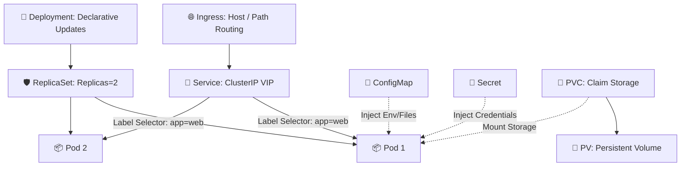

# ☸️ Kubernetes Fundamentals Production Master Handbook (Volume 1)
> **From Containers to Your First Production Cluster — The Definitive Hands-On Architecture, YAML Blueprint & Interview Master Guide**  
> *Engineered for DevOps Engineers, Site Reliability Engineers, Cloud Architects, and Certified Kubernetes Administrator (CKA/CKAD) Candidates.*

---

## 📑 Master Table of Contents
1. [Core Kubernetes Mental Models & Architectural Principles](#1-core-kubernetes-mental-models--architectural-principles)
2. [20-Module Enterprise Kubernetes Curriculum Deep Dive](#2-20-module-enterprise-kubernetes-curriculum-deep-dive)
   - [Module 1: Introduction to Kubernetes & Container Orchestration](#module-1-introduction-to-kubernetes--container-orchestration-page-1)
   - [Module 2: Why Kubernetes Was Created: Borg, Docker Limits & CNCF](#module-2-why-kubernetes-was-created-borg-docker-limits--cncf-page-2)
   - [Module 3: Kubernetes Architecture Overview: Brains vs. Muscles](#module-3-kubernetes-architecture-overview-brains-vs-muscles-page-3)
   - [Module 4: Control Plane Components: `apiserver`, `etcd`, `scheduler`, `controller-manager`](#module-4-control-plane-components-apiserver-etcd-scheduler-controller-manager-page-4)
   - [Module 5: Worker Node Components: `kubelet`, `kube-proxy`, Container Runtime & CRI](#module-5-worker-node-components-kubelet-kube-proxy-container-runtime--cri-page-5)
   - [Module 6: Pods Internals: Single vs. Multi-Container, Init Containers & Lifecycle](#module-6-pods-internals-single-vs-multi-container-init-containers--lifecycle-page-6)
   - [Module 7: ReplicaSets & Self-Healing Controllers](#module-7-replicasets--self-healing-controllers-page-7)
   - [Module 8: Deployments: Rolling Updates, Zero-Downtime Releases & Rollbacks](#module-8-deployments-rolling-updates-zero-downtime-releases--rollbacks-page-8)
   - [Module 9: Namespaces, Resource Isolation & Multi-Tenancy](#module-9-namespaces-resource-isolation--multi-tenancy-page-9)
   - [Module 10: Labels, Selectors & Declarative Metadata Discovery](#module-10-labels-selectors--declarative-metadata-discovery-page-10)
   - [Module 11: Kubernetes Services: ClusterIP, NodePort, LoadBalancer & CoreDNS](#module-11-kubernetes-services-clusterip-nodeport-loadbalancer--coredns-page-11)
   - [Module 12: ConfigMaps: Decoupling Configurations, Env Injection & Volumes](#module-12-configmaps-decoupling-configurations-env-injection--volumes-page-12)
   - [Module 13: Secrets Management: Opaque, TLS, Docker Registry & Base64 vs. Encryption](#module-13-secrets-management-opaque-tls-docker-registry--base64-vs-encryption-page-13)
   - [Module 14: Kubernetes Volumes: `emptyDir`, `hostPath`, ConfigMap/Secret Mounts](#module-14-kubernetes-volumes-emptydir-hostpath-configmapsecret-mounts-page-14)
   - [Module 15: Persistent Volumes (PV), Claims (PVC), StorageClasses & CSI Drivers](#module-15-persistent-volumes-pv-claims-pvc-storageclasses--csi-drivers-page-15)
   - [Module 16: Resource Management: Requests, Limits & Quality of Service (QoS)](#module-16-resource-management-requests-limits--quality-of-service-qos-page-16)
   - [Module 17: Kubernetes YAML Anatomy: The 5 Core Fields & Declarative State](#module-17-kubernetes-yaml-anatomy-the-5-core-fields--declarative-state-page-17)
   - [Module 18: `kubectl` Essentials: CLI Mastery, Resource Shortcuts & One-Liners](#module-18-kubectl-essentials-cli-mastery-resource-shortcuts--one-liners-page-18)
   - [Module 19: Kubernetes Object Relationships & Complete Architecture Map](#module-19-kubernetes-object-relationships--complete-architecture-map-page-19)
   - [Module 20: Production Readiness Checklist & Self-Assessment Matrix](#module-20-production-readiness-checklist--self-assessment-matrix-page-20)
3. [High-Frequency Kubernetes Interview Q&A (Senior Level)](#3-high-frequency-kubernetes-interview-qa-senior-level)

---

## 1. Core Kubernetes Mental Models & Architectural Principles

```
                          THE 7 GOLDEN RULES OF KUBERNETES
 ┌─────────────────────────────────────────────────────────────────────────────┐
 │ 1. Declarative Desired State vs. Reconciliation Loop                        │
 │    • You declare WHAT you want (YAML); Kubernetes continuously loops to     │
 │      make the Actual State match the Desired State (Controller Manager).    │
 ├─────────────────────────────────────────────────────────────────────────────┤
 │ 2. Pods are Ephemeral (Mortal), Services are Eternal                        │
 │    • Pod IPs change dynamically when recreated. Never hardcode Pod IPs.     │
 │    • Services provide static ClusterIP VIPs and stable CoreDNS hostnames.   │
 ├─────────────────────────────────────────────────────────────────────────────┤
 │ 3. The API Server is the Single Source of Truth Gatekeeper                  │
 │    • All components (etcd, kubelet, scheduler, CLI) talk ONLY to the        │
 │      kube-apiserver. No component ever talks directly to etcd.              │
 ├─────────────────────────────────────────────────────────────────────────────┤
 │ 4. Labels are for Humans, Selectors are for Controllers                     │
 │    • Deployments find Pods via matchLabels. Services route traffic via      │
 │      Selectors. Labels form the loose-coupling glue of the cluster.         │
 ├─────────────────────────────────────────────────────────────────────────────┤
 │ 5. CPU is Compressible (Throttled); Memory is Non-Compressible (OOMKilled)  │
 │    • When a Pod exceeds CPU limit ──▶ Throttling occurs (Slow performance). │
 │    • When a Pod exceeds Memory limit ──▶ Kernel OOM Killer kills container. │
 ├─────────────────────────────────────────────────────────────────────────────┤
 │ 6. Base64 is Encoding (Not Encryption)                                      │
 │    • K8s Secrets are only Base64 encoded by default. Enable etcd encryption │
 │      at rest or integrate external Secret Managers (AWS Secrets, HashiCorp).│
 ├─────────────────────────────────────────────────────────────────────────────┤
 │ 7. Storage Claims (PVC) Decouple Developers from Infrastructure (PV)        │
 │    • Devs request capacity via PVC; StorageClasses & CSI dynamically prov.  │
 └─────────────────────────────────────────────────────────────────────────────┘
```

---

## 2. 20-Module Enterprise Kubernetes Curriculum Deep Dive

---

### Module 1: Introduction to Kubernetes & Container Orchestration (Page 1)

```
                            WHAT KUBERNETES AUTOMATES
 ┌───────────────────┬───────────────────┬───────────────────┬───────────────────┐
 │ 🚀 Deployment     │ 📈 Auto-Scaling   │ 🩺 Self-Healing   │ 🔄 Rolling Update │
 │ Automated rollout │ Scale Pods based  │ Auto-restart and  │ Zero downtime     │
 │ across nodes      │ on CPU / Memory   │ reschedule crashes│ version upgrades  │
 ├───────────────────┼───────────────────┼───────────────────┼───────────────────┤
 │ 🌐 Service Discov.│ 🔐 Config & Secret│ 💾 Storage Mgmt   │ ⚙️ Declarative State│
 │ Built-in CoreDNS  │ Decouple env vars │ Dynamic volume    │ Continuous loop   │
 │ & Load Balancing  │ from images       │ provisioning (CSI)│ reconciliation    │
 └───────────────────┴───────────────────┴───────────────────┴───────────────────┘
```

* **What Kubernetes Is:** An open-source container orchestration engine that automates the deployment, scaling, networking, and lifecycle management of containerized applications.
* **Why Docker Alone Fails in Production:** Docker runs containers on a single host. It lacks native multi-node clustering, auto-scaling, self-healing, rolling updates, and distributed storage management.

---

### Module 2: Why Kubernetes Was Created: Borg, Docker Limits & CNCF (Page 2)

```
                              EVOLUTION TIMELINE
 2003-2013             2014                   2015                   2018-Present
 ┌───────────────┐     ┌───────────────┐      ┌───────────────┐      ┌───────────────┐
 │ Google Borg   │────▶│ Kubernetes    │─────▶│ K8s v1.0 &    │─────▶│ De-Facto Cloud│
 │ Internal scale│     │ Open-Sourced  │      │ CNCF Founded  │      │ Standard      │
 │ infrastructure│     │ by Google     │      │ (Linux Found.)│      │ Global adopted│
 └───────────────┘     └───────────────┘      └───────────────┘      └───────────────┘
```

* **Google Borg:** Google ran billions of containers internally for a decade using Borg. Kubernetes was designed by Google engineers from lessons learned running Borg.
* **CNCF (Cloud Native Computing Foundation):** In 2015, Google partnered with the Linux Foundation to create the CNCF and donated Kubernetes as its seed project.

---

### Module 3: Kubernetes Architecture Overview: Brains vs. Muscles (Page 3)

```
+========================================================================================+
|                        CONTROL PLANE (The Brain - Master Node)                         |
|                                                                                        |
|  [ Users / CI/CD ] ──▶ [ kube-apiserver ] <─────────────────┐                          |
|         (kubectl)             │                             │                          |
|                               ▼                             │                          |
|                         [    etcd     ]                     │                          |
|                         (Key-Value DB)                      ▼                          |
|                               │                 [ kube-controller-manager ]            |
|                               ▼                 (Node, Replica, Endpoints)             |
|                       [ kube-scheduler ]                    ▲                          |
|                       (Picks best node)                     │                          |
|                               │                 [ cloud-controller-manager ]           |
|                               └─────────────────────────────┘                          |
+========================================================================================+
                                │ HTTPS API (Port 6443)
                                ▼
+========================================================================================+
|                           WORKER NODES (The Muscles - Compute)                         |
|                                                                                        |
|  +-----------------------------------+     +----------------------------------------+  |
|  | WORKER NODE 1                     |     | WORKER NODE 2                          |  |
|  | ┌───────────────────────────────┐ |     | ┌────────────────────────────────────┐ |  |
|  | │ kubelet (Node Agent Manager)  │ |     | │ kubelet (Node Agent Manager)       │ |  |
|  | ├───────────────────────────────┤ |     | ├────────────────────────────────────┤ |  |
|  | │ kube-proxy (Network Proxy)    │ |     | │ kube-proxy (Network Proxy)         │ |  |
|  | ├───────────────────────────────┤ |     | ├────────────────────────────────────┤ |  |
|  | │ Container Runtime (containerd)│ |     | │ Container Runtime (containerd)     │ |  |
|  | └───────────────────────────────┘ |     | └────────────────────────────────────┘ |  |
|  |  +-----------------------------+  |     |  +----------------------------------+  |  |
|  |  | [Pod 1]  [Pod 2]   [Pod 3]  |  |     |  | [Pod 4]   [Pod 5]   [Pod 6]      |  |  |
|  |  +-----------------------------+  |     |  +----------------------------------+  |  |
|  +-----------------------------------+     +----------------------------------------+  |
+========================================================================================+
```

---

### Module 4: Control Plane Components: `apiserver`, `etcd`, `scheduler`, `controller-manager` (Page 4)

| Component | Mental Role | Key Functionality & Production Details |
| :--- | :--- | :--- |
| **`kube-apiserver`** | The **"Front Door"** | Exposes the REST API (Port 6443). Validates, authenticates, authorizes requests via RBAC, and coordinates all cluster state changes. |
| **`etcd`** | The **"Cluster Memory"** | Distributed, highly consistent key-value store based on the Raft consensus algorithm. Holds all cluster configuration and real-time state. |
| **`kube-scheduler`** | The **"Matchmaker"** | Watches for unscheduled Pods; filters and scores nodes based on CPU/RAM requests, affinity/anti-affinity, taints, and tolerations. |
| **`kube-controller-manager`** | The **"Caretaker"** | Runs continuous background reconciliation loops (Node Controller, ReplicaSet Controller, EndpointSlice Controller, Job Controller). |
| **`cloud-controller-manager`** | The **"Cloud Bridge"** | Interacts with underlying cloud providers (AWS, GCP, Azure) to provision Cloud Load Balancers, EBS/Disk volumes, and node IP routing. |

---

### Module 5: Worker Node Components: `kubelet`, `kube-proxy`, Container Runtime & CRI (Page 5)

```
                            WORKER NODE EXECUTION FLOW
 ┌──────────────┐    ┌──────────────┐    ┌──────────────┐    ┌──────────────┐
 │ 1. kubelet   │───▶│ 2. CRI       │───▶│ 3. Runtime   │───▶│ 4. kube-proxy│
 │ Receives     │    │ Container    │    │ Pulls image &│    │ Configures   │
 │ PodSpec      │    │ Runtime Int. │    │ starts Pod   │    │ iptables/IPVS│
 └──────────────┘    └──────────────┘    └──────────────┘    └──────────────┘
```

* **`kubelet`:** The primary node agent. Talks to `kube-apiserver`, mounts storage volumes, runs container health probes (liveness, readiness, startup), and reports node status.
* **`kube-proxy`:** Network proxy running on every node. Maintains local network packet filtering rules (`iptables` or `IPVS`) to route traffic targeted at Service Virtual IPs to backend Pods.
* **Container Runtime (CRI):** Low-level software responsible for pulling images and running containers (Standard: `containerd`, `CRI-O`).

---

### Module 6: Pods Internals: Single vs. Multi-Container, Init Containers & Lifecycle (Page 6)

```
                       POD ARCHITECTURE & MULTI-CONTAINER
 ┌─────────────────────────────────────────────────────────────────────────────┐
 │ POD (Shared Network Namespace: 10.244.1.15 | Shared IPC | Shared Storage)   │
 │                                                                             │
 │  ┌───────────────────────────────┐     ┌─────────────────────────────────┐  │
 │  │ Main Container (App Engine)   │     │ Sidecar Container (Log Shipper) │  │
 │  │ Port: 8080                    │     │ Reads shared volume /var/log    │  │
 │  └───────────────┬───────────────┘     └────────────────┬────────────────┘  │
 │                  │                                      │                   │
 │                  ▼                                      ▼                   │
 │             ┌────────────────────────────────────────────────┐              │
 │             │ Shared Volume (/var/log - emptyDir)            │              │
 │             └────────────────────────────────────────────────┘              │
 └─────────────────────────────────────────────────────────────────────────────┘
```

#### 🔄 Pod Lifecycle Phases
1. **Pending:** Pod accepted by API Server, but waiting for scheduler to assign a node or downloading container images.
2. **Running:** Pod bound to a node, all containers created, at least one container running.
3. **Succeeded:** All containers in the Pod completed successfully and terminated (Exit 0; typical for Jobs).
4. **Failed:** All containers terminated, and at least one container failed (Non-zero exit code).
5. **Unknown:** State cannot be obtained (typically node network failure).

#### 🚀 Init Containers
* Run **sequentially before** any main application container starts.
* Used for pre-flight database migrations, permission configuration, or waiting for external dependencies.

---

### Module 7: ReplicaSets & Self-Healing Controllers (Page 7)

```
                            REPLICASET SELF-HEALING
 ┌─────────────────┐           ┌─────────────────┐           ┌─────────────────┐
 │ Pod 1 (Running) │           │ Pod 2 (CRASHED) │           │ Pod 3 (Running) │
 └─────────────────┘           └────────┬────────┘           └─────────────────┘
                                        │
                                        ▼ (ReplicaSet Controller Detects: 2 != 3)
                               ┌─────────────────┐
                               │ Pod 4 (CREATED) │ (Desired State 3 Restored!)
                               └─────────────────┘
```

```yaml
apiVersion: apps/v1
kind: ReplicaSet
metadata:
  name: frontend-rs
spec:
  replicas: 3
  selector:
    matchLabels:
      app: frontend
  template:
    metadata:
      labels:
        app: frontend
    spec:
      containers:
        - name: web
          image: nginx:1.25
```

---

### Module 8: Deployments: Rolling Updates, Zero-Downtime Releases & Rollbacks (Page 8)

```
                           ROLLING UPDATE PROGRESSION
 Step 1 (v1 Active)          Step 2 (Transition)          Step 3 (v2 Complete)
 ┌─────────────────┐         ┌─────────────────┐          ┌─────────────────┐
 │ ReplicaSet v1   │         │ RS v1 (2 Pods)  │          │ ReplicaSet v1   │
 │ (3 Pods active) │         │ RS v2 (2 Pods)  │          │ (0 Pods active) │
 └─────────────────┘         └─────────────────┘          └─────────────────┘
                                                                  │
                                                          ┌───────▼─────────┐
                                                          │ ReplicaSet v2   │
                                                          │ (3 Pods active) │
                                                          └─────────────────┘
```

```yaml
apiVersion: apps/v1
kind: Deployment
metadata:
  name: api-deployment
spec:
  replicas: 3
  strategy:
    type: RollingUpdate
    rollingUpdate:
      maxSurge: 1            # Max 1 extra Pod created above desired count during update
      maxUnavailable: 0      # 0 Pods can be down (Guarantees zero downtime)
  selector:
    matchLabels:
      app: api
  template:
    metadata:
      labels:
        app: api
    spec:
      containers:
        - name: api
          image: myapp:v2.0
          ports:
            - containerPort: 8080
```

```bash
# Rollout Inspection & Rollback Commands
kubectl rollout status deployment/api-deployment
kubectl rollout history deployment/api-deployment
kubectl rollout undo deployment/api-deployment --to-revision=2
```

---

### Module 9: Namespaces, Resource Isolation & Multi-Tenancy (Page 9)

```
                            KUBERNETES CLUSTER (Physical)
 ┌───────────────────────────┬───────────────────────────┬───────────────────────────┐
 │ Namespace: development    │ Namespace: staging        │ Namespace: production     │
 │ ├── Pods, Services        │ ├── Pods, Services        │ ├── Pods, Services        │
 │ └── ResourceQuotas (2CPU) │ └── ResourceQuotas (8CPU) │ └── ResourceQuotas (32CPU)│
 └───────────────────────────┴───────────────────────────┴───────────────────────────┘
```

* **System Namespaces:**
  * `default`: Default namespace when none is specified.
  * `kube-system`: Core system components (`CoreDNS`, `kube-proxy`, CNI).
  * `kube-public`: Publicly readable cluster data (bootstrap tokens).
  * `kube-node-lease`: Node heartbeat leases to reduce API server pressure.

---

### Module 10: Labels, Selectors & Declarative Metadata Discovery (Page 10)

```yaml
# 1. matchLabels (Equality-based matching)
selector:
  matchLabels:
    app: payment
    environment: production

# 2. matchExpressions (Set-based matching)
selector:
  matchExpressions:
    - { key: environment, operator: In, values: [production, staging] }
    - { key: tier, operator: NotIn, values: [frontend] }
    - { key: partition, operator: Exists }
```

---

### Module 11: Kubernetes Services: ClusterIP, NodePort, LoadBalancer & CoreDNS (Page 11)

```
       [ Client / User ]
               │
               ▼
   [ External Cloud LoadBalancer ] (e.g. AWS NLB - Public IP)
               │
               ▼
   [ NodePort (30000-32767) ] (Exposed on every Worker Node IP)
               │
               ▼
   [ ClusterIP (Virtual IP) ] (Internal Cluster Virtual IP)
               │
      ┌────────┴────────┐
      ▼                 ▼
 [Pod 1: 10.244.1.2] [Pod 2: 10.244.2.3]
```

#### 🌐 CoreDNS Fully Qualified Domain Name (FQDN) Format
$$\text{service-name}.\text{namespace}.\text{svc}.\text{cluster}.\text{local}$$
*Example:* `payment-service.production.svc.cluster.local:8080`

```yaml
apiVersion: v1
kind: Service
metadata:
  name: payment-service
spec:
  type: ClusterIP
  selector:
    app: payment
  ports:
    - name: http
      port: 80           # Port exposed by the Service
      targetPort: 8080   # Port application listens on inside container
```

---

### Module 12: ConfigMaps: Decoupling Configurations, Env Injection & Volumes (Page 12)

```yaml
apiVersion: v1
kind: ConfigMap
metadata:
  name: app-config
data:
  APP_ENV: "production"
  LOG_LEVEL: "info"
  database.properties: |
    db.host=postgres.prod.svc.cluster.local
    db.port=5432
    db.pool_size=20
```

```yaml
# Consuming ConfigMap in a Pod
spec:
  containers:
    - name: web
      image: nginx
      env:
        - name: ENVIRONMENT
          valueFrom:
            configMapKeyRef:
              name: app-config
              key: APP_ENV
      volumeMounts:
        - name: config-volume
          mountPath: /etc/config
  volumes:
    - name: config-volume
      configMap:
        name: app-config
```

---

### Module 13: Secrets Management: Opaque, TLS, Docker Registry & Base64 vs. Encryption (Page 13)

```bash
# Base64 Encoding vs Decoding
echo -n "SuperSecretPassword123" | base64
# Output: U3VwZXJTZWNyZXRQYXNzd29yZDEyMw==

echo -n "U3VwZXJTZWNyZXRQYXNzd29yZDEyMw==" | base64 --decode
```
> [!CAUTION]
> **Base64 is NOT Encryption.** It is plain text encoding for binary data transfer. In production:
> 1. Enable **KMS Encryption at Rest** for `etcd`.
> 2. Use **HashiCorp Vault**, AWS Secrets Manager, or External Secrets Operator (ESO).
> 3. Enforce **RBAC Least Privilege** on Secret read permissions.

---

### Module 14: Kubernetes Volumes: `emptyDir`, `hostPath`, ConfigMap/Secret Mounts (Page 14)

| Volume Type | Lifetime | Scope / Persistence | Production Use Case |
| :--- | :--- | :--- | :--- |
| **`emptyDir`** | Pod Lifetime | Deleted when Pod is deleted | Temporary scratchpad, fast local caching, inter-container shared buffer |
| **`hostPath`** | Node Lifetime | Persists on node disk | Node monitoring daemons (Fluentd, Prometheus Node Exporter), access to `/var/log` |
| **`configMap` / `secret`** | Pod Lifetime | Injected from API objects | Mounting config files, TLS certs (`/etc/tls/tls.crt`) |
| **`persistentVolumeClaim`** | Independent | Persists after Pod deletion | Production databases (Postgres, MySQL, MongoDB), StatefulSets |

---

### Module 15: Persistent Volumes (PV), Claims (PVC), StorageClasses & CSI Drivers (Page 15)

```
                            STORAGE PROVISIONING CYCLE
 ┌──────────────┐    ┌──────────────┐    ┌──────────────┐    ┌──────────────┐
 │ 1. Storage-  │───▶│ 2. PVC       │───▶│ 3. Dynamic   │───▶│ 4. Pod Mount │
 │    Class     │    │ Claim 100Gi  │    │ CSI Volume   │    │ Bound &      │
 │ (gp3 / ebs)  │    │ ReadWriteOnce│    │ (AWS EBS)    │    │ Mounted      │
 └──────────────┘    └──────────────┘    └──────────────┘    └──────────────┘
```

#### 🔒 Persistent Volume Reclaim Policies
* **`Delete` (Default in Cloud):** When PVC is deleted, underlying cloud EBS/SAN disk is immediately deleted.
* **`Retain`:** When PVC is deleted, the PV remains intact; data is preserved for manual administrator recovery.

```yaml
apiVersion: v1
kind: PersistentVolumeClaim
metadata:
  name: db-pvc
spec:
  accessModes:
    - ReadWriteOnce                  # RWO: Mounted read-write by a single node
  resources:
    requests:
      storage: 50Gi
  storageClassName: gp3
```

---

### Module 16: Resource Management: Requests, Limits & Quality of Service (QoS) (Page 16)

```yaml
resources:
  requests:
    cpu: "500m"        # 500 millicores (0.5 CPU core) guaranteed for scheduling
    memory: "256Mi"    # 256 Mebibytes RAM guaranteed
  limits:
    cpu: "1000m"       # Max 1 CPU core (Throttled if exceeded)
    memory: "512Mi"    # Max 512 Mebibytes RAM (OOMKilled if exceeded)
```

```
                          QUALITY OF SERVICE (QoS) HIERARCHY
 ┌──────────────┬────────────────────────────────────┬─────────────────────────┐
 │ QoS Class    │ Resource Requirements              │ Node Eviction Priority  │
 ├──────────────┼────────────────────────────────────┼─────────────────────────┤
 │ 🥇 Guaranteed│ Requests == Limits (CPU & RAM)     │ Last to be evicted      │
 │ 🥈 Burstable │ Requests < Limits                  │ Evicted under pressure  │
 │ 🥉 BestEffort│ No Requests, No Limits specified   │ FIRST TO BE KILLED!     │
 └──────────────┴────────────────────────────────────┴─────────────────────────┘
```

---

### Module 17: Kubernetes YAML Anatomy: The 5 Core Fields & Declarative State (Page 17)

```
                       THE 5 ROOT FIELDS OF EVERY K8S YAML
 ┌──────────────────┬──────────────────────────────────────────────────────────┐
 │ 1. apiVersion    │ API group and schema version (e.g., apps/v1, v1)         │
 │ 2. kind          │ Type of Kubernetes object (e.g., Deployment, Service)    │
 │ 3. metadata      │ Identifying information: name, namespace, labels         │
 │ 4. spec          │ Desired state: replicas, containers, ports, volumes      │
 │ 5. status        │ Real-time actual state (Managed by K8s; read-only)       │
 └──────────────────┴──────────────────────────────────────────────────────────┘
```

---

### Module 18: `kubectl` Essentials: CLI Mastery, Resource Shortcuts & One-Liners (Page 18)

```bash
# Resource Short Names Mastery
po   -> pods           svc  -> services        deploy -> deployments
rs   -> replicasets    cm   -> configmaps      sec    -> secrets
ns   -> namespaces     ing  -> ingresses       pv     -> persistentvolumes
pvc  -> persistentvolumeclaims                 no     -> nodes

# High-Frequency Debugging Commands
kubectl get pods -A -o wide                    # View all pods across all namespaces with IPs & Nodes
kubectl describe pod <pod-name>                # Inspect detailed events, failure reasons, and probes
kubectl logs -f <pod-name> -c <container>      # Stream live container logs
kubectl exec -it <pod-name> -- /bin/sh         # Open interactive debugging shell inside container
kubectl top nodes && kubectl top pods          # Check real-time CPU and Memory consumption
```

---

### Module 19: Kubernetes Object Relationships & Complete Architecture Map (Page 19)



---

### Module 20: Production Readiness Checklist & Self-Assessment Matrix (Page 20)

```
                    KUBERNETES PRODUCTION READINESS AUDIT
 ┌──┬─────────────────────────────┬────────────────────────────────────────────┐
 │  │ Verification Area           │ Production Standard                        │
 ├──┼─────────────────────────────┼────────────────────────────────────────────┤
 │☐ │ Resource Limits             │ Every container has CPU/RAM requests/limits│
 │☐ │ Health Probes               │ Liveness, readiness, and startup probes set│
 │☐ │ High Availability           │ Replicas >= 2 with PodAntiAffinity enabled │
 │☐ │ Secrets Hardening           │ etcd encrypted at rest; RBAC restricted    │
 │☐ │ Graceful Termination        │ preStop hooks & terminationGracePeriodSecs │
 │☐ │ Zero-Downtime Strategy      │ maxUnavailable: 0 in RollingUpdate strategy│
 │☐ │ Ingress Security            │ TLS certificates managed by cert-manager   │
 │☐ │ Namespace Isolation         │ Strict NetworkPolicies (Default Deny)      │
 └──┴─────────────────────────────┴────────────────────────────────────────────┘
```

---

## 3. High-Frequency Kubernetes Interview Q&A (Senior Level)

| # | High-Frequency Interview Question | Senior DevOps / SRE Model Answer |
|---|---|---|
| 1 | **What is the difference between a Pod and a Container?** | *A Container is a single isolated process runtime (via Linux namespaces and cgroups). A **Pod** is the smallest deployable abstraction in Kubernetes that encapsulates one or more co-located containers sharing the same network namespace (IP and port space), IPC namespace, and shared storage volumes.* |
| 2 | **What is the difference between Liveness, Readiness, and Startup Probes?** | *• **Startup Probe:** Checks if the application has completed initial startup. Disables liveness/readiness checks until it succeeds.<br>• **Liveness Probe:** Checks if container is alive. If it fails, `kubelet` kills and **restarts** the container.<br>• **Readiness Probe:** Checks if container is ready to accept user traffic. If it fails, the Pod's IP is **removed from Service Endpoints** (no traffic routed).* |
| 3 | **What causes `CrashLoopBackOff`, and how do you debug it?** | *`CrashLoopBackOff` means a container starts, encounters a fatal error, crashes, and `kubelet` repeatedly attempts to restart it with exponential backoff delay. Debugging workflow:<br>1. Run `kubectl logs <pod> --previous` to inspect the exit crash log.<br>2. Run `kubectl describe pod <pod>` to inspect exit codes (`137` = OOMKilled, `1` = App crash).* |
| 4 | **What happens to Pods when a Worker Node dies?** | *1. Node controller stops receiving heartbeats from `kubelet` after `node-monitor-grace-period` (default 40s), marking node `NotReady`.<br>2. After `pod-eviction-timeout` (default 5m), the controller marks Pods for termination and the Scheduler creates replacement Pods on healthy worker nodes.* |
| 5 | **What is the difference between `ClusterIP`, `NodePort`, and `LoadBalancer` Services?** | *• **ClusterIP:** Virtual internal IP only accessible inside the cluster (Default).<br>• **NodePort:** Exposes the service on a static high-range port (`30000-32767`) on every worker node's external IP.<br>• **LoadBalancer:** Provisions an external cloud load balancer (AWS NLB/ALB) that automatically routes traffic to the NodePort / ClusterIP.* |

---
*Created for Enterprise Kubernetes Operations, CKA Certification Mastery & Senior Technical Interviews.*
