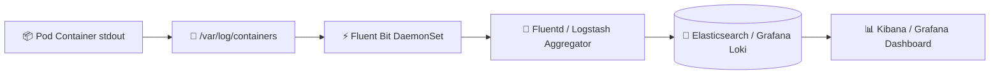

# ☸️ Kubernetes Production Engineering Master Handbook (Volume 2)
> **Running Kubernetes in Real Production Environments — Advanced Scheduling, Stateful Workloads, Autoscaling, Observability, Advanced Deployments & Incident Response**  
> *Engineered for Senior DevOps Engineers, Lead Site Reliability Engineers (SREs), Platform Architects, and CKA/CKS Practitioners.*

---

## 📑 Master Table of Contents
1. [Core Production Engineering Mental Models](#1-core-production-engineering-mental-models)
2. [20-Module Advanced Kubernetes Curriculum Deep Dive](#2-20-module-advanced-kubernetes-curriculum-deep-dive)
   - [Module 1: Advanced Kubernetes Scheduling Engine (Filter ➔ Score ➔ Bind)](#module-1-advanced-kubernetes-scheduling-engine-filter--score--bind-page-1)
   - [Module 2: Node Selectors, Node Affinity (Hard vs. Soft) & Topology Spread](#module-2-node-selectors-node-affinity-hard-vs-soft--topology-spread-page-2)
   - [Module 3: Taints & Tolerations: `NoSchedule`, `PreferNoSchedule`, `NoExecute`](#module-3-taints--tolerations-noschedule-prefernoschedule-noexecute-page-3)
   - [Module 4: DaemonSets: Node Agents, Logging, CNI & Security Monitoring](#module-4-daemonsets-node-agents-logging-cni--security-monitoring-page-4)
   - [Module 5: StatefulSets: Stable Network Identifiers, Headless Services & PVCs](#module-5-statefulsets-stable-network-identifiers-headless-services--pvcs-page-5)
   - [Module 6: Batch Workloads: Jobs, CronJobs & Auto-Cleanup (`ttlSecondsAfterFinished`)](#module-6-batch-workloads-jobs-cronjobs--auto-cleanup-ttlsecondsafterfinished-page-6)
   - [Module 7: Horizontal Pod Autoscaler (HPA): CPU/Memory & Custom Prometheus Metrics](#module-7-horizontal-pod-autoscaler-hpa-cpumemory--custom-prometheus-metrics-page-7)
   - [Module 8: Vertical Pod Autoscaler (VPA): Resource Right-Sizing & Auto Mode](#module-8-vertical-pod-autoscaler-vpa-resource-right-sizing--auto-mode-page-8)
   - [Module 9: Cluster Autoscaler (CA) & Cloud Node Provisioning (AWS ASG / Karpenter)](#module-9-cluster-autoscaler-ca--cloud-node-provisioning-aws-asg--karpenter-page-9)
   - [Module 10: Kubernetes Probes: Liveness, Readiness & Startup Health Checks](#module-10-kubernetes-probes-liveness-readiness--startup-health-checks-page-10)
   - [Module 11: Rolling Updates, Zero-Downtime Releases (`maxSurge`/`maxUnavailable`)](#module-11-rolling-updates-zero-downtime-releases-maxsurgemaxunavailable-page-11)
   - [Module 12: Advanced Release Strategies: Blue-Green, Canary & Progressive Delivery](#module-12-advanced-release-strategies-blue-green-canary--progressive-delivery-page-12)
   - [Module 13: Resource Optimization, Bin-Packing & Cost Reduction Strategies](#module-13-resource-optimization-bin-packing--cost-reduction-strategies-page-13)
   - [Module 14: Centralized Logging Architecture: Fluent Bit, Fluentd, Loki & ELK](#module-14-centralized-logging-architecture-fluent-bit-fluentd-loki--elk-page-14)
   - [Module 15: Enterprise Monitoring & Metrics: Prometheus, Grafana & Alertmanager](#module-15-enterprise-monitoring--metrics-prometheus-grafana--alertmanager-page-15)
   - [Module 16: Systematic Production Troubleshooting Playbooks](#module-16-systematic-production-troubleshooting-playbooks-page-16)
   - [Module 17: Incident Response Framework: Containment, Recovery & 5-Whys RCA](#module-17-incident-response-framework-containment-recovery--5-whys-rca-page-17)
   - [Module 18: Real-World Case Studies: Node Outage, Split-Brain etcd & CNI Blackholes](#module-18-real-world-case-studies-node-outage-split-brain-etcd--cni-blackholes-page-18)
   - [Module 19: Senior Production CLI Mastery Cheat Sheet & One-Liner Hero Commands](#module-19-senior-production-cli-mastery-cheat-sheet--one-liner-hero-commands-page-19)
   - [Module 20: Production Readiness & Disaster Recovery Scorecard](#module-20-production-readiness--disaster-recovery-scorecard-page-20)
3. [Senior Systems Engineering Interview Q&A (Advanced Level)](#3-senior-systems-engineering-interview-qa-advanced-level)

---

## 1. Core Production Engineering Mental Models

```
                   THE 7 GOLDEN RULES OF PRODUCTION KUBERNETES
 ┌─────────────────────────────────────────────────────────────────────────────┐
 │ 1. Scheduling is a Two-Stage Pipeline: Filtering (Hard) ➔ Scoring (Soft)    │
 │    • Filtering eliminates ineligible nodes (Taints, Requests, Affinity).    │
 │    • Scoring ranks eligible nodes (Balance resources, least loaded).        │
 ├─────────────────────────────────────────────────────────────────────────────┤
 │ 2. Taints REPEL Pods; Tolerations ALLOW (Never Attract)                     │
 │    • A Taint on a Node pushes pods away. A Toleration allows a Pod to land, │
 │      but does NOT force it there (Use NodeAffinity to attract).             │
 ├─────────────────────────────────────────────────────────────────────────────┤
 │ 3. StatefulSets Guarantee Identity, Storage Binding & Ordered Operations    │
 │    • Pod-0 is created before Pod-1. Pod-1 is terminated before Pod-0.       │
 │    • PVC `data-db-0` stays bound to `db-0` across node crashes & moves.     │
 ├─────────────────────────────────────────────────────────────────────────────┤
 │ 4. Never Combine HPA and VPA on the Same Metric (CPU/Memory)                │
 │    • HPA scales Pod count; VPA scales Pod size. Scaling both on CPU causes  │
 │      feedback loops and scheduling oscillation.                             │
 ├─────────────────────────────────────────────────────────────────────────────┤
 │ 5. Zero-Downtime Rolling Update Formula                                     │
 │    • `maxUnavailable: 0` AND `maxSurge: 25%` (or `maxSurge: 1`).            │
 │    • Ensures no active Pods are terminated until new Pods pass Readiness.   │
 ├─────────────────────────────────────────────────────────────────────────────┤
 │ 6. Startup Probes Protect Slow-Starting Applications from Premature Kills   │
 │    • Disables Liveness probes during startup so slow JVM/DB apps don't get  │
 │      stuck in perpetual crash loops.                                        │
 ├─────────────────────────────────────────────────────────────────────────────┤
 │ 7. Safe Node Maintenance Protocol: Cordon ➔ Drain ➔ Terminate               │
 │    • `kubectl cordon` stops new pods; `kubectl drain` evicts running pods.  │
 └─────────────────────────────────────────────────────────────────────────────┘
```

---

## 2. 20-Module Advanced Kubernetes Curriculum Deep Dive

---

### Module 1: Advanced Kubernetes Scheduling Engine (Filter ➔ Score ➔ Bind) (Page 1)

```
                            SCHEDULER DECISION WORKFLOW
 ┌──────────────┐    ┌──────────────┐    ┌──────────────┐    ┌──────────────┐
 │ New Pod      │───▶│ 1. FILTER    │───▶│ 2. SCORE     │───▶│ 3. BIND      │
 │ (Pending)    │    │ Removes bad  │    │ Ranks viable │    │ Binds Pod to │
 │              │    │ candidate    │    │ nodes by     │    │ Best Winner  │
 │              │    │ nodes        │    │ priority     │    │ Node         │
 └──────────────┘    └──────────────┘    └──────────────┘    └──────────────┘
```

#### 🔍 The 2-Stage Scheduling Pipeline
1. **Filtering Phase (Predicates):** Evaluates hard constraints:
   * Node resource capacity (`requests.cpu` & `requests.memory` fit inside `Allocatable`).
   * Taints & Tolerations matching.
   * `NodeSelector` & `RequiredDuringSchedulingIgnoredDuringExecution`.
   * Port conflicts (`hostPort`).
   * Storage volume availability.
2. **Scoring Phase (Priorities):** Ranks remaining candidate nodes:
   * Resource balance (`NodeResourcesBalancedAllocation`).
   * `PreferredDuringSchedulingIgnoredDuringExecution` weights (1–100).
   * `PodTopologySpreadConstraints` (distribute evenly across AZs).

---

### Module 2: Node Selectors, Node Affinity (Hard vs. Soft) & Topology Spread (Page 2)

```yaml
apiVersion: apps/v1
kind: Deployment
metadata:
  name: payment-engine
spec:
  replicas: 3
  template:
    spec:
      affinity:
        # 1. HARD AFFINITY (Must be satisfied, or Pod stays Pending)
        nodeAffinity:
          requiredDuringSchedulingIgnoredDuringExecution:
            nodeSelectorTerms:
              - matchExpressions:
                  - key: topology.kubernetes.io/zone
                    operator: In
                    values: [us-east-1a, us-east-1b]
                  - key: disktype
                    operator: In
                    values: [ssd, nvme]

        # 2. SOFT AFFINITY (Best effort ranking; weight 1-100)
        nodeAffinity:
          preferredDuringSchedulingIgnoredDuringExecution:
            - weight: 80
              preference:
                matchExpressions:
                  - key: instance-type
                    operator: In
                    values: [c5.2xlarge]

      # 3. TOPOLOGY SPREAD (Spread evenly across Availability Zones)
      topologySpreadConstraints:
        - maxSkew: 1
          topologyKey: topology.kubernetes.io/zone
          whenUnsatisfiable: DoNotSchedule
          labelSelector:
            matchLabels:
              app: payment-engine
```

---

### Module 3: Taints & Tolerations: `NoSchedule`, `PreferNoSchedule`, `NoExecute` (Page 3)

```
                            NODE TAINT vs. POD TOLERATION
      [ Node: gpu-node-01 ]                              [ Pod Spec ]
  Taint: dedicated=gpu:NoSchedule           Toleration: dedicated=gpu:NoSchedule
                │                                            │
                └────────────────── MATCHED! ────────────────┘
                        (Pod is permitted to run on Node)
```

#### 🛡️ Taint Effects
* **`NoSchedule`:** New Pods without matching toleration will **never** be scheduled on this node. Existing pods continue running.
* **`PreferNoSchedule`:** Soft constraint. Kubernetes tries to avoid scheduling here, but will place pods here if no other nodes are available.
* **`NoExecute`:** Evicts running Pods that do not tolerate the taint. Useful for **Node Drain** or maintenance.

```bash
# Add Taint to Node
kubectl taint nodes worker-node-01 dedicated=gpu:NoSchedule

# Remove Taint from Node (Note trailing minus)
kubectl taint nodes worker-node-01 dedicated=gpu:NoSchedule-
```

---

### Module 4: DaemonSets: Node Agents, Logging, CNI & Security Monitoring (Page 4)

```
                       DAEMONSET 1-PER-NODE PATTERN
 ┌─────────────────┐           ┌─────────────────┐           ┌─────────────────┐
 │ Worker Node 1   │           │ Worker Node 2   │           │ Worker Node 3   │
 │ ┌─────────────┐ │           │ ┌─────────────┐ │           │ ┌─────────────┐ │
 │ │ FluentBit   │ │           │ │ FluentBit   │ │           │ │ FluentBit   │ │
 │ │ (DaemonSet) │ │           │ │ (DaemonSet) │ │           │ │ (DaemonSet) │ │
 │ └─────────────┘ │           │ └─────────────┘ │           │ └─────────────┘ │
 └─────────────────┘           └─────────────────┘           └─────────────────┘
```

#### 🛠️ Production DaemonSet Spec (`node-exporter`)
```yaml
apiVersion: apps/v1
kind: DaemonSet
metadata:
  name: node-exporter
  namespace: monitoring
spec:
  selector:
    matchLabels:
      app: node-exporter
  template:
    metadata:
      labels:
        app: node-exporter
    spec:
      hostNetwork: true
      hostPID: true
      containers:
        - name: node-exporter
          image: prom/node-exporter:v1.7.0
          volumeMounts:
            - name: proc
              mountPath: /host/proc
              readOnly: true
      volumes:
        - name: proc
          hostPath:
            path: /proc
```

---

### Module 5: StatefulSets: Stable Network Identifiers, Headless Services & PVCs (Page 5)

```
                            STATEFULSET ARCHITECTURE
        Headless Service: mysql-headless (ClusterIP: None)
                          │
         ┌────────────────┼────────────────┐
         ▼                ▼                ▼
   [ mysql-0 ]      [ mysql-1 ]      [ mysql-2 ]
   (Ordinal 0)      (Ordinal 1)      (Ordinal 2)
         │                │                │
         ▼                ▼                ▼
   [ PVC data-0 ]   [ PVC data-1 ]   [ PVC data-2 ]
```

* **Deterministic DNS Hostnames:** `mysql-0.mysql-headless.production.svc.cluster.local`
* **Ordered Startup:** `0` $\rightarrow$ `1` $\rightarrow$ `2` (Waits for previous Pod to be `Running & Ready`).
* **Ordered Teardown:** `2` $\rightarrow$ `1` $\rightarrow$ `0` (Prevents split-brain in quorum clusters like Kafka/etcd).
* **Dedicated VolumeClaimTemplates:** Dynamically allocates persistent disk per ordinal pod.

---

### Module 6: Batch Workloads: Jobs, CronJobs & Auto-Cleanup (`ttlSecondsAfterFinished`) (Page 6)

```yaml
apiVersion: batch/v1
kind: CronJob
metadata:
  name: nightly-db-backup
spec:
  schedule: "0 2 * * *"              # Every night at 2:00 AM UTC
  concurrencyPolicy: Forbid          # Do not run parallel jobs if previous is still active
  jobTemplate:
    spec:
      ttlSecondsAfterFinished: 86400 # Auto-delete completed Job after 24 hours (Cleanup!)
      backoffLimit: 3                # Max 3 retries before marking Job as Failed
      template:
        spec:
          restartPolicy: OnFailure
          containers:
            - name: backup
              image: postgres-backup:v1
```

---

### Module 7: Horizontal Pod Autoscaler (HPA): CPU/Memory & Custom Prometheus Metrics (Page 7)

```yaml
apiVersion: autoscaling/v2
kind: HorizontalPodAutoscaler
metadata:
  name: api-hpa
spec:
  scaleTargetRef:
    apiVersion: apps/v1
    kind: Deployment
    name: api-deployment
  minReplicas: 3
  maxReplicas: 30
  metrics:
    # 1. Resource Metric (Average CPU)
    - type: Resource
      resource:
        name: cpu
        target:
          type: Utilization
          averageUtilization: 70

    # 2. Custom Metric (HTTP Requests Per Second via Prometheus Adapter)
    - type: Pods
      pods:
        metric:
          name: http_requests_per_second
        target:
          type: AverageValue
          averageValue: "500"
  behavior:
    scaleDown:
      stabilizationWindowSeconds: 300 # Prevent thrashing / rapid downscaling
```

---

### Module 8: Vertical Pod Autoscaler (VPA): Resource Right-Sizing & Auto Mode (Page 8)

```
                            VPA vs. HPA COMPARISON
 ┌──────────────────────────────────────┬──────────────────────────────────────┐
 │ Vertical Pod Autoscaler (VPA)        │ Horizontal Pod Autoscaler (HPA)      │
 ├──────────────────────────────────────┼──────────────────────────────────────┤
 │ • Scales the SIZE of each Pod        │ • Scales the NUMBER of Pods          │
 │ • Changes `requests.cpu` & `memory`  │ • Changes `replicas: N`              │
 │ • Requires Pod eviction/restart (Auto│ • Zero-downtime scaling              │
 │ • Best for monolithic / batch apps   │ • Best for stateless microservices   │
 └──────────────────────────────────────┴──────────────────────────────────────┘
```

#### 🛡️ VPA Recommendation-Only Mode (`Off`)
```yaml
apiVersion: autoscaling.k8s.io/v1
kind: VerticalPodAutoscaler
metadata:
  name: analytics-vpa
spec:
  targetRef:
    apiVersion: apps/v1
    kind: Deployment
    name: analytics-engine
  updatePolicy:
    updateMode: "Off" # Generates recommendations without restarting running pods
```

---

### Module 9: Cluster Autoscaler (CA) & Cloud Node Provisioning (AWS ASG / Karpenter) (Page 9)

```
                            CLUSTER AUTOSCALER TRIGGER
 ┌─────────────────┐      Fails to Schedule      ┌───────────────────────────┐
 │ Pod in PENDING  │────────────────────────────▶│ Cluster Autoscaler (CA)  │
 │ Insufficient CPU│                             │ Detects Capacity Shortage │
 └─────────────────┘                             └─────────────┬─────────────┘
                                                               │ (Triggers Cloud API)
                                                               ▼
                                                 ┌───────────────────────────┐
                                                 │ AWS EC2 Auto Scaling Group│
                                                 │ Provisions new Node (t3)  │
                                                 └───────────────────────────┘
```

* **Scale-Up Trigger:** Triggered strictly when Pods enter `Pending` state with `Insufficient cpu/memory`.
* **Scale-Down Trigger:** Triggered when node resource utilization is $<50\%$ for $>10\text{ minutes}$ and all pods can fit on other nodes.

---

### Module 10: Kubernetes Probes: Liveness, Readiness & Startup Health Checks (Page 10)

```
                         THE 3 PROBES IN PRODUCTION
 ┌─────────────────┬───────────────────────────────┬───────────────────────────┐
 │ Probe Type      │ Failure Action by Kubelet     │ Production Role           │
 ├─────────────────┼───────────────────────────────┼───────────────────────────┤
 │ 🚦 Startup      │ Disables Liveness/Readiness   │ Protects slow-starting    │
 │                 │ checks until startup succeeds │ apps (JVM, migrations)    │
 ├─────────────────┼───────────────────────────────┼───────────────────────────┤
 │ 🩺 Liveness     │ Kills and RESTARTS container  │ Recovers from deadlocks & │
 │                 │ (CrashLoop if buggy)          │ frozen event loops        │
 ├─────────────────┼───────────────────────────────┼───────────────────────────┤
 │ 🔀 Readiness    │ REMOVES Pod from Service      │ Prevents user traffic from│
 │                 │ Endpoints (No traffic routed) │ hitting unready backends  │
 └─────────────────┴───────────────────────────────┴───────────────────────────┘
```

```yaml
spec:
  containers:
    - name: backend-app
      image: myapp:v2.1
      startupProbe:
        httpGet:
          path: /health/startup
          port: 8080
        failureThreshold: 30
        periodSeconds: 10
      readinessProbe:
        httpGet:
          path: /health/ready
          port: 8080
        initialDelaySeconds: 5
        periodSeconds: 5
      livenessProbe:
        httpGet:
          path: /health/live
          port: 8080
        initialDelaySeconds: 10
        periodSeconds: 10
```

---

### Module 11: Rolling Updates, Zero-Downtime Releases (`maxSurge`/`maxUnavailable`) (Page 11)

$$\text{Total Max Pods During Deploy} = \text{replicas} + \text{maxSurge}$$
$$\text{Min Available Pods During Deploy} = \text{replicas} - \text{maxUnavailable}$$

```yaml
strategy:
  type: RollingUpdate
  rollingUpdate:
    maxUnavailable: 0     # Guarantees 100% capacity during entire rollout
    maxSurge: 25%         # Spawns up to 25% extra temporary pods
```

---

### Module 12: Advanced Release Strategies: Blue-Green, Canary & Progressive Delivery (Page 12)

```
                    ADVANCED DEPLOYMENT STRATEGIES
 ┌──────────────────────────┬─────────────────────────────────────────────────┐
 │ Strategy                 │ Routing Mechanism & Characteristics             │
 ├──────────────────────────┼─────────────────────────────────────────────────┤
 │ 🟢🔵 Blue-Green          │ Instant Service selector switch (Zero downtime, │
 │                          │ requires 2x infrastructure footprint).          │
 ├──────────────────────────┼─────────────────────────────────────────────────┤
 │ 🐤 Canary (Traffic Split)│ Route 5% ──▶ 25% ──▶ 100% via NGINX Ingress /   │
 │                          │ Istio Envoy weights; monitor error rates.       │
 ├──────────────────────────┼─────────────────────────────────────────────────┤
 │ 🚀 Progressive Delivery  │ Automated Canary analysis & automated rollback  │
 │                          │ powered by Argo Rollouts / Flagger.             │
 └──────────────────────────┴─────────────────────────────────────────────────┘
```

---

### Module 13: Resource Optimization, Bin-Packing & Cost Reduction Strategies (Page 13)

```
                        POOR BIN-PACKING vs. OPTIMIZED BIN-PACKING
 ┌──────────────────────────────────────┬──────────────────────────────────────┐
 │ Poor Bin-Packing (Wasted Waste: 60%) │ Optimized Bin-Packing (Waste: <15%)  │
 ├──────────────────────────────────────┼──────────────────────────────────────┤
 │ Node 1: [ Pod A (Req 4C) - Util 0.5C]│ Node 1: [Pod A][Pod B][Pod C][Pod D] │
 │ Node 2: [ Pod B (Req 4C) - Util 0.2C]│ Node 2: [Pod E][Pod F][Pod G][Pod H] │
 │ 3 Nodes Running at 20% Utilization   │ 1 Node Running at 80% Utilization    │
 └──────────────────────────────────────┴──────────────────────────────────────┘
```

* **Right-Sizing Rule of Thumb:**
  * `requests.cpu` $\implies 50–70\%$ of average observed peak usage.
  * `limits.cpu` $\implies 1.5\times - 2\times$ of requests (allows bursting).
  * `requests.memory` $\implies 70–80\%$ of average usage.
  * `limits.memory` $\implies 1.2\times - 1.5\times$ of requests (headroom against OOMKill).

---

### Module 14: Centralized Logging Architecture: Fluent Bit, Fluentd, Loki & ELK (Page 14)



---

### Module 15: Enterprise Monitoring & Metrics: Prometheus, Grafana & Alertmanager (Page 15)

```
                         PROMETHEUS PULL ARCHITECTURE
 ┌─────────────────┐      Scrape Metrics (:9100)      ┌───────────────────────────┐
 │ node-exporter   │◀─────────────────────────────────│ Prometheus Server (TSDB)  │
 │ (DaemonSet)     │                                  │ Pulls metrics every 15s   │
 └─────────────────┘                                  └─────────────┬─────────────┘
 ┌─────────────────┐      Scrape K8s State (:8080)                  │
 │ kube-state-metr │◀───────────────────────────────────────────────┤ (Sends Alerts)
 └─────────────────┘                                                ▼
 ┌─────────────────┐                                  ┌───────────────────────────┐
 │ Application Pod │                                  │ Alertmanager ──▶ PagerDuty│
 │ (/metrics)      │◀─────────────────────────────────│ (Deduplicates & Routes)   │
 └─────────────────┘                                  └───────────────────────────┘
```

---

### Module 16: Systematic Production Troubleshooting Playbooks (Page 16)

```
 ┌────┬────────────────────────┬──────────────────────────────────┬────────────────────────────────────────────┐
 │ #  │ Failure Mode           │ Diagnostic Command               │ Root Cause & Resolution                    │
 ├────┼────────────────────────┼──────────────────────────────────┼────────────────────────────────────────────┤
 │ 1  │ `CrashLoopBackOff`     │ `kubectl logs <pod> --previous`  │ App crash (Exit 1) or OOM (Exit 137).      │
 │ 2  │ `ImagePullBackOff`     │ `kubectl describe pod <pod>`     │ Typo in tag or missing `imagePullSecret`.  │
 │ 3  │ `Pending` Pod          │ `kubectl get events -A --sort-by`│ No matching node, taint, or CPU saturated. │
 │ 4  │ `OOMKilled`            │ `kubectl describe pod` (Exit 137)│ Memory limit too low or application leak.  │
 │ 5  │ `Node NotReady`        │ `journalctl -u kubelet -n 100`   │ DiskPressure (>85%), runtime crash, or net.│
 └────┴────────────────────────┴──────────────────────────────────┴────────────────────────────────────────────┘
```

---

### Module 17: Incident Response Framework: Containment, Recovery & 5-Whys RCA (Page 17)

```
                            5-STAGE INCIDENT RESPONSE TIMELINE
 ┌──────────────┐    ┌──────────────┐    ┌──────────────┐    ┌──────────────┐    ┌──────────────┐
 │ 1. DETECT    │───▶│ 2. CONTAIN   │───▶│ 3. INVESTIG. │───▶│ 4. RECOVERY  │───▶│ 5. RCA       │
 │ Prometheus / │    │ Cordon node /│    │ Logs, traces,│    │ Rollback /   │    │ 5-Whys Root  │
 │ Alertmanager │    │ Drain traffic│    │ metrics snap │    │ Scale repair │    │ Cause Post-M │
 └──────────────┘    └──────────────┘    └──────────────┘    └──────────────┘    └──────────────┘
```

#### 🔬 Example 5-Whys Analysis
1. *Why did users receive 502 errors?* $\rightarrow$ The backend Pods crashed.
2. *Why did the Pods crash?* $\rightarrow$ The Linux kernel OOMKilled the container (Exit 137).
3. *Why did it exceed memory limits?* $\rightarrow$ A memory leak in the image processing loop retained byte buffers.
4. *Why wasn't this caught in staging?* $\rightarrow$ Load tests only processed small thumbnail images.
5. *Root Fix:* Refactor buffer pooling, add large image integration tests, and raise VPA memory safety limits.

---

### Module 18: Real-World Case Studies: Node Outage, Split-Brain etcd & CNI Blackholes (Page 18)

* **Case 1: Node Hardware Outage:** Kubelet heartbeat lost. Node marked `NotReady` after 40s. Pod eviction starts after 5m. Replacement pods spawned on healthy nodes.
* **Case 2: CNI MTU Mismatch Outage:** Large packets dropped silently over VXLAN tunnels. Fix: Decreased CNI interface MTU to 8951 to fit AWS Jumbo frame encapsulation.
* **Case 3: `etcd` Quorum Loss:** 2 out of 3 etcd members died on disk saturation. Fix: Restored etcd cluster snapshot from S3 and re-established Raft quorum leader.

---

### Module 19: Senior Production CLI Mastery Cheat Sheet & One-Liner Hero Commands (Page 19)

```bash
# 1. Safely Drain a Node for Maintenance (Evicts pods safely respecting PDBs)
kubectl drain <node-name> --ignore-daemonsets --delete-emptydir-data

# 2. Uncordon Node after Maintenance
kubectl uncordon <node-name>

# 3. Find Top 10 CPU Consuming Pods Across All Namespaces
kubectl top pods -A --sort-by=cpu | head -n 11

# 4. Find All Pods Not in "Running" Status
kubectl get pods -A --field-selector status.phase!=Running

# 5. Delete All Evicted Pods in Cluster Instantly
kubectl get pods -A | grep Evicted | awk '{print "kubectl delete pod " $2 " -n " $1}' | bash
```

---

### Module 20: Production Readiness & Disaster Recovery Scorecard (Page 20)

```
                    PRODUCTION KUBERNETES READINESS SCORECARD
 ┌──┬─────────────────────────────┬────────────────────────────────────────────┐
 │  │ Domain Area                 │ Enterprise Standard                        │
 ├──┼─────────────────────────────┼────────────────────────────────────────────┤
 │☐ │ Pod Disruption Budgets      │ PDBs configured for all critical services  │
 │☐ │ Multi-AZ High Availability  │ Control plane & workers split across 3 AZs │
 │☐ │ Resource Sizing             │ Requests & limits on 100% of workloads    │
 │☐ │ Automated Node Scaling      │ Cluster Autoscaler / Karpenter active      │
 │☐ │ Automated Pod Scaling       │ HPA enabled with stabilization windows     │
 │☐ │ Disaster Recovery           │ Daily automated etcd snapshots to S3       │
 │☐ │ Probes Standard             │ Liveness, readiness, and startup probes set│
 │☐ │ Zero-Downtime Rollouts      │ `maxUnavailable: 0` on all deployments     │
 └──┴─────────────────────────────┴────────────────────────────────────────────┘
```

---

## 3. Senior Systems Engineering Interview Q&A (Advanced Level)

| # | High-Frequency Senior Interview Question | Senior DevOps / SRE Model Answer |
|---|---|---|
| 1 | **How does the Kubernetes Scheduler decide which node runs a Pod?** | *The Scheduler operates in a 2-phase loop: **Filtering (Predicates)** and **Scoring (Priorities)**. In Filtering, it drops nodes that lack CPU/RAM, have untolerated taints, or violate NodeAffinity. In Scoring, it ranks surviving nodes based on resource balance and soft affinity weights (1–100) before binding the highest-scoring node to the Pod.* |
| 2 | **What is the difference between a Deployment and a StatefulSet?** | *Deployments manage stateless interchangeable Pods with random hashes (`app-7f8d-abc`), shared volumes, and unordered scaling. **StatefulSets** manage stateful workloads requiring stable unique network identities (`db-0, db-1`), dedicated PVC storage per ordinal (`data-db-0`), and strict ordered deployment/teardown.* |
| 3 | **Why should you never run HPA and VPA together on the same metric?** | *If both HPA and VPA scale based on CPU utilization, a traffic spike causes VPA to increase Pod CPU limits while HPA simultaneously spawns additional replicas. Once the spike subsides, both controllers reduce resources concurrently, causing extreme metric oscillation, thrashing, and cluster instability.* |
| 4 | **How do you perform safe zero-downtime node upgrades in a production cluster?** | *1. Run `kubectl cordon <node>` to prevent new pods from scheduling.<br>2. Run `kubectl drain <node> --ignore-daemonsets --delete-emptydir-data` to safely evict pods according to PodDisruptionBudgets (PDBs).<br>3. Upgrade OS kernel / kubelet on the node.<br>4. Run `kubectl uncordon <node>` to rejoin the cluster.* |
| 5 | **What is the difference between `NoSchedule` and `NoExecute` taint effects?** | *`NoSchedule` only affects future pods (preventing non-tolerating pods from landing on the node), leaving existing pods running. **`NoExecute`** immediately evicts existing running pods that lack the toleration (or after `tolerationSeconds` expires), making it essential for node maintenance and node drain.* |

---
*Created for Enterprise Production Reliability, CKA/CKS Exam Mastery & Senior Technical Interviews.*
