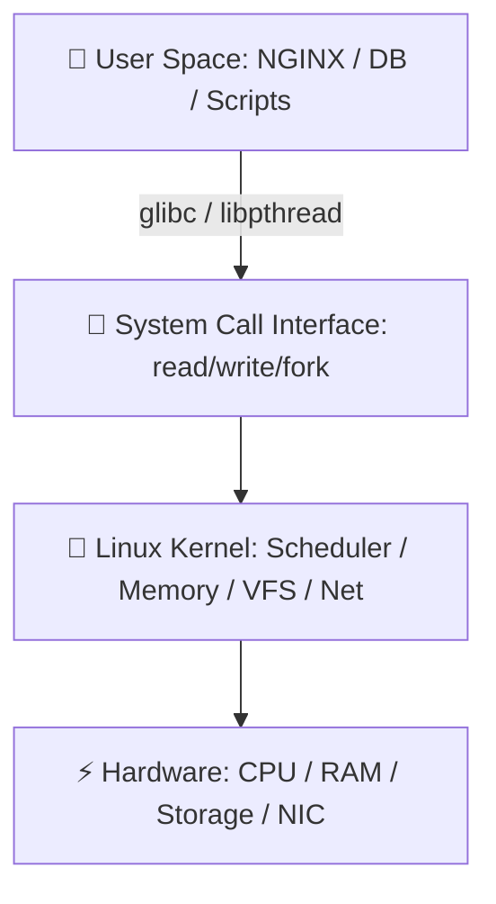
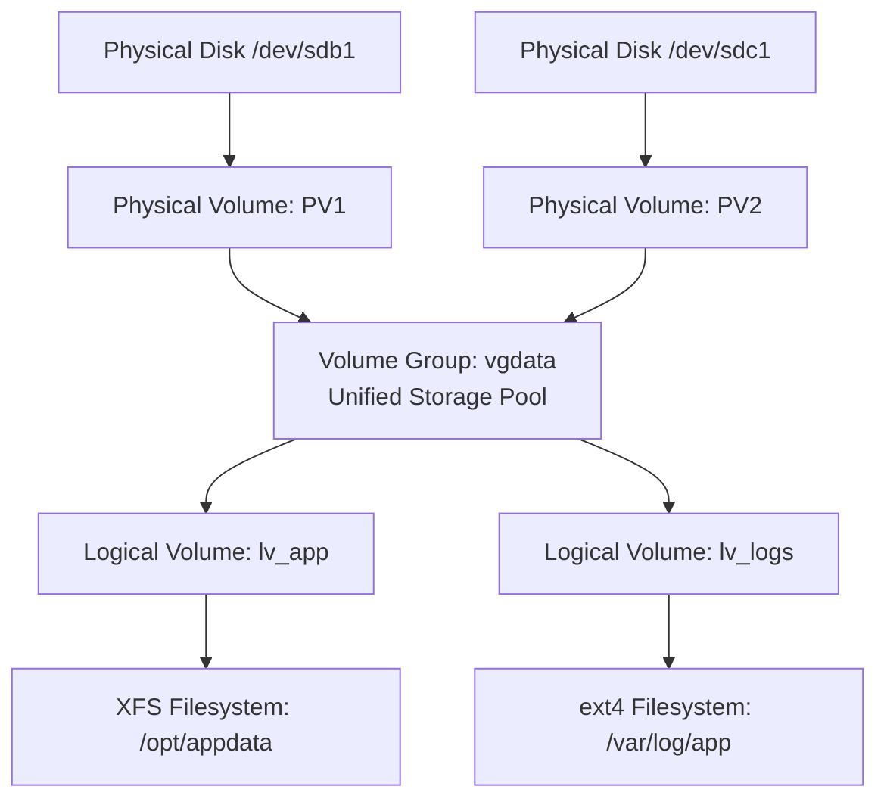

# 🐧 Linux Production Systems Engineering Master Handbook (Volume 1)
> **Comprehensive Senior SRE, DevOps & Production Engineering Handbook (Questions 1 – 200)**  
> *Architected for Long-Term Memory Retention, Incident Response Playbooks, and High-Yield Interview Mastery.*

---

## 📑 Table of Contents
1. [Core Mental Models for Systems Engineering](#1-core-mental-models-for-systems-engineering)
2. [Sequential Chapter Summaries (Modules 1–15)](#2-sequential-chapter-summaries)
   - [1. Linux Foundations & Architecture Stack](#1-linux-foundations--architecture-stack)
   - [2. Boot Sequence, Bootloaders & systemd Targets](#2-boot-sequence-bootloaders--systemd-targets)
   - [3. Filesystem Hierarchy Standard (FHS) & Inode Mechanics](#3-filesystem-hierarchy-standard-fhs--inode-mechanics)
   - [4. Permissions, SUID/SGID, Sticky Bit & ACLs](#4-permissions-suidsgid-sticky-bit--acls)
   - [5. Process Lifecycle, Threads & Signal Handling](#5-process-lifecycle-threads--signal-handling)
   - [6. System Information & Environment Configuration](#6-system-information--environment-configuration)
   - [7. Package Management & Dynamic Kernel Modules](#7-package-management--dynamic-kernel-modules)
   - [8. Service Management (systemd) & Task Scheduling](#8-service-management-systemd--task-scheduling)
   - [9. Storage Partitioning, GPT vs MBR & `/etc/fstab`](#9-storage-partitioning-gpt-vs-mbr--etcfstab)
   - [10. Logical Volume Management (LVM) Architecture](#10-logical-volume-management-lvm-architecture)
   - [11. Swap Memory Management & Swappiness Tuning](#11-swap-memory-management--swappiness-tuning)
   - [12. RAID Arrays & Network Storage (NFS / CIFS)](#12-raid-arrays--network-storage-nfs--cifs)
   - [13. Storage Performance Metrics (IOPS, Latency, %util)](#13-storage-performance-metrics-iops-latency-util)
   - [14. Production Incident Troubleshooting Scenarios](#14-production-incident-troubleshooting-scenarios)
   - [15. High-Frequency Interview Q&A (Questions 1–200)](#15-high-frequency-interview-qa-questions-1200)
3. [Production Incident Triage Cheatsheet](#3-production-incident-triage-cheatsheet)

---

## 1. Core Mental Models for Systems Engineering

```
                          THE LINUX SYSTEM STACK
 ┌────────────────────────────────────────────────────────────────────────┐
 │ 1. USER SPACE: Applications (NGINX, MySQL, Docker, Bash)               │
 ├────────────────────────────────────────────────────────────────────────┤
 │ 2. SYSTEM LIBRARIES: glibc, OpenSSL, libpthread                        │
 ├────────────────────────────────────────────────────────────────────────┤
 │ 3. SYSTEM CALL INTERFACE: sys_read(), sys_write(), sys_fork(), exec()  │
 ├────────────────────────────────────────────────────────────────────────┤
 │ 4. LINUX KERNEL (Monolithic):                                          │
 │    [Process Scheduler] [Virtual File System (VFS)] [Memory Mgmt / MMU] │
 │    [Network Stack (TCP/IP)] [Device Drivers] [cgroups & Namespaces]    │
 ├────────────────────────────────────────────────────────────────────────┤
 │ 5. HARDWARE: CPU, RAM, NVMe / SSD / HDD, Network Interface Cards (NIC) │
 └────────────────────────────────────────────────────────────────────────┘
```

### 🧠 4 Core Rules to Remember for Life
1. **Everything is a File Descriptor:** In Linux, files, directories, block storage devices (`/dev/sda`), pseudo-files (`/proc`), and network sockets are all represented as file descriptors.
2. **df vs du (Metadata vs Data Tree):** `df` queries filesystem superblocks (counts space held by deleted-but-open files); `du` traverses actual directories.
3. **Inodes Hold Metadata, Not Filenames:** Filenames exist strictly inside directory entries pointing to Inode numbers.
4. **LVM = Dynamic Lego Blocks:** Disks $\rightarrow$ Physical Volumes (PV) $\rightarrow$ Volume Groups (VG Pool) $\rightarrow$ Logical Volumes (LV) $\rightarrow$ Filesystems.

---

## 2. Sequential Chapter Summaries

---

### 1. Linux Foundations & Architecture Stack

#### 🎯 Key Concept in Simple Terms
Linux is a **monolithic kernel** that runs in Ring 0 (Kernel Space). User applications run in Ring 3 (User Space) and must pass through the **System Call Interface** (`syscalls`) to request hardware resources.



* **Debian/Ubuntu Family:** Cloud/container standard; uses `apt` / `dpkg` with `.deb` packages.
* **Enterprise Red Hat Family (RHEL, Rocky, AlmaLinux):** Enterprise server standard; uses `dnf` / `rpm` with `.rpm` packages.

---

### 2. Boot Sequence, Bootloaders & systemd Targets

```
                               6-STAGE BOOT WORKFLOW
 ┌──────────────┐    ┌──────────────┐    ┌──────────────┐    ┌──────────────┐
 │  1. POST     │───▶│  2. BIOS /   │───▶│  3. GRUB2    │───▶│  4. Kernel & │
 │ (Hardware OK)│    │     UEFI     │    │  Bootloader  │    │   initramfs  │
 └──────────────┘    └──────────────┘    └──────────────┘    └──────────────┘
                                                                    │
                                                                    ▼
 ┌──────────────┐                         ┌──────────────┐    ┌──────────────┐
 │  Target Units│◀────────────────────────│ 6. multi-user│◀───│  5. systemd  │
 │  (Services)  │                         │   .target    │    │   (PID 1)    │
 └──────────────┘                         └──────────────┘    └──────────────┘
```

#### 🛡️ BIOS vs UEFI
| Feature | BIOS (Legacy) | UEFI (Modern Standard) |
| :--- | :--- | :--- |
| **Partition Table** | MBR (Master Boot Record) | GPT (GUID Partition Table) |
| **Disk Size Ceiling**| Max 2 TB | Up to 9.4 ZB (Zettabytes) |
| **Security** | None | Secure Boot (Cryptographic driver validation) |

#### 🎯 systemd Targets (Replacing Legacy Runlevels)
* `multi-user.target` *(Old Runlevel 3)*: Standard CLI server with full networking.
* `graphical.target` *(Old Runlevel 5)*: Desktop GUI mode.
* `rescue.target` *(Old Runlevel 1)*: Single-user maintenance mode for emergency repair.

```bash
# Check current default boot target
systemctl get-default

# Change default boot target to headless server mode
sudo systemctl set-default multi-user.target
```

---

### 3. Filesystem Hierarchy Standard (FHS) & Inode Mechanics

#### 📁 Standard Directory Structure
```
/ (Root Directory)
├── bin, sbin ──▶ Core command binaries (symlinked to /usr/bin)
├── boot      ──▶ Kernel images (vmlinuz), initramfs, GRUB configs
├── dev       ──▶ Special device nodes (/dev/sda, /dev/null, /dev/urandom)
├── etc       ──▶ Host-specific system & service configuration files
├── home      ──▶ Regular user home directories (/home/ubuntu)
├── opt       ──▶ Standalone third-party software packages (/opt/docker)
├── proc, sys ──▶ In-memory virtual pseudo-filesystems (Kernel & process state)
├── run       ──▶ Ephemeral runtime state since last boot (tmpfs)
├── tmp       ──▶ Temporary files (auto-wiped on system reboot)
├── usr       ──▶ User binaries, shared libraries (/usr/lib), read-only assets
└── var       ──▶ Dynamic variable data: /var/log (logs), /var/lib/mysql (DB data)
```

#### 🔗 Hard Links vs Soft (Symbolic) Links
```
  [file1.txt] ────┐
                  ├───▶ [ Inode 1048576 ] ───▶ [ Physical Data Blocks on Disk ]
  [file2.txt] ────┘     (HARD LINK: Shares exact same inode; survives file deletion)

  [link.txt]  ────────▶ [ Inode 2049100 ] ───▶ Points to String Path: "/data/file1.txt"
                        (SOFT LINK: Independent inode; breaks if target is moved/deleted)
```

| Metric | Hard Link (`ln target link`) | Soft Link (`ln -s target link`) |
| :--- | :--- | :--- |
| **Inode** | Shares exact same inode number | Creates a new distinct inode |
| **Cross-Filesystem** | ❌ No (same partition only) | ✅ Yes (crosses disks/mounts) |
| **Directory Linking**| ❌ No | ✅ Yes |
| **Original Deleted** | ✅ File content preserved | ❌ Becomes a broken dangling link |

---

### 4. Permissions, SUID/SGID, Sticky Bit & ACLs

#### 🧮 Octal Permission Math
$$\text{Read (r)} = 4 \quad|\quad \text{Write (w)} = 2 \quad|\quad \text{Execute (x)} = 1$$

* `chmod 755 app.sh` $\implies \text{rwxr-xr-x}$ (Owner: 7 [rwx], Group: 5 [r-x], Others: 5 [r-x])
* `chmod 600 id_ed25519` $\implies \text{rw-------}$ (Owner: 6 [rw-], Group/Others: 0 [---])

```
                     SPECIAL PERMISSION BITS
 ┌──────────────────────┬───────┬─────────────────────────────────────────────┐
 │ Bit                  │ Octal │ Function in Production                      │
 ├──────────────────────┼───────┼─────────────────────────────────────────────┤
 │ SUID (Set User ID)   │ 4000  │ Binary executes as file OWNER (e.g. passwd) │
 │ SGID (Set Group ID)  │ 2000  │ New files inherit parent DIRECTORY group    │
 │ Sticky Bit           │ 1000  │ Only file OWNER or root can delete (/tmp)   │
 └──────────────────────┴───────┴─────────────────────────────────────────────┘
```

```bash
# Secure a multi-user collaborative DevOps directory
sudo mkdir -p /opt/devops_shared
sudo chown -R root:devops /opt/devops_shared
sudo chmod 2770 /opt/devops_shared   # rwxrws--- (SGID enabled)
sudo chmod +t /opt/devops_shared     # rwxrws--T (Sticky Bit enabled)
```

---

### 5. Process Lifecycle, Threads & Signal Handling

```
  [NEW] ──▶ [READY (Queue)] ──▶ [RUNNING (CPU)] ──▶ [TERMINATED / EXIT]
                   ▲                  │
                   │   I/O or Wait    │
                   └──────────────────┘
```

#### 🚦 Process States
* **`R` (Running / Runnable):** Actively computing on CPU or queued in CFS run queue.
* **`S` (Interruptible Sleep):** Idle, waiting for an event, socket signal, or timer.
* **`D` (Uninterruptible Sleep):** Blocked waiting directly on hardware/disk I/O.
* **`T` (Stopped):** Paused via `Ctrl + Z` or `SIGSTOP`.
* **`Z` (Zombie):** Dead process waiting for parent to collect exit code via `waitpid()`.

#### ⚡ Core Linux Signals
* **`SIGHUP` (1):** Reload configuration without dropping network traffic.
* **`SIGINT` (2):** Interactive interrupt (`Ctrl + C`).
* **`SIGKILL` (9):** Uncatchable immediate termination by the kernel.
* **`SIGTERM` (15):** Standard graceful shutdown request (allows cleanup of connections and files).

---

### 6. System Information & Environment Configuration

```bash
uname -a                  # Kernel version and architecture
hostnamectl               # Comprehensive OS, virtualization, and host info
uptime                    # System load averages (1, 5, 15 min)
lscpu                     # CPU sockets, cores, virtualization extensions
free -h                   # RAM and Swap breakdown
```

* **Login Shells (SSH):** Loads `/etc/profile` $\rightarrow$ `~/.bash_profile` (or `~/.profile`).
* **Non-Login Interactive Shells (Subshells / Scripts):** Loads `/etc/bash.bashrc` $\rightarrow$ `~/.bashrc`.

---

### 7. Package Management & Dynamic Kernel Modules

#### 📦 Package Management Matrix
| Task | Debian / Ubuntu (`apt`) | RHEL / Rocky / AlmaLinux (`dnf`) |
| :--- | :--- | :--- |
| **Refresh Repos** | `sudo apt update` | `sudo dnf makecache` |
| **Upgrade Software**| `sudo apt upgrade` | `sudo dnf upgrade` |
| **Install Package** | `sudo apt install nginx` | `sudo dnf install nginx` |
| **Direct Package**  | `dpkg -i package.deb` | `rpm -ivh package.rpm` |

#### 🔌 Kernel Modules (`.ko` in `/lib/modules/$(uname -r)/`)
```bash
lsmod                             # List active loaded kernel modules
sudo modprobe br_netfilter        # Load module AND auto-resolve dependencies
sudo modprobe -r br_netfilter     # Remove module safely
```

---

### 8. Service Management (`systemd`) & Task Scheduling

```bash
# Service Lifecycle Control
sudo systemctl start nginx
sudo systemctl stop nginx
sudo systemctl restart nginx
sudo systemctl reload nginx        # Hot-reload config without dropping client connections
sudo systemctl enable --now nginx  # Enable on boot and start immediately
sudo systemctl status nginx

# Always reload systemd after modifying unit files
sudo systemctl daemon-reload
```

#### ⏰ Scheduling: `cron` vs `systemd` Timers
* **`cron` format:** `Minute Hour Day Month DayOfWeek Command`
  * Example: `0 2 * * * /opt/scripts/db_backup.sh >> /var/log/backup.log 2>&1`
* **`systemd` Timers:** Modern standard; catches up missed execution after downtime (`Persistent=true`), accurate to nanoseconds, and integrates with `journalctl`.

---

### 9. Storage Partitioning, GPT vs MBR & `/etc/fstab`

$$\text{Physical Disk (/dev/sdb)} \longrightarrow \text{Partition (/dev/sdb1)} \longrightarrow \text{Filesystem (ext4/XFS)} \longrightarrow \text{Mount Point (/data)}$$

#### 💾 `/etc/fstab` Persistent Mount Entry
```ini
# <Device/UUID>                          <Mount Point> <FSType> <Options>                <Dump> <Pass>
UUID=e81d7f3a-9c4b-4f62-b921-1234567890ab /data         xfs      defaults,noatime,nofail  0      2
```
* **`noatime`:** Disables writing access timestamps, improving I/O throughput.
* **`nofail`:** Prevents system boot failure if an external or cloud volume is missing.
* **Verification:** Always run `sudo mount -a` before rebooting to catch syntax errors!

---

### 10. Logical Volume Management (LVM) Architecture



#### 🚀 Zero-Downtime Online Storage Expansion
```bash
# 1. Add new physical disk to Volume Group
sudo pvcreate /dev/sdd1
sudo vgextend vgdata /dev/sdd1

# 2. Expand Logical Volume by 50GB
sudo lvextend -L +50G /dev/vgdata/lv_app

# 3. Grow filesystem online without unmounting
sudo xfs_growfs /opt/appdata            # For XFS
# OR: sudo resize2fs /dev/vgdata/lv_app # For ext4
```

---

### 11. Swap Memory Management & Swappiness Tuning

Swap acts as an overflow safety buffer when physical RAM is exhausted, preventing immediate Out-of-Memory (OOM) kernel terminations.

```bash
# Create and activate a 4GB swapfile
sudo fallocate -l 4G /swapfile
sudo chmod 600 /swapfile
sudo mkswap /swapfile
sudo swapon /swapfile

# Configure vm.swappiness (Recommended for servers: 10)
cat /proc/sys/vm/swappiness
sudo sysctl -w vm.swappiness=10
```

---

### 12. RAID Arrays & Network Storage (NFS / CIFS)

#### 🛡️ RAID Levels Comparison
| Level | Min Disks | Fault Tolerance | Usable Capacity | Performance | Best Use Case |
| :--- | :--- | :--- | :--- | :--- | :--- |
| **RAID 0** | 2 | 0 Disks (Data loss if 1 fails)| 100% | Ultra High Read/Write | Non-critical cache/temp data |
| **RAID 1** | 2 | 1 Disk | 50% | High Read, Normal Write | Boot disks, OS partitions |
| **RAID 5** | 3 | 1 Disk (Distributed Parity) | $(N-1)/N$ | High Read, Slower Write | General storage, file shares |
| **RAID 6** | 4 | 2 Disks (Dual Parity) | $(N-2)/N$ | High Read, Slower Write | High-resilience enterprise arrays|
| **RAID 10**| 4 | 1 Disk per mirror pair | 50% | Ultra High Read & Write | High-throughput databases |

* **NFS (Port 2049):** Linux-to-Linux storage clusters and Kubernetes Persistent Volumes.
* **CIFS / SMB (Port 445):** Windows/Linux cross-platform network shares.

---

### 13. Storage Performance Metrics (IOPS, Latency, %util)

```bash
# Detailed per-disk performance breakdown
iostat -xz 1 5

# Interactive per-process disk I/O monitoring
sudo iotop -oPa
```

* **IOPS:** Frequency of individual I/O requests per second (Critical for databases).
* **Throughput (MB/s):** Volume of data transferred per second (Critical for backups/streaming).
* **`await` (Latency in ms):** Average time for disk requests. **`>15-20ms`** indicates severe I/O delay.
* **`%util`:** Percentage of time the disk was busy. **`>85%`** indicates disk saturation.

---

### 14. Production Incident Troubleshooting Scenarios

```
                            3 CLASSIC STORAGE INCIDENTS
 ┌─────────────────────────────────────────────────────────────────────────────────┐
 │ Scenario 1: Disk shows Free Space, but writes fail with "No space left on device"│
 │ • Root Cause: Inode Exhaustion (Too many tiny files).                           │
 │ • Diagnosis: df -i (Look for 100% inode usage).                                 │
 │ • Fix: find /var/spool -type d ... | wc -l to find and clean rogue session files│
 ├─────────────────────────────────────────────────────────────────────────────────┤
 │ Scenario 2: High Disk Space Usage, but 'du' cannot find any large files         │
 │ • Root Cause: Deleted log files held open by running processes (unlinked FDs).  │
 │ • Diagnosis: lsof +L1                                                           │
 │ • Fix: Gracefully reload or restart the process (e.g. systemctl reload nginx).  │
 ├─────────────────────────────────────────────────────────────────────────────────┤
 │ Scenario 3: Filesystem suddenly remounts as Read-Only (ro)                      │
 │ • Root Cause: Kernel detected storage corruption or SAN timeout (errors=remount-ro)│
 │ • Diagnosis: dmesg -T | grep -E "EXT4|XFS|I/O error"                            │
 │ • Fix: Unmount (umount /data) → Run repair (fsck -y / xfs_repair) → Remount rw  │
 └─────────────────────────────────────────────────────────────────────────────────┘
```

---

### 15. High-Frequency Interview Q&A (Questions 1–200)

| Question | Senior Engineer Direct Answer |
| :--- | :--- |
| **Q: What is the exact difference between `df` and `du`?** | *"df queries filesystem metadata/superblocks directly, including space held open by deleted-but-active file descriptors. du traverses the actual directory tree and sums existing file sizes."* |
| **Q: What is the difference between `systemctl restart` and `reload`?** | *"restart terminates the process and starts a fresh one (causes brief downtime). reload sends a SIGHUP signal to re-read config files without dropping active TCP client connections."* |
| **Q: What happens when you delete the source of a Hard Link vs Soft Link?** | *"With a Hard Link, the data remains intact and accessible as long as at least 1 hard link points to the Inode. With a Soft Link, the link breaks immediately (dangling symlink)."* |
| **Q: Can an XFS filesystem be shrunk/reduced?** | *"No. XFS supports online expansion (`xfs_growfs`), but does not support shrinking. To reduce size, you must backup, recreate the filesystem, and restore."* |
| **Q: Why are UUIDs used in `/etc/fstab` instead of `/dev/sda1`?** | *"Device node names (`/dev/sda1`) can shift dynamically across reboots depending on hardware detection order and bus topology. UUIDs are persistent cryptographic identifiers stored in the superblock."* |

---

## 3. Production Incident Triage Cheatsheet

```
                        PRODUCTION TRIAGE SEQUENCE
 ┌──────────────┐    ┌──────────────┐    ┌──────────────┐    ┌──────────────┐
 │ 1. Reachable?│───▶│ 2. System    │───▶│ 3. Memory &  │───▶│ 4. Storage & │
 │ (ping / ssh) │    │ Load & CPU   │    │ OOM Status   │    │ Inode Health │
 └──────────────┘    └──────────────┘    └──────────────┘    └──────────────┘
                            │                   │                   │
                     uptime / top -c         free -h             df -h / df -i
                                                                    │
                                                                    ▼
 ┌──────────────┐    ┌──────────────┐    ┌──────────────┐    ┌──────────────┐
 │ 8. Verify &  │◀───│ 7. Port & Net│◀───│ 6. System &  │◀───│ 5. Services  │
 │  Post-Mortem │    │ Sockets (ss) │    │ Service Logs │    │ (systemctl)  │
 └──────────────┘    └──────────────┘    └──────────────┘    └──────────────┘
```

---
*Created for Systems Engineering Mastery & Production Architecture Excellence.*
