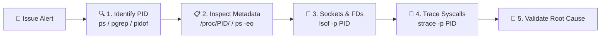
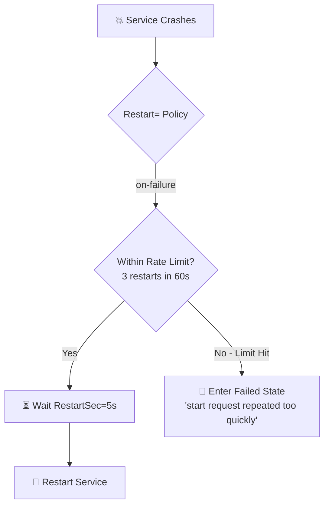
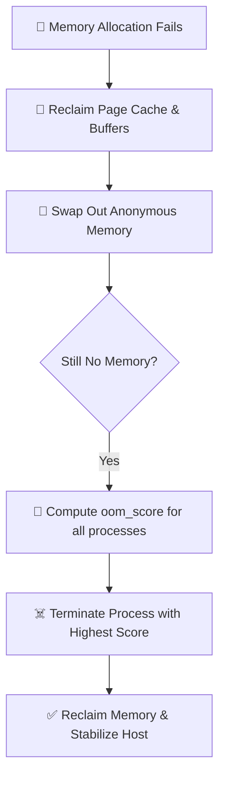

# 🐧 Linux Production Interview Bible — Section 2: Processes, Services & Performance
> **A Comprehensive Senior Production Engineering Guide (Questions 201 – 300)**
> *Optimized for Long-Term Memory Retention, Technical Interviews, and Real-World Production Troubleshooting.*

---

## 📑 Table of Contents
1. [Core Mental Models for Production Engineering](#1-core-mental-models-for-production-engineering)
2. [Topic-by-Topic Deep Dives (Pages 41–60)](#2-topic-by-topic-deep-dives)
   - [Page 41: Advanced Process Investigation](#page-41-advanced-process-investigation-q201-205)
   - [Page 42: Process Trees & Parent Relationships](#page-42-process-trees--parent-relationships-q206-210)
   - [Page 43: Linux Namespaces & Process Isolation](#page-43-linux-namespaces--process-isolation-q211-215)
   - [Page 44: Zombie, Orphan & Stuck (D-State) Processes](#page-44-zombie-orphan--stuck-d-state-processes-q216-220)
   - [Page 45: Systemd Unit File Architecture](#page-45-systemd-unit-file-architecture-q221-225)
   - [Page 46: Service Dependencies & Startup Ordering](#page-46-service-dependencies--startup-ordering-q226-230)
   - [Page 47: Service Restart & Failure Control](#page-47-service-restart--failure-control-q231-235)
   - [Page 48: Resource Limits & `ulimit`](#page-48-resource-limits--ulimit-q236-240)
   - [Page 49: cgroups & Resource Governance (v1 vs v2)](#page-49-cgroups--resource-governance-q241-245)
   - [Page 50: CPU Scheduling & Process Priority](#page-50-cpu-scheduling--process-priority-q246-250)
   - [Page 51: Load Average & Run Queue Analysis](#page-51-load-average--run-queue-analysis-q251-255)
   - [Page 52: Memory Pressure & Linux Memory Accounting](#page-52-memory-pressure--linux-memory-accounting-q256-260)
   - [Page 53: OOM Killer & Memory Failure Investigation](#page-53-oom-killer--memory-failure-investigation-q261-265)
   - [Page 54: CPU Bottleneck Investigation](#page-54-cpu-bottleneck-investigation-q266-270)
   - [Page 55: Context Switching & Scheduler Pressure](#page-55-context-switching--scheduler-pressure-q271-275)
   - [Page 56: NUMA & Multi-Socket Performance](#page-56-numa--multi-socket-performance-q276-280)
   - [Page 57: Performance Baselines & Capacity Signals](#page-57-performance-baselines--capacity-signals-q281-285)
   - [Page 58: Production Performance Toolkit](#page-58-production-performance-toolkit-q286-290)
   - [Page 59: Incident Scenarios & Troubleshooting Playbooks](#page-59-incident-scenarios--troubleshooting-playbooks-q291-295)
   - [Page 60: Master Production Review & Readiness Checklist](#page-60-master-production-review--readiness-checklist-q296-300)
3. [Senior Engineer Interview Quick-Fire Cheat Sheet](#3-senior-engineer-interview-quick-fire-cheat-sheet)

---

## 1. Core Mental Models for Production Engineering

```
                             THE 8-STEP INVESTIGATION FRAMEWORK
 ┌──────────────┐    ┌──────────────┐    ┌──────────────┐    ┌──────────────┐
 │  1. Impact   │───▶│ 2. Timeline  │───▶│ 3. Gather    │───▶│4. Hypothesize│
 │  Assessment  │    │ Construction │    │   Evidence   │    │  Root Cause  │
 └──────────────┘    └──────────────┘    └──────────────┘    └──────────────┘
        ▲                                                           │
        │                                                           ▼
 ┌──────────────┐    ┌──────────────┐    ┌──────────────┐    ┌──────────────┐
 │  8. Prevent  │◀───│  7. Verify   │◀───│  6. Recover  │◀───│5. Test Safely│
 │  Recurrence  │    │  Stability   │    │   Service    │    │ (Least Risk) │
 └──────────────┘    └──────────────┘    └──────────────┘    └──────────────┘
```

### 🧠 3 Golden Rules to Remember
1. **Never kill blindly:** Always understand *who* owns the process (PPID) and *why* it is stuck before executing `kill -9`.
2. **Correlate, Don't Guess:** High Load $\neq$ High CPU. High Memory Usage $\neq$ Memory Leak. Correlate across CPU, Memory, I/O, and Network.
3. **Start Read-Only:** Use `top`, `vmstat`, `lsof`, `journalctl`, and `/proc` before running invasive tools like `strace` or restart commands.

---

## 2. Topic-by-Topic Deep Dives

---

### Page 41: Advanced Process Investigation (Q201–205)

#### 🎯 Key Concept in Simple Terms
When an incident happens, you need to identify the exact culprit process, what command launched it, what files/network ports it holds open, and what system calls it makes.



#### 📁 Inside `/proc/<PID>/` (Kernel's Live Window)
| File / Directory | What It Tells You | Practical Production Use |
| :--- | :--- | :--- |
| `cmdline` | Full command-line arguments (separated by null bytes) | Verify if the correct config flags were passed |
| `environ` | Environment variables of the running process | Check for missing `DATABASE_URL` or wrong `JAVA_HOME` |
| `status` | Process state (R, S, D, Z), VmSize, Threads, Uid | Quick health check without parsing `ps` |
| `fd/` | Directory of symlinks to open files and sockets | Check file descriptor leaks or locked log files |
| `fdinfo/` | Flags and seek position for open descriptors | Monitor if a process is actively reading a file |
| `io` | Read/write bytes and syscall counts | Spot runaway disk writes per process |
| `maps` / `smaps` | Virtual memory mappings & detailed PSS/RSS usage | Investigate memory fragmentation and shared libs |
| `cwd` / `root` | Current working dir and chroot directory | Spot paths for rogue binaries |
| `task/` | Subdirectory containing all Thread IDs (TIDs) | Identify which exact thread consumes 100% CPU |
| `net/` | Network namespace socket information | Check per-process TCP/UDP connection states |

#### 🛠️ Essential Commands
```bash
# 1. Snapshot all processes with custom columns
ps -eo pid,ppid,user,stat,%cpu,%mem,etime,cmd --sort=-%cpu | head -n 15

# 2. Find PID by name pattern
pgrep -fl nginx
pidof mysqld

# 3. List all open network sockets and files for a PID
lsof -p 1234
lsof -i :8080 -sTCP:LISTEN

# 4. Safely trace system calls without crashing high-traffic apps
strace -p 1234 -e trace=network,file -s 128 -c   # -c gives summary statistics
```

> [!CAUTION]
> Running `strace` on high-throughput production services (e.g. Redis, high-load DBs) can slow them down by 10x–50x. Always use `-c` for summaries or filter with `-e trace=...`.

---

### Page 42: Process Trees & Parent Relationships (Q206–210)

#### 🎯 Key Concept in Simple Terms
Linux organizes all processes as a strict hierarchy. **PID 1 (`systemd`)** is the ancestor of everything. Every child process inherits environment variables and file descriptors from its parent (PPID).

```
         ┌──────────────────────────────────────┐
         │         systemd (PID 1)              │
         └──────────────────┬───────────────────┘
                            │
              ┌─────────────┴─────────────┐
              ▼                           ▼
      sshd (PID 100)              nginx (PID 1234 - Master)
              │                           │
      bash (PID 2345)             ┌───────┴───────┐
              │                   ▼               ▼
      rsync (PID 3456)      worker (1235)   worker (1236)
                                  │               │
                               [Threads]       [Threads]
```

#### 💡 Key Rules
- **Parent controls lifecycle:** If a worker crashes, the master process is responsible for restarting it.
- **Root Cause Direction:** Always investigate **upwards** to the parent to stop a restart loop, and **downwards** to children/threads to find the resource hog.
- **Threads vs Processes:** Threads share the same PID address space but have distinct TIDs in `/proc/<PID>/task/`.

#### 🛠️ Essential Commands
```bash
# View full process hierarchy tree
pstree -p
ps --forest -eo pid,ppid,user,stat,cmd

# Find all children of a specific parent PID
pgrep -P 1234

# View thread IDs for a process
ls /proc/1234/task/
```

---

### Page 43: Linux Namespaces & Process Isolation (Q211–215)

#### 🎯 Key Concept in Simple Terms
Namespaces are the foundational building blocks of containers (Docker, Podman, Kubernetes). They do **not** virtualize hardware; they provide isolated **views** of global system resources to a set of processes.

```
                    ┌───────────────────────────────┐
                    │     Host Linux Kernel (1)     │
                    └───────────────┬───────────────┘
            ┌───────────────────────┼───────────────────────┐
            ▼                       ▼                       ▼
   ┌─────────────────┐     ┌─────────────────┐     ┌─────────────────┐
   │  Container A    │     │  Container B    │     │  Container C    │
   │  PID 1 (App)    │     │  PID 1 (App)    │     │  PID 1 (App)    │
   │  Isolated Net   │     │  Isolated Net   │     │  Isolated Net   │
   │  Isolated Mount │     │  Isolated Mount │     │  Isolated Mount │
   └─────────────────┘     └─────────────────┘     └─────────────────┘
```

#### 🛡️ The 8 Linux Namespaces
| Namespace | Flag | What It Isolates | Why It Matters in Production |
| :--- | :--- | :--- | :--- |
| **PID** | `-p` | Process ID space | Container sees its own `PID 1`; cannot see host PIDs |
| **Mount (`mnt`)** | `-m` | Filesystem mount points | Root filesystem `/` isolation, private mounts |
| **Network (`net`)**| `-n` | IP addresses, routing, firewall | Dedicated virtual NIC (`veth`), loopback, port 80 |
| **User (`user`)** | `-U` | UID/GID mappings | Root inside container maps to non-root on host |
| **UTS** | `-u` | Hostname and NIS domain | Container can have hostname `web-app-01` independently |
| **IPC** | `-i` | POSIX message queues, semaphores| Prevents inter-process memory tampering between apps |
| **Cgroup** | `-C` | Root directory for cgroups | Restricts visibility of system-wide cgroup structure |
| **Time** | `-T` | System clocks (monotonic/boot) | Independent clock offsets for testing & simulation |

#### 🛠️ Essential Commands
```bash
# List all active namespaces on the host
lsns

# Enter a container's namespace from the host for troubleshooting
sudo nsenter -t <CONTAINER_PID> -m -u -i -n -p /bin/bash

# Run a command in a new isolated network namespace
sudo unshare -n -- /bin/bash
```

---

### Page 44: Zombie, Orphan & Stuck (D-State) Processes (Q216–220)

#### 🎯 Key Concept in Simple Terms
- **Zombie Process (`Z`):** A process that has finished execution (dead), but its exit status remains in the process table because the parent has not called `wait()` / `waitpid()`.
- **Orphan Process:** A process whose parent died while it was still running. It is adopted by `PID 1` (`systemd`), which automatically reaps it upon exit.
- **Uninterruptible Sleep (`D`):** A process blocked waiting for hardware/kernel I/O (disk, NFS, lock). **It ignores all signals, including `kill -9`**.

```
                   ZOMBIE vs ORPHAN vs D-STATE
 ┌─────────────────────────────────────────────────────────────────┐
 │ ZOMBIE (Z)                                                      │
 │ • Child: Dead (Code finished)    • Memory/CPU: 0MB, 0% CPU      │
 │ • Parent: Alive, forgot to wait()• Fix: Fix parent or restart it│
 ├─────────────────────────────────────────────────────────────────┤
 │ ORPHAN                                                          │
 │ • Child: Alive and running       • Adopted by: PID 1 (systemd)  │
 │ • Reaping: Cleanly handled by systemd upon completion           │
 ├─────────────────────────────────────────────────────────────────┤
 │ UNINTERRUPTIBLE SLEEP (D)                                       │
 │ • State: Stuck in kernel I/O     • Signals: IGNORES kill -9     │
 │ • Cause: Unresponsive NFS/Disk   • Fix: Fix backend storage/host│
 └─────────────────────────────────────────────────────────────────┘
```

#### ❓ Interview Question: Why doesn't `kill -9` work on a Zombie or D-State?
- **Zombie:** It is already dead. You cannot kill what is not alive. Only the parent process reading its status or the parent being terminated will remove the entry from the process table.
- **D-State:** The process is waiting inside a critical kernel code path where interrupting it could corrupt kernel or filesystem state. The kernel will only resume it once the I/O request completes or errors out.

#### 🛠️ Essential Commands
```bash
# Find all Zombie processes
ps -eo pid,ppid,stat,cmd | awk '$3 ~ /Z/'

# Find D-state processes
ps -eo pid,ppid,stat,wchan:20,cmd | grep " D"

# Check where a D-state process is stuck in kernel stack
cat /proc/<PID>/stack
cat /proc/<PID>/wchan

# Inspect kernel logs for hardware/NFS errors
dmesg -T | tail -n 50
```

---

### Page 45: Systemd Unit File Architecture (Q221–225)

#### 🎯 Key Concept in Simple Terms
Systemd uses declarative `.service` configuration files composed of three mandatory sections: `[Unit]` (metadata & dependencies), `[Service]` (execution instructions), and `[Install]` (boot enablement target).

```ini
# /etc/systemd/system/myapp.service
[Unit]
Description=Core API Gateway Service
After=network-online.target
Wants=network-online.target

[Service]
Type=simple
User=appuser
Group=appgroup
WorkingDirectory=/opt/myapp
EnvironmentFile=/etc/myapp/env
ExecStart=/opt/myapp/bin/gateway --config /etc/myapp/config.yml
ExecReload=/bin/kill -HUP $MAINPID
Restart=on-failure
RestartSec=5s

# Security Hardening & Limits
LimitNOFILE=65535
MemoryMax=2G
CPUQuota=200%

[Install]
WantedBy=multi-user.target
```

#### ⚙️ Service `Type=` Breakdown
- `simple` *(Default)*: `ExecStart` is the main process. Systemd considers it started immediately.
- `forking`: `ExecStart` spawns a background daemon and the parent exits (e.g. traditional Nginx/MySQL). Requires `PIDFile=`.
- `oneshot`: Runs a short task and exits (e.g. database migrations, cleanup scripts).
- `notify`: The service sends an explicit readiness signal via `sd_notify()` before systemd considers it active.

#### 🛠️ Essential Commands
```bash
# Verify unit file syntax
systemd-analyze verify /etc/systemd/system/myapp.service

# Reload systemd configuration after file edits (MANDATORY)
sudo systemctl daemon-reload

# Check service status, logs, and cgroup resource usage
systemctl status myapp.service
journalctl -u myapp.service -f -n 100
```

---

### Page 46: Service Dependencies & Startup Ordering (Q226–230)

#### 🎯 Key Concept in Simple Terms
In systemd, **ordering is completely separate from dependency**.
- `Before=` / `After=` = **WHEN** to start.
- `Requires=` / `Wants=` = **WHAT** must be started together.

```
       ORDERING vs DEPENDENCY MATRIX
                 ┌───────────────────┬───────────────────┐
                 │    Order Only     │  Order + Require  │
 ┌───────────────┼───────────────────┼───────────────────┤
 │ Strict (Hard) │ After=foo.service │ Requires=foo      │
 │ Dependency    │                   │ After=foo.service │
 ├───────────────┼───────────────────┼───────────────────┤
 │ Weak (Soft)   │ Before=bar.service│ Wants=bar         │
 │ Dependency    │                   │ After=bar.service │
 └───────────────┴───────────────────┴───────────────────┘
```

> [!WARNING]
> If Service A has `Requires=B.service` but omits `After=B.service`, systemd will launch both **in parallel**. A will likely crash because B is not ready yet!

#### 🛠️ Dependency Management Tools
```bash
# View complete dependency tree
systemctl list-dependencies myapp.service

# Find bottleneck in boot startup time (Critical Path analysis)
systemd-analyze critical-chain
systemd-analyze blame
```

---

### Page 47: Service Restart & Failure Control (Q231–235)

#### 🎯 Key Concept in Simple Terms
Uncontrolled restarts cause **restart storms**, which peg the CPU at 100% and fill disks with log noise. Systemd provides rate limiters to prevent endless loops.



#### 🛡️ Protection Configuration
```ini
[Service]
Restart=on-failure
RestartSec=5s

# Allow max 3 restarts in a 60-second window
StartLimitIntervalSec=60s
StartLimitBurst=3
```

---

### Page 48: Resource Limits & `ulimit` (Q236–240)

#### 🎯 Key Concept in Simple Terms
Linux enforces resource boundaries per user session and per process. The two most common production limit failures are **`open files` (`nofile`)** and **`max user processes` (`nproc`)**.

```
                   RESOURCE LIMIT PRECEDENCE
 ┌─────────────────────────────────────────────────────────────┐
 │ 1. Systemd Service Directive (LimitNOFILE=) [HIGHEST]       │
 ├─────────────────────────────────────────────────────────────┤
 │ 2. Shell Limits (/etc/security/limits.conf & limits.d/)     │
 ├─────────────────────────────────────────────────────────────┤
 │ 3. Kernel Defaults (/proc/sys/fs/file-max) [LOWEST]         │
 └─────────────────────────────────────────────────────────────┘
```

#### ⚖️ Soft vs Hard Limits
- **Soft Limit:** The current active operational threshold. A non-root application can increase its soft limit up to the hard limit.
- **Hard Limit:** The absolute ceiling. Only `root` can increase the hard limit.

#### 🛠️ Essential Commands
```bash
# Check current shell limits
ulimit -a
ulimit -n 65535      # Set soft file descriptor limit

# Check live limits applied to a running process
cat /proc/<PID>/limits

# Dynamically change limits on a running process without restarting it!
sudo prlimit --pid <PID> --nofile=65535:65535
```

---

### Page 49: cgroups & Resource Governance (Q241–245)

#### 🎯 Key Concept in Simple Terms
While namespaces isolate **what a process can see**, Control Groups (cgroups) dictate **how much resources a process can use** (CPU, Memory, Disk I/O, PIDs).

```
                      CGROUPS v1 vs CGROUPS v2
 ┌──────────────────────────────┬──────────────────────────────┐
 │          cgroups v1          │          cgroups v2          │
 ├──────────────────────────────┼──────────────────────────────┤
 │ • Multiple separate trees    │ • Single unified hierarchy   │
 │ • CPU, Memory, I/O in silos  │ • All controllers in 1 tree  │
 │ • Poor memory/IO integration │ • Seamless page-cache I/O    │
 │ • Prone to thread-level bugs │ • Process & subtree model    │
 └──────────────────────────────┴──────────────────────────────┘
```

#### 🌲 Systemd Slices
- `system.slice`: Background system daemons (`sshd`, `nginx`, `docker`).
- `user.slice`: Logged-in user interactive sessions.
- `app.slice` / `machine.slice`: Containers and virtual machines.

#### 🛠️ Essential Commands
```bash
# Interactive live monitor for cgroup resource consumption
systemd-cgtop

# Display entire cgroup hierarchy tree
systemd-cgls

# Set resource limits dynamically on a live systemd service
sudo systemctl set-property myapp.service MemoryMax=1G CPUQuota=150%
```

---

### Page 50: CPU Scheduling & Process Priority (Q246–250)

#### 🎯 Key Concept in Simple Terms
The Linux Completely Fair Scheduler (CFS) allocates CPU time slices based on **Nice values** (-20 to +19). Lower numbers mean higher priority ("less nice to others").

```
             NICE VALUES vs REAL-TIME PRIORITY
 ┌──────────────────────────────┬──────────────────────────────┐
 │       NICE (-20 to 19)       │  REAL-TIME PRIORITY (1 to 99)│
 ├──────────────────────────────┼──────────────────────────────┤
 │ • Managed by CFS             │ • Managed by FIFO / RR       │
 │ • Influences CPU % share     │ • Preempts normal tasks      │
 │ • Default is 0               │ • Requires root privileges   │
 │ • Cannot guarantee latency   │ • High risk: can freeze OS   │
 └──────────────────────────────┴──────────────────────────────┘
```

#### 📌 CPU Affinity & Core Pinning
Binding a high-performance database or network worker thread to dedicated CPU cores reduces CPU cache misses and expensive cross-core context switches.

```bash
# Launch a background script with lower CPU priority (nice = +10)
nice -n 10 /opt/scripts/backup.sh

# Change priority of an already running process
renice -n 5 -p 1234

# Pin PID 1234 to CPU cores 0 and 1
taskset -cp 0,1 1234
```

---

### Page 51: Load Average & Run Queue Analysis (Q251–255)

#### 🎯 The #1 Interview Gotcha: What is Load Average?
**Load Average is NOT CPU utilization.**
It is the exponential average of the number of processes in the **Run Queue (`R` state)** PLUS the number of processes waiting in **Uninterruptible Disk/Network I/O (`D` state)** over 1, 5, and 15 minutes.

$$\text{Load Average} = \text{Processes Running/Runnable (R)} + \text{Processes in Uninterruptible I/O (D)}$$

```
                   CPU BOUND vs I/O BOUND LOAD
 ┌─────────────────────────────────────────────────────────────┐
 │ CPU-Bound Overload:                                         │
 │ • Load = 16 (on 4 cores)   • CPU Usage = 98%   • %iowait = 0%│
 │ • Root Cause: High application compute / infinite loops     │
 ├─────────────────────────────────────────────────────────────┤
 │ Storage/I/O-Bound Overload:                                 │
 │ • Load = 16 (on 4 cores)   • CPU Usage = 5%    • %iowait = 85%│
 │ • Root Cause: Slow disk, degraded SAN/NFS, stuck kernel lock │
 └─────────────────────────────────────────────────────────────┘
```

#### 🛠️ Diagnosis Cheat Sheet
- If `Load > Cores` and `%usr/%sys` is high $\rightarrow$ **CPU saturation** (Scale CPU, optimize code).
- If `Load > Cores` and `%wa` (iowait) is high $\rightarrow$ **Disk/NFS bottleneck** (Fix storage, check `dmesg`).

---

### Page 52: Memory Pressure & Linux Memory Accounting (Q256–260)

#### 🎯 Key Concept in Simple Terms
"Free memory is wasted memory." Linux uses all available free RAM for **Page Cache** (caching files from disk) and **Buffers**. When an application needs memory, the kernel drops or flushes page cache instantly.

```
                   LINUX MEMORY BREAKDOWN
 ┌─────────────────────────────────────────────────────────────┐
 │ Total System Memory (e.g. 16 GB)                            │
 ├─────────────────────────┬───────────────────────────────────┤
 │ Applications (Anon RSS) │ Page Cache + Buffers (Reclaimable)│
 │ ~6 GB (Cannot drop)     │ ~9 GB (Instantly freed on demand) │
 ├─────────────────────────┴───────────────────────────────────┤
 │ Free RAM: ~1 GB         │ Available Memory: 1 GB + 9 GB = 10GB│
 └─────────────────────────┴───────────────────────────────────┘
```

#### 📊 Metric Definitions
- **Free:** Completely untouched memory doing nothing.
- **Available:** The actual amount of memory that can be given to new apps **without causing swap**.
- **Anonymous Memory:** Heap, stack, and dynamically allocated memory (`malloc`). Cannot be dropped; must be swapped to disk if memory is exhausted.
- **Page Cache / Slab:** Cached disk files and kernel data structures (`dentries`, `inodes`). Clean page caches can be discarded immediately.

#### 🛠️ Essential Commands
```bash
# View memory in human-readable gigabytes
free -h

# Check detailed breakdown of memory counters
cat /proc/meminfo | grep -E "MemTotal|MemFree|MemAvailable|Cached|Buffers|Active|Inactive|SReclaimable"

# Live swap activity monitoring (si = swap in, so = swap out)
vmstat 1 10
```

---

### Page 53: OOM Killer & Memory Failure Investigation (Q261–265)

#### 🎯 Key Concept in Simple Terms
When the kernel completely runs out of physical RAM and swap space, it invokes the **Out-Of-Memory (OOM) Killer** to terminate a process and save the operating system from crashing.



#### 🎯 How OOM Score is Calculated
1. **Memory Usage:** Baseline score is proportional to `% RAM consumed` (0 to 1000).
2. **`oom_score_adj` Adjustment:** An admin can set `/proc/<PID>/oom_score_adj` from `-1000` (Never kill) to `+1000` (Always kill first).

#### 🛡️ Protecting Critical Services in Systemd
```ini
[Service]
# Set memory ceiling
MemoryMax=4G
MemoryHigh=3.5G

# Protect daemon from being chosen by OOM Killer
OOMScoreAdjust=-1000
```

#### 🛠️ Proving an OOM Kill Occurred
```bash
# Check kernel ring buffer for OOM events
dmesg -T | grep -i -E "oom|killed process"

# Check systemd journal
journalctl -k | grep -i "out of memory"
```

---

### Page 54: CPU Bottleneck Investigation (Q266–270)

#### 🎯 CPU Time Metrics Explained
- `us` (User): CPU time spent running application code in user space.
- `sy` (System): CPU time spent inside kernel system calls (context switches, network I/O, disk drivers).
- `id` (Idle): CPU doing nothing (normal and good).
- `wa` (IOwait): CPU idle waiting for disk or network I/O to return.
- `st` (Steal): **In virtual machines/cloud (AWS EC2, GCP)**: CPU time stolen by the hypervisor to service other noisy neighbor VMs.

```
                   CPU METRIC ROOT CAUSE MAP
 ┌──────────────────────┬──────────────────────────────────────┐
 │ Metric Alert         │ Probable Production Root Cause       │
 ├──────────────────────┼──────────────────────────────────────┤
 │ High %us (>80%)      │ App computation, regex, JSON parsing │
 │ High %sy (>30%)      │ Syscall thrashing, excessive context │
 │ High %wa (>20%)      │ Slow disk, storage lock, NFS lag    │
 │ High %st (>10%)      │ Cloud VM CPU oversubscription (noisy)│
 └──────────────────────┴──────────────────────────────────────┘
```

#### 🛠️ Profiling Threads
```bash
# Find top CPU hogging threads (TID) per second
pidstat -t -u 1 5

# System-wide CPU profiling with perf
perf top
```

---

### Page 55: Context Switching & Scheduler Pressure (Q271–275)

#### 🎯 Key Concept in Simple Terms
A **context switch** occurs when the CPU saves the execution state of one thread/process and loads another.
- **Voluntary (`cswch/s`):** The process voluntarily yields the CPU to wait for I/O, a sleep timer, or a mutex lock.
- **Involuntary (`nvcswch/s`):** The kernel CFS forces the process off the CPU because its time slice expired or a higher-priority task arrived.

> [!TIP]
> High **involuntary context switching** indicates CPU contention (too many active threads fighting for too few cores). High **voluntary context switching** indicates lock contention or excessive I/O waiting.

```bash
# Check system context switches (cs column)
vmstat 1

# Check per-process voluntary vs involuntary switches
pidstat -w -p <PID> 1
```

---

### Page 56: NUMA & Multi-Socket Performance (Q276–280)

#### 🎯 Key Concept in Simple Terms
In multi-socket motherboards, memory is divided into **NUMA Nodes** attached directly to specific CPU sockets.
- **Local Memory Access:** Fast, direct bus access.
- **Remote Memory Access:** Slow (traverses the Inter-Socket UPI/QPI interconnect), introducing latency.

```
       SOCKET 0 (Node 0)                     SOCKET 1 (Node 1)
 ┌───────────────────────────┐         ┌───────────────────────────┐
 │   [ CPU 0 ]   [ CPU 1 ]   │  UPI    │   [ CPU 2 ]   [ CPU 3 ]   │
 │             ▲             │ Inter-  │             ▲             │
 │             │ Local (Fast)│ connect │             │ Local (Fast)│
 │             ▼             │◀───────▶│             ▼             │
 │    [ LOCAL RAM NODE 0 ]   │ (Slow)  │    [ LOCAL RAM NODE 1 ]   │
 └───────────────────────────┘         └───────────────────────────┘
```

```bash
# View hardware NUMA topology
numactl --hardware

# Check remote memory allocation penalties (numa_miss)
numastat

# Bind a latency-sensitive DB process to Node 0 only
numactl --cpunodebind=0 --membind=0 /usr/bin/mongod --config /etc/mongod.conf
```

---

### Page 57: Performance Baselines & Capacity Signals (Q281–285)

#### 🎯 Golden Metrics to Baseline
1. **CPU Utilization & Run Queue Depth**
2. **Memory Available vs Active Swap Rate**
3. **Context Switches & Interrupt Rate**
4. **Service Latency Percentiles ($p50, p95, p99$)**
5. **Error Rates & Process Restart Counts**

> [!NOTE]
> Single snapshots are deceptive due to diurnal seasonality (peak vs off-peak hours). Always compare metrics against a **2-week trailing baseline**.

---

### Page 58: Production Performance Toolkit (Q286–290)

```
                     TOOL SELECTION DECISION TREE
 ┌─────────────────────────────────────────────────────────────┐
 │ What is the immediate goal?                                 │
 ├─────────────────────────────────────────────────────────────┤
 │ • Live overall summary?                 ──▶ top / htop      │
 │ • Point-in-time process snapshot?       ──▶ ps aux          │
 │ • Run queue, I/O wait & swap trends?    ──▶ vmstat 1        │
 │ • Deep per-process / per-thread CPU?    ──▶ pidstat -u -t 1 │
 │ • Historical trends over days/weeks?    ──▶ sar -u / sar -r │
 │ • Per-core CPU hotspot & balance?       ──▶ mpstat -P ALL 1 │
 └─────────────────────────────────────────────────────────────┘
```

---

### Page 59: Incident Scenarios & Troubleshooting Playbooks (Q291–295)

```
                            5 CLASSIC PRODUCTION SCENARIOS
 ┌─────────────────────────────────────────────────────────────────────────────────┐
 │ 1. Service Crash Loop (Every few seconds)                                       │
 │    • Check exit code & logs: journalctl -u myapp.service -n 100 --no-pager       │
 │    • Verify config syntax & missing env variables                               │
 │    • Check systemd rate limits: systemctl show myapp.service -p NRestarts       │
 ├─────────────────────────────────────────────────────────────────────────────────┤
 │ 2. High Load Average but Low CPU Usage (<5%)                                    │
 │    • Check for D-state processes: ps -eo pid,stat,wchan,cmd | grep " D"         │
 │    • Check disk/NFS latency: vmstat 1 (look at wa/b columns) and iostat -xz 1   │
 │    • Inspect storage errors: dmesg -T | grep -E "I/O error|blocked"             │
 ├─────────────────────────────────────────────────────────────────────────────────┤
 │ 3. Memory Gradually Climbs Until Killed                                         │
 │    • Proactive tracking: smem -r -k or ps -eo pid,%mem,rss,cmd --sort=-rss      │
 │    • Confirm OOM event in kernel ring buffer: dmesg -T | grep -i "killed process"│
 │    • Protect process or profile heap: generate heap dump / gdb                  │
 ├─────────────────────────────────────────────────────────────────────────────────┤
 │ 4. One CPU Core at 100%, Others Idle                                            │
 │    • Find culprit thread TID: pidstat -t -p <PID> 1                             │
 │    • Check thread affinity & lock contention: taskset -p <PID>                  │
 │    • Profile code hotspot: perf top -p <PID>                                    │
 ├─────────────────────────────────────────────────────────────────────────────────┤
 │ 5. Service Running (200 OK), but Users Report Errors                            │
 │    • Check downstream dependencies (DB pool exhaustion, DNS latency)            │
 │    • Inspect open sockets and queue drops: ss -s and netstat -s                 │
 │    • Check socket file descriptor exhaustion: lsof -p <PID> | wc -l             │
 └─────────────────────────────────────────────────────────────────────────────────┘
```

---

### Page 60: Master Production Review & Readiness Checklist (Q296–300)

```
                     PRODUCTION READINESS CHECKLIST
 ┌──┬─────────────────────────────┬────────────────────────────────────────────┐
 │  │ Area                        │ Production Validation Criteria             │
 ├──┼─────────────────────────────┼────────────────────────────────────────────┤
 │☐ │ Process Management          │ Clean parent-child hierarchy; no zombies   │
 │☐ │ Systemd Configuration       │ Non-root user; Restart=on-failure; limits  │
 │☐ │ Resource Limits             │ LimitNOFILE >= 65535; MemoryMax defined    │
 │☐ │ cgroup Governance           │ Correct slice assignment; cgroup v2 active │
 │☐ │ CPU & Scheduling            │ No real-time priority misuse; affinities   │
 │☐ │ Memory & OOM Protection     │ OOMScoreAdjust configured for critical apps│
 │☐ │ Monitoring & Baselines      │ Alerts on p99 latency, run queue & iowait  │
 │☐ │ Incident Playbooks          │ Runbooks documented; rollback plans tested │
 └──┴─────────────────────────────┴────────────────────────────────────────────┘
```

---

## 3. Senior Engineer Interview Quick-Fire Cheat Sheet

| Question | What the Interviewer Wants to Hear |
| :--- | :--- |
| **Q: How do you kill a Zombie process?** | *"You can't kill a zombie with `kill -9` because it's already dead. You must notify or restart its parent process so it reaps the exit code, or kill the parent so `systemd` (PID 1) inherits and reaps it."* |
| **Q: What does a Load Average of 10 mean on a 4-core machine?** | *"It means the system is overloaded by 2.5x capacity. However, I must check `vmstat` to determine if it is CPU-bound (`R` state) or disk/NFS I/O-bound (`D` state) before taking action."* |
| **Q: What is the difference between `free` and `available` memory?** | *"`Free` is untouched physical RAM. `Available` includes reclaimable page cache and buffers that can be immediately handed to applications without forcing swap."* |
| **Q: Why did our app crash with 'Too many open files' when `ulimit -n` was 65535?** | *"The systemd service unit was likely missing `LimitNOFILE=65535` (systemd ignores `/etc/security/limits.conf`), or the system-wide kernel limit `fs.file-max` was exceeded."* |
| **Q: How does the kernel pick an OOM victim?** | *"It calculates an `oom_score` (0-1000) based on the proportion of RAM consumed by the process, adjusted by `/proc/<PID>/oom_score_adj`. Root and system services with negative adj values are spared."* |

---
*Created for Production Engineering Excellence & SRE Technical Interview Mastery.*
