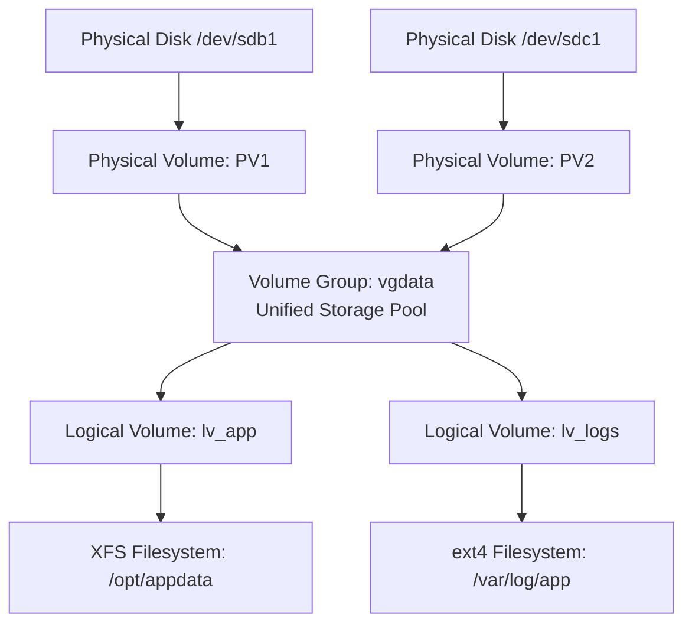
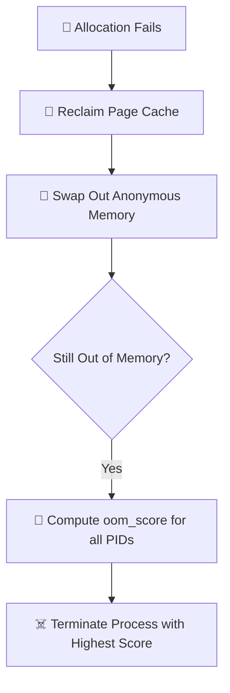

# 🐧 Linux Production Systems Engineering & Interview Master Bible
> **Comprehensive 300+ Question Reference, Architecture Guide, Performance Deep Dives & SRE Incident Playbooks**  
> *Engineered for Long-Term Mental Retention, Production Troubleshooting, and Technical Interview Mastery.*

---

## 📑 Table of Contents
1. [Core Mental Models for Systems & SRE Engineers](#1-core-mental-models-for-systems--sre-engineers)
2. [Section 1: Foundations, Storage, Architecture & Automation (Q1–Q200)](#2-section-1-foundations-storage-architecture--automation)
   - [1. Linux Kernel & Operating System Architecture](#1-linux-kernel--operating-system-architecture)
   - [2. Boot Sequence (BIOS/UEFI $\rightarrow$ GRUB2 $\rightarrow$ systemd)](#2-boot-sequence-biosuefi--grub2--systemd)
   - [3. Filesystem Hierarchy Standard (FHS) & Inode Mechanics](#3-filesystem-hierarchy-standard-fhs--inode-mechanics)
   - [4. Permissions, SUID/SGID, Sticky Bit & POSIX ACLs](#4-permissions-suidsgid-sticky-bit--posix-acls)
   - [5. Process Lifecycle, Signals (SIGTERM vs SIGKILL) & States](#5-process-lifecycle-signals-sigterm-vs-sigkill--states)
   - [6. Dynamic Kernel Modules & Package Managers](#6-dynamic-kernel-modules--package-managers)
   - [7. Storage Architecture, Partitioning, GPT vs MBR & `/etc/fstab`](#7-storage-architecture-partitioning-gpt-vs-mbr--etcfstab)
   - [8. Logical Volume Management (LVM) & Online Expansion](#8-logical-volume-management-lvm--online-expansion)
   - [9. RAID Arrays & Network Storage (NFS vs CIFS/SMB)](#9-raid-arrays--network-storage-nfs-vs-cifssmb)
   - [10. Networking, Firewalls (iptables/UFW) & Packet Inspection](#10-networking-firewalls-iptablesufw--packet-inspection)
   - [11. Bash Automation Engineering & High-Performance Text Processing](#11-bash-automation-engineering--high-performance-text-processing)
3. [Section 2: Processes, Services & Performance Engineering (Q201–Q300)](#3-section-2-processes-services--performance-engineering)
   - [12. Advanced Process Investigation (`/proc/<PID>/`, `lsof`, `strace`)](#12-advanced-process-investigation-procpid-lsof-strace)
   - [13. Process Trees, Parent Relationships & Threads](#13-process-trees-parent-relationships--threads)
   - [14. Linux Namespaces & Container Isolation Fundamentals](#14-linux-namespaces--container-isolation-fundamentals)
   - [15. Zombie, Orphan & Stuck (D-State) Processes](#15-zombie-orphan--stuck-d-state-processes)
   - [16. Systemd Unit File Architecture & Lifecycle (`systemctl`)](#16-systemd-unit-file-architecture--lifecycle-systemctl)
   - [17. Service Dependencies, Startup Ordering & Failure Restart Control](#17-service-dependencies-startup-ordering--failure-restart-control)
   - [18. Resource Limits (`ulimit`), `prlimit` & Systemd Limits](#18-resource-limits-ulimit-prlimit--systemd-limits)
   - [19. Control Groups (cgroups v1 vs v2) & Resource Governance](#19-control-groups-cgroups-v1-vs-v2--resource-governance)
   - [20. CPU Scheduling (CFS, Nice, Real-Time) & Core Pinning](#20-cpu-scheduling-cfs-nice-real-time--core-pinning)
   - [21. Load Average vs CPU Utilization & Run Queue Analysis](#21-load-average-vs-cpu-utilization--run-queue-analysis)
   - [22. Memory Accounting (Free vs Available, Anonymous, Page Cache)](#22-memory-accounting-free-vs-available-anonymous-page-cache)
   - [23. Out-Of-Memory (OOM) Killer & Failure Investigation](#23-out-of-memory-oom-killer--failure-investigation)
   - [24. CPU Bottlenecks (%usr, %sy, %wa, %st) & Thread Profiling](#24-cpu-bottlenecks-usr-sy-wa-st--thread-profiling)
   - [25. Context Switching (Voluntary vs Involuntary) & Lock Contention](#25-context-switching-voluntary-vs-involuntary--lock-contention)
   - [26. NUMA & Multi-Socket Architecture Performance](#26-numa--multi-socket-architecture-performance)
   - [27. Performance Baselines & Capacity Planning](#27-performance-baselines--capacity-planning)
   - [28. SRE Performance Diagnostic Toolkit](#28-sre-performance-diagnostic-toolkit)
4. [Master Incident Playbooks & Real-World Outage Scenarios](#4-master-incident-playbooks--real-world-outage-scenarios)
5. [Top 20 Senior Engineer Interview Questions & Model Answers](#5-top-20-senior-engineer-interview-questions--model-answers)
6. [Production Readiness & Audit Checklist](#6-production-readiness--audit-checklist)

---

## 1. Core Mental Models for Systems & SRE Engineers

```
                          THE 7 PILLARS OF LINUX PRODUCTION
 ┌─────────────────────────────────────────────────────────────────────────────────┐
 │ 1. Everything is a File Descriptor                                              │
 │    • Files, disks (/dev/sda), pseudo-nodes (/proc), sockets are all FDs.        │
 ├─────────────────────────────────────────────────────────────────────────────────┤
 │ 2. The System Call Boundary (Ring 3 User ──▶ Ring 0 Kernel)                     │
 │    • User apps cannot touch hardware directly; they must invoke syscalls.       │
 ├─────────────────────────────────────────────────────────────────────────────────┤
 │ 3. Inodes Store Metadata; Directories Store Filenames                           │
 │    • A filesystem can be 100% full with 0 bytes of data if Inodes are spent.    │
 ├─────────────────────────────────────────────────────────────────────────────────┤
 │ 4. df (Filesystem Superblock) vs du (Directory Walk)                            │
 │    • df accounts for disk blocks held open by deleted-but-active file handles.  │
 ├─────────────────────────────────────────────────────────────────────────────────┤
 │ 5. Load Average = Running/Runnable (R) + Uninterruptible I/O (D)                │
 │    • High load + low CPU usage = Disk / SAN / NFS bottleneck or lock contention.│
 ├─────────────────────────────────────────────────────────────────────────────────┤
 │ 6. Available Memory ≠ Free Memory                                               │
 │    • Linux caches disk reads in RAM (Page Cache). Available memory is what      │
 │      applications can safely claim without triggering swapping.                 │
 ├─────────────────────────────────────────────────────────────────────────────────┤
 │ 7. Namespaces Isolate "What You See"; cgroups Throttle "What You Use"           │
 └─────────────────────────────────────────────────────────────────────────────────┘
```

---

## 2. Section 1: Foundations, Storage, Architecture & Automation

### 1. Linux Kernel & Operating System Architecture

```
+--------------------------------------------------------------------------+
|                         User Space Applications                          |
|       (NGINX, MySQL, Docker, Python Services, System Utilities)          |
+--------------------------------------------------------------------------+
                                     │
                                     ▼
+--------------------------------------------------------------------------+
|                               Shell Layer                                |
|                     (Bash, Zsh, Fish, POSIX sh)                          |
+--------------------------------------------------------------------------+
                                     │
                                     ▼
+--------------------------------------------------------------------------+
|                             System Libraries                             |
|                       (glibc, libssl, libpthread)                        |
+--------------------------------------------------------------------------+
                                     │  [System Calls: fork, execve, read, write]
                                     ▼
+==========================================================================+
|                              LINUX KERNEL                                |
|  +---------------------+  +--------------------+  +-------------------+  |
|  | Process Scheduler   |  | Memory Management  |  | Virtual File Sys  |  |
|  | (CFS, cgroups)      |  | (Paging, OOM Kill) |  | (VFS: ext4, XFS)  |  |
|  +---------------------+  +--------------------+  +-------------------+  |
|  +---------------------+  +--------------------+  +-------------------+  |
|  | Network Stack       |  | Device Drivers     |  | Kernel Security   |  |
|  | (Netfilter, TCP/IP) |  | & Loadable Modules |  | (SELinux/AppArmor)|  |
|  +---------------------+  +--------------------+  +-------------------+  |
+==========================================================================+
                                     │
                                     ▼
+--------------------------------------------------------------------------+
|                                 Hardware                                 |
|                  (CPU, RAM, Disks, NICs, Motherboard)                    |
+--------------------------------------------------------------------------+
```

* **Linux vs Unix:** Linux is an open-source, monolithic kernel with loadable dynamic modules (LKMs). Unix (Solaris, AIX, HP-UX) is proprietary and tied to vendor-specific hardware.
* **`su -` vs `sudo`:** `su -` switches full user context and requires the **target user's password** (poor audit trail). `sudo` executes approved commands using the **invoking user's password** with full audit logging in `/var/log/auth.log`.

---

### 2. Boot Sequence (BIOS/UEFI $\rightarrow$ GRUB2 $\rightarrow$ systemd)


* **BIOS vs UEFI:**
  * BIOS: Legacy 16-bit execution, MBR partition table (max 2 TB drives, max 4 primary partitions).
  * UEFI: Modern 32/64-bit execution, GPT partition table (up to 9.4 ZB drives, 128 partitions), Secure Boot cryptographic driver verification.
* **systemd Targets (Replacing Legacy Runlevels):**
  * `poweroff.target` *(Runlevel 0)*: System shutdown.
  * `rescue.target` *(Runlevel 1)*: Single-user maintenance mode.
  * `multi-user.target` *(Runlevel 3)*: Standard multi-user CLI server mode with networking.
  * `graphical.target` *(Runlevel 5)*: Full GUI mode with display manager.
  * `reboot.target` *(Runlevel 6)*: System reboot.

---

### 3. Filesystem Hierarchy Standard (FHS) & Inode Mechanics

#### 📁 Standard Directory Structure
* `/etc`: Host-specific static configuration files (`/etc/nginx`, `/etc/fstab`, `/etc/ssh`).
* `/var`: Dynamic variable data (`/var/log` for logs, `/var/lib/mysql` for databases).
* `/proc` & `/sys`: In-memory virtual pseudo-filesystems exposing kernel metrics and device states.
* `/run`: Ephemeral runtime data (PID files, sockets) mounted as `tmpfs` (RAM-backed).
* `/tmp`: Temporary scratchpad space (auto-emptied on reboot, protected by Sticky Bit).
* `/opt`: Third-party vendor software packages (`/opt/datadog`, `/opt/google`).

#### 🔗 Hard Links vs Soft (Symbolic) Links
```
  [file1.txt] ────┐
                  ├───▶ [ Inode 1048576 ] ───▶ [ Physical Data Blocks on Disk ]
  [file2.txt] ────┘     (HARD LINK: Shares exact same inode; survives source deletion)

  [link.txt]  ────────▶ [ Inode 2049100 ] ───▶ Points to String Path: "/data/file1.txt"
                        (SOFT LINK: Distinct inode; becomes dangling if target is deleted)
```

| Metric | Hard Link (`ln source link`) | Soft / Symbolic Link (`ln -s source link`) |
| :--- | :--- | :--- |
| **Inode ID** | Shares identical inode number | Allocates a brand-new independent inode |
| **Cross-Filesystem** | ❌ No (restricted to same partition) | ✅ Yes (can span partitions & mounts) |
| **Directory Linking**| ❌ No (avoids filesystem loops) | ✅ Yes |
| **Original Deleted** | ✅ Data intact until link count = 0 | ❌ Becomes a broken dangling link |

---

### 4. Permissions, SUID/SGID, Sticky Bit & POSIX ACLs

#### 🧮 Octal Permission Math
$$\text{Read (r)} = 4 \quad|\quad \text{Write (w)} = 2 \quad|\quad \text{Execute (x)} = 1$$

* `chmod 755 script.sh` $\implies \text{rwxr-xr-x}$ (Owner: `7` [rwx], Group: `5` [r-x], Others: `5` [r-x])
* `chmod 600 id_ed25519` $\implies \text{rw-------}$ (Owner: `6` [rw-], Group/Others: `0` [---])

#### 🛡️ Special Permission Bits
| Bit | Octal | Applies To | Behavior in Production |
| :--- | :--- | :--- | :--- |
| **SUID (Set User ID)** | `4000` / `u+s` | Executables | Process runs with privileges of file **Owner** (e.g. `/usr/bin/passwd`) |
| **SGID (Set Group ID)**| `2000` / `g+s` | Directories | New files created inside automatically inherit parent **Group** |
| **Sticky Bit** | `1000` / `+t` | Shared Folders | Only file **Owner** or `root` can delete files inside (`/tmp`) |

```bash
# Production collaboration directory setup
sudo mkdir -p /opt/devops_shared
sudo chown -R root:devops /opt/devops_shared
sudo chmod 2770 /opt/devops_shared   # rwxrws--- (SGID enabled)
sudo chmod +t /opt/devops_shared     # rwxrws--T (Sticky Bit enabled)

# POSIX Access Control Lists (ACLs)
setfacl -m u:deployer:rwx /opt/devops_shared
getfacl /opt/devops_shared
```

---

### 5. Process Lifecycle, Signals (SIGTERM vs SIGKILL) & States

```
  [NEW] ──▶ [READY (Queue)] ──▶ [RUNNING (CPU)] ──▶ [TERMINATED / EXIT]
                   ▲                  │
                   │   I/O or Wait    │
                   └──────────────────┘
```

#### ⚡ Core Linux Signals
* **`SIGHUP` (1):** Hangup signal; prompts daemons (NGINX, Apache) to hot-reload configurations without dropping active network connections.
* **`SIGINT` (2):** Interactive interrupt sent from terminal via `Ctrl + C`.
* **`SIGKILL` (9):** Uncatchable, unignorable immediate termination handled directly by the kernel.
* **`SIGTERM` (15):** Standard graceful termination request allowing application cleanup (flushing buffers, completing in-flight transactions).
* **`SIGSTOP` (19):** Uncatchable signal to pause process execution (`Ctrl + Z`).

---

### 6. Dynamic Kernel Modules & Package Managers

* **Debian / Ubuntu:** High-level package manager `apt` wraps low-level engine `dpkg`.
* **RHEL / Rocky Linux:** High-level package manager `dnf` / `yum` wraps low-level engine `rpm`.

#### 🔌 Dynamic Kernel Modules (`/lib/modules/$(uname -r)/`)
```bash
lsmod                             # List active loaded kernel modules
sudo modprobe br_netfilter        # Load module AND auto-resolve dependencies
sudo modprobe -r br_netfilter     # Remove module safely
modinfo br_netfilter              # Display module metadata
```

---

### 7. Storage Architecture, Partitioning, GPT vs MBR & `/etc/fstab`

$$\text{Physical Disk (/dev/sdb)} \longrightarrow \text{Partition (/dev/sdb1)} \longrightarrow \text{Filesystem (ext4/XFS)} \longrightarrow \text{Mount Point (/data)}$$

#### 💾 `/etc/fstab` Configuration Rules
```ini
# Format: <Device/UUID> <Mount Point> <FSType> <Options> <Dump> <Pass/fsck>
UUID=e81d7f3a-9c4b-4f62-b921-1234567890ab  /data  xfs  defaults,noatime,nofail  0  2
```
* **`noatime`:** Prevents updating file read timestamps, boosting disk I/O throughput.
* **`nofail`:** Prevents system boot hangs if a secondary or cloud EBS volume is missing.
* **Rule:** Always run `sudo mount -a` before rebooting to validate `/etc/fstab` syntax.

---

### 8. Logical Volume Management (LVM) & Online Expansion



#### 🚀 Zero-Downtime Storage Expansion
```bash
# 1. Initialize physical volume and extend Volume Group
sudo pvcreate /dev/sdd1
sudo vgextend vgdata /dev/sdd1

# 2. Expand Logical Volume by 50GB
sudo lvextend -L +50G /dev/vgdata/lv_app

# 3. Grow filesystem online without unmounting
sudo xfs_growfs /opt/appdata            # For XFS filesystems
# OR for ext4: sudo resize2fs /dev/vgdata/lv_app
```

---

### 9. RAID Arrays & Network Storage (NFS vs CIFS/SMB)

| RAID Level | Min Disks | Fault Tolerance | Usable Capacity | Perf (Read/Write) | Primary Production Use Case |
| :--- | :--- | :--- | :--- | :--- | :--- |
| **RAID 0** | 2 | 0 Disks (Data loss if 1 fails)| 100% | Ultra High / Ultra High | Non-critical caching / scratchpads |
| **RAID 1** | 2 | 1 Disk | 50% | High / Moderate | OS boot drives, system partitions |
| **RAID 5** | 3 | 1 Disk (Distributed Parity) | $(N-1)/N$ | High / Slower (Parity) | File shares, general storage |
| **RAID 6** | 4 | 2 Disks (Dual Parity) | $(N-2)/N$ | High / Slow (Dual Parity)| Enterprise archival storage |
| **RAID 10**| 4 | 1 Disk per Mirrored Pair | 50% | Ultra High / Ultra High | High-throughput OLTP databases |

* **NFS (Port 2049):** Linux-to-Linux network storage clusters and Kubernetes Persistent Volumes.
* **CIFS / SMB (Port 445):** Cross-platform Linux/Windows Active Directory file shares.

---

### 10. Networking, Firewalls (iptables/UFW) & Packet Inspection

```bash
# Modern Network Inspection (iproute2)
ip addr show                       # View interface IPs
ip route show                      # Display routing table
ss -tulpen                         # Inspect listening TCP/UDP ports with PIDs

# Packet Capture
sudo tcpdump -i eth0 -nn "port 80 or port 443" -w web_traffic.pcap

# Production UFW Firewall Baseline
sudo ufw default deny incoming
sudo ufw default allow outgoing
sudo ufw allow 22/tcp comment "SSH"
sudo ufw allow 80/tcp comment "HTTP"
sudo ufw allow 443/tcp comment "HTTPS"
sudo ufw --force enable
```

---

### 11. Bash Automation Engineering & High-Performance Text Processing

#### 🛡️ Production Bash Best Practice Template
```bash
#!/bin/bash
set -euo pipefail
IFS=$'\n\t'

trap 'echo "[ERROR] Command failed at line $LINENO" >&2; exit 1' ERR

main() {
    echo "Executing hardened automation routine..."
}

main "$@"
```

#### ⚡ Text Processing Power Commands
```bash
# awk: Extract top IP addresses from NGINX access log
awk '{print $1}' /var/log/nginx/access.log | sort | uniq -c | sort -nr | head -n 10

# sed: In-place configuration changes without opening editors
sed -i 's/PasswordAuthentication yes/PasswordAuthentication no/g' /etc/ssh/sshd_config
```

---

## 3. Section 2: Processes, Services & Performance Engineering

### 12. Advanced Process Investigation (`/proc/<PID>/`, `lsof`, `strace`)

```
               /proc/<PID>/ LIVE KERNEL WINDOW
 ┌──────────────┬─────────────────────────────────────────────────────────────┐
 │ File/Folder  │ What It Reveals in Production                              │
 ├──────────────┼─────────────────────────────────────────────────────────────┤
 │ cmdline      │ Full startup arguments (null-byte delimited)                │
 │ environ      │ Complete environment variables (detect missing DB configs)  │
 │ status       │ Process state (R, S, D, Z), VmSize, RSS, Thread count       │
 │ fd/          │ Active symlinks to open files, pipes, and network sockets   │
 │ io           │ Cumulative disk read/write bytes and syscall counts         │
 │ maps / smaps │ Virtual memory mappings, PSS (Proportional Set Size) & RSS  │
 │ task/        │ Subdirectories for every individual Thread ID (TID)         │
 └──────────────┴─────────────────────────────────────────────────────────────┘
```

```bash
# Trace system calls safely without crashing high-load servers
strace -p <PID> -e trace=network,file -s 128 -c   # -c gives summary call stats
```

---

### 13. Process Trees, Parent Relationships & Threads

* **Parent controls child lifecycle:** Master processes (e.g. NGINX Master) monitor and spawn worker processes.
* **Direction of Investigation:**
  * **Upwards (PPID):** Find who launched the runaway process or why it keeps restarting.
  * **Downwards (Threads):** Look into `/proc/<PID>/task/` to pinpoint the specific thread consuming 100% CPU.

```bash
# Display full process tree with PIDs
pstree -p
ps --forest -eo pid,ppid,user,stat,cmd
```

---

### 14. Linux Namespaces & Container Isolation Fundamentals

Namespaces provide isolated **views** of global system resources to a group of processes:

```
                    ┌───────────────────────────────┐
                    │     Host Linux Kernel (1)     │
                    └───────────────┬───────────────┘
            ┌───────────────────────┼───────────────────────┐
            ▼                       ▼                       ▼
   ┌─────────────────┐     ┌─────────────────┐     ┌─────────────────┐
   │  Container A    │     │  Container B    │     │  Container C    │
   │  PID 1 (App)    │     │  PID 1 (App)    │     │  PID 1 (App)    │
   │  Isolated Net   │     │  Isolated Net   │     │  Isolated Net   │
   │  Isolated Mount │     │  Isolated Mount │     │  Isolated Mount │
   └─────────────────┘     └─────────────────┘     └─────────────────┘
```

| Namespace | Flag | Isolated Resource | Production Container Purpose |
| :--- | :--- | :--- | :--- |
| **PID** | `-p` | Process IDs | Container sees itself as `PID 1`; hidden from host PIDs |
| **Mount (`mnt`)** | `-m` | Filesystem Mounts | Root filesystem isolation, container volume mounts |
| **Network (`net`)**| `-n` | IP, Routing, Ports | Dedicated virtual NIC (`veth`), port 80 allocation |
| **User (`user`)** | `-U` | UID / GID space | Container root maps to unprivileged user on host |
| **UTS** | `-u` | Hostname | Dedicated container hostname |
| **IPC** | `-i` | Shared Memory / Semaphores | Prevents inter-process memory tampering across apps |
| **Cgroup** | `-C` | Root Cgroup view | Restricts visibility of system cgroup hierarchy |
| **Time** | `-T` | System Clocks | Independent clock offsets for container testing |

```bash
# Troubleshoot container by entering its namespaces from the host
sudo nsenter -t <CONTAINER_PID> -m -u -i -n -p /bin/bash
```

---

### 15. Zombie, Orphan & Stuck (D-State) Processes

```
                   ZOMBIE vs ORPHAN vs D-STATE
 ┌─────────────────────────────────────────────────────────────────┐
 │ ZOMBIE (Z)                                                      │
 │ • Child: Dead (Finished)         • Memory/CPU: 0MB, 0% CPU      │
 │ • Parent: Alive, forgot to wait()• Fix: Fix parent or restart it│
 ├─────────────────────────────────────────────────────────────────┤
 │ ORPHAN                                                          │
 │ • Child: Alive and running       • Adopted by: PID 1 (systemd)  │
 │ • Reaping: Cleanly handled by systemd upon completion           │
 ├─────────────────────────────────────────────────────────────────┤
 │ UNINTERRUPTIBLE SLEEP (D)                                       │
 │ • State: Stuck in kernel I/O     • Signals: IGNORES kill -9     │
 │ • Cause: Unresponsive NFS/Disk   • Fix: Fix backend storage/host│
 └─────────────────────────────────────────────────────────────────┘
```

```bash
# Find Zombie processes
ps -eo pid,ppid,stat,cmd | awk '$3 ~ /Z/'

# Find D-state processes and inspect kernel call stack
ps -eo pid,ppid,stat,wchan:20,cmd | grep " D"
cat /proc/<PID>/stack
```

---

### 16. Systemd Unit File Architecture & Lifecycle (`systemctl`)

```ini
# /etc/systemd/system/myapp.service
[Unit]
Description=Production API Microservice
After=network-online.target
Wants=network-online.target

[Service]
Type=simple
User=appsvc
Group=appsvc
WorkingDirectory=/opt/myapp
EnvironmentFile=/etc/myapp/env
ExecStart=/opt/myapp/bin/server --config /etc/myapp/config.yml
ExecReload=/bin/kill -HUP $MAINPID
Restart=on-failure
RestartSec=5s

# Hardening & Limits
LimitNOFILE=65535
MemoryMax=2G
CPUQuota=150%

[Install]
WantedBy=multi-user.target
```

```bash
# Validate syntax and reload
systemd-analyze verify /etc/systemd/system/myapp.service
sudo systemctl daemon-reload
sudo systemctl enable --now myapp.service
```

---

### 17. Service Dependencies, Startup Ordering & Failure Restart Control

```
                 ORDERING vs DEPENDENCY MATRIX
                 ┌───────────────────┬───────────────────┐
                 │    Order Only     │  Order + Require  │
 ┌───────────────┼───────────────────┼───────────────────┤
 │ Strict (Hard) │ After=foo.service │ Requires=foo      │
 │ Dependency    │                   │ After=foo.service │
 ├───────────────┼───────────────────┼───────────────────┤
 │ Weak (Soft)   │ Before=bar.service│ Wants=bar         │
 │ Dependency    │                   │ After=bar.service │
 └───────────────┴───────────────────┴───────────────────┘
```

#### 🛡️ Throttling Restart Storms
```ini
[Service]
Restart=on-failure
RestartSec=5s
StartLimitIntervalSec=60s
StartLimitBurst=3
```

---

### 18. Resource Limits (`ulimit`), `prlimit` & Systemd Limits

* **Soft Limit:** The current operational threshold (user can raise up to hard limit).
* **Hard Limit:** The absolute ceiling (only `root` can raise).

```bash
# Change resource limits dynamically on a live running process without restarting!
sudo prlimit --pid <PID> --nofile=65535:65535
```

---

### 19. Control Groups (cgroups v1 vs v2) & Resource Governance

```
                      CGROUPS v1 vs CGROUPS v2
 ┌──────────────────────────────┬──────────────────────────────┐
 │          cgroups v1          │          cgroups v2          │
 ├──────────────────────────────┼──────────────────────────────┤
 │ • Multiple separate trees    │ • Single unified hierarchy   │
 │ • CPU, Memory, I/O in silos  │ • All controllers in 1 tree  │
 │ • Poor page-cache accounting │ • Accurate buffer/cache I/O  │
 └──────────────────────────────┴──────────────────────────────┘
```

```bash
# Monitor live cgroup resource consumption
systemd-cgtop
systemd-cgls
```

---

### 20. CPU Scheduling (CFS, Nice, Real-Time) & Core Pinning

* **Nice Values:** `-20` (Highest CPU priority) to `+19` (Lowest CPU priority). Default = `0`.
* **Real-Time Priority (1–99):** Uses `SCHED_FIFO` / `SCHED_RR`. Preempts normal user processes. Use with caution to avoid kernel starvation.

```bash
# Pin process to CPU cores 0 and 1
taskset -cp 0,1 <PID>
```

---

### 21. Load Average vs CPU Utilization & Run Queue Analysis

$$\text{Load Average} = \text{Processes Running/Runnable (R)} + \text{Processes in Uninterruptible I/O (D)}$$

```
                   CPU BOUND vs I/O BOUND LOAD
 ┌─────────────────────────────────────────────────────────────┐
 │ CPU-Bound Overload:                                         │
 │ • Load = 16 (on 4 cores)   • CPU Usage = 98%   • %iowait = 0%│
 │ • Cause: High application compute / infinite loops          │
 ├─────────────────────────────────────────────────────────────┤
 │ Storage/I/O-Bound Overload:                                 │
 │ • Load = 16 (on 4 cores)   • CPU Usage = 5%    • %iowait = 85%│
 │ • Cause: Slow disk, degraded SAN/NFS, stuck kernel lock     │
 └─────────────────────────────────────────────────────────────┘
```

---

### 22. Memory Accounting (Free vs Available, Anonymous, Page Cache)

```
               total        used        free      shared  buff/cache   available
Mem:            15Gi       3.8Gi       1.2Gi       250Mi        10Gi        11Gi
Swap:          2.0Gi          0B       2.0Gi
```

* **Anonymous Memory:** Process heap, stack, and dynamically allocated memory (`malloc`). Cannot be dropped; must be written to Swap when physical RAM is exhausted.
* **Page Cache:** Clean cached disk files. Reclaimed instantly by the kernel on demand.
* **`available`:** True indicator of available RAM without forcing swap.

---

### 23. Out-Of-Memory (OOM) Killer & Failure Investigation



* **Score Calculation:** Proportion of RAM consumed (0–1000) adjusted by `/proc/<PID>/oom_score_adj`.
* **Protection:** Set `OOMScoreAdjust=-1000` for mission-critical databases and daemons.

---

### 24. CPU Bottlenecks (%usr, %sy, %wa, %st) & Thread Profiling

* `%us` (User): Application compute logic (JSON, regex, business loops).
* `%sy` (System): Kernel execution, system calls, driver interrupts.
* `%wa` (I/O Wait): CPU sitting idle waiting for storage/network I/O.
* `%st` (Steal): **Cloud VM CPU oversubscription** by the underlying hypervisor.

```bash
# Pinpoint top CPU-consuming thread (TID)
pidstat -t -u 1 5
```

---

### 25. Context Switching (Voluntary vs Involuntary) & Lock Contention

* **Voluntary (`cswch/s`):** Process yields CPU to wait for I/O, sleep, or mutex locks.
* **Involuntary (`nvcswch/s`):** Kernel preempts process because its CPU time slice expired (signals CPU core starvation).

```bash
pidstat -w -p <PID> 1
```

---

### 26. NUMA & Multi-Socket Architecture Performance

* **Local Access:** Fast CPU memory bus access.
* **Remote Access:** Slow cross-socket interconnect traversal (UPI/QPI).

```bash
# Inspect NUMA node allocation penalties
numastat
numactl --cpunodebind=0 --membind=0 /usr/bin/mongod --config /etc/mongod.conf
```

---

### 27. Performance Baselines & Capacity Planning

* Always compare live telemetry against a **2-week trailing baseline** to account for diurnal seasonality.
* Track latency percentiles ($p50, p95, p99$), run queue length, and memory growth slope.

---

### 28. SRE Performance Diagnostic Toolkit

```
                     SRE TOOL SELECTION MATRIX
 ┌──────────────────────┬──────────────────────────────────────────────┐
 │ Goal                 │ Recommended Diagnostic Command               │
 ├──────────────────────┼──────────────────────────────────────────────┤
 │ Live Overview        │ top / htop                                   │
 │ Run Queue & Swap     │ vmstat 1                                     │
 │ Per-Process/Thread   │ pidstat -u -t 1                              │
 │ Per-Core CPU Hotspot │ mpstat -P ALL 1                              │
 │ Disk Latency (await) │ iostat -xz 1                                 │
 │ Sockets & Ports      │ ss -tulpen                                   │
 │ Kernel Ring Buffer   │ dmesg -T                                     │
 │ Historical Metrics   │ sar -u / sar -r / sar -n DEV                 │
 └──────────────────────┴──────────────────────────────────────────────┘
```

---

## 4. Master Incident Playbooks & Real-World Outage Scenarios

```
                            5 CLASSIC PRODUCTION SCENARIOS
 ┌─────────────────────────────────────────────────────────────────────────────────┐
 │ 1. Service Crash Loop (Every few seconds)                                       │
 │    • journalctl -u <service> -n 100 --no-pager to find the fatal exit code.     │
 │    • Check systemd rate limits: systemctl show <service> -p NRestarts           │
 ├─────────────────────────────────────────────────────────────────────────────────┤
 │ 2. High Load Average but Low CPU Usage (<5%)                                    │
 │    • Check for D-state processes: ps -eo pid,stat,wchan,cmd | grep " D"         │
 │    • Inspect disk latency via iostat -xz 1 and search dmesg -T for I/O errors.  │
 ├─────────────────────────────────────────────────────────────────────────────────┤
 │ 3. Disk Full but 'du' Shows Space Available                                     │
 │    • Unlinked deleted files held open by processes: lsof +L1                    │
 │    • Fix: Gracefully reload the holding daemon (systemctl reload nginx).        │
 ├─────────────────────────────────────────────────────────────────────────────────┤
 │ 4. Write Fails with "No space left on device" (Disk has 50% free)               │
 │    • Inode exhaustion: df -i                                                    │
 │    • Fix: Clean up millions of small unrotated session/cache files.             │
 ├─────────────────────────────────────────────────────────────────────────────────┤
 │ 5. One CPU Core at 100%, Others Idle                                            │
 │    • Single-threaded bottleneck: pidstat -t -p <PID> 1                          │
 │    • Profile code hotspot via perf top -p <PID>.                                │
 └─────────────────────────────────────────────────────────────────────────────────┘
```

---

## 5. Top 20 Senior Engineer Interview Questions & Model Answers

```
 ┌────┬──────────────────────────────────────────┬──────────────────────────────────────────────────────────────────┐
 │ #  │ Question                                 │ Senior Production Engineer Answer                                │
 ├────┼──────────────────────────────────────────┼──────────────────────────────────────────────────────────────────┤
 │ 1  │ Difference between df and du?            │ df queries filesystem superblocks (includes open deleted files); │
 │    │                                          │ du walks the active directory tree summing existing files.       │
 ├────┼──────────────────────────────────────────┼──────────────────────────────────────────────────────────────────┤
 │ 2  │ How do you kill a Zombie process?        │ You cannot kill a zombie with kill -9 (it is already dead). Must │
 │    │                                          │ signal/restart the parent or kill parent so PID 1 reaps it.      │
 ├────┼──────────────────────────────────────────┼──────────────────────────────────────────────────────────────────┤
 │ 3  │ Difference between restart and reload?   │ restart terminates and respawns the process (downtime); reload   │
 │    │                                          │ sends SIGHUP to re-read config without dropping TCP sockets.     │
 ├────┼──────────────────────────────────────────┼──────────────────────────────────────────────────────────────────┤
 │ 4  │ What is a D-state process?               │ Uninterruptible Sleep waiting on hardware/NFS I/O. Ignores all   │
 │    │                                          │ signals including kill -9 until the kernel I/O returns.          │
 ├────┼──────────────────────────────────────────┼──────────────────────────────────────────────────────────────────┤
 │ 5  │ free vs available memory?                │ free is unallocated RAM; available includes reclaimable page     │
 │    │                                          │ cache that applications can claim without causing swap.          │
 ├────┼──────────────────────────────────────────┼──────────────────────────────────────────────────────────────────┤
 │ 6  │ What causes high %wa in top?             │ CPU is idle waiting for disk or network storage I/O responses.   │
 ├────┼──────────────────────────────────────────┼──────────────────────────────────────────────────────────────────┤
 │ 7  │ What is CPU Steal Time (%st)?            │ CPU cycles taken by the cloud hypervisor for other noisy VMs.    │
 ├────┼──────────────────────────────────────────┼──────────────────────────────────────────────────────────────────┤
 │ 8  │ How does OOM Killer choose victims?      │ Calculates oom_score based on % RAM used + oom_score_adj offset. │
 ├────┼──────────────────────────────────────────┼──────────────────────────────────────────────────────────────────┤
 │ 9  │ Difference between SUID, SGID & Sticky?  │ SUID: Run as file owner; SGID: Inherit parent directory group;   │
 │    │                                          │ Sticky Bit: Only file owner or root can delete files (/tmp).     │
 ├────┼──────────────────────────────────────────┼──────────────────────────────────────────────────────────────────┤
 │ 10 │ Why do we use UUID in /etc/fstab?        │ Device names (/dev/sda) can shift across boots; UUIDs are fixed. │
 ├────┼──────────────────────────────────────────┼──────────────────────────────────────────────────────────────────┤
 │ 11 │ Can XFS filesystems be shrunk?           │ No. XFS supports online growth (xfs_growfs) but cannot shrink.   │
 ├────┼──────────────────────────────────────────┼──────────────────────────────────────────────────────────────────┤
 │ 12 │ What is Inode exhaustion?                │ File count hits inode maximum (df -i); no new files can be made. │
 ├────┼──────────────────────────────────────────┼──────────────────────────────────────────────────────────────────┤
 │ 13 │ What does vm.swappiness control?         │ Balance between reclaiming page cache vs swapping anonymous RAM. │
 ├────┼──────────────────────────────────────────┼──────────────────────────────────────────────────────────────────┤
 │ 14 │ Namespaces vs cgroups?                   │ Namespaces provide isolation; cgroups enforce resource limits.   │
 ├────┼──────────────────────────────────────────┼──────────────────────────────────────────────────────────────────┤
 │ 15 │ Difference: Hard Link vs Soft Link?      │ Hard link shares Inode; Soft link is a path string shortcut.     │
 ├────┼──────────────────────────────────────────┼──────────────────────────────────────────────────────────────────┤
 │ 16 │ Why is chmod 777 dangerous?              │ World-writable; lets any local user or exploit overwrite files.  │
 ├────┼──────────────────────────────────────────┼──────────────────────────────────────────────────────────────────┤
 │ 17 │ Difference: SIGTERM vs SIGKILL?          │ SIGTERM (15) allows clean shutdown; SIGKILL (9) halts instantly. │
 ├────┼──────────────────────────────────────────┼──────────────────────────────────────────────────────────────────┤
 │ 18 │ What is NUMA imbalance?                  │ One CPU node exhausts local RAM while others have free RAM.      │
 ├────┼──────────────────────────────────────────┼──────────────────────────────────────────────────────────────────┤
 │ 19 │ Involuntary vs Voluntary context switch? │ Voluntary: waiting on I/O/lock; Involuntary: scheduler preempted.│
 ├────┼──────────────────────────────────────────┼──────────────────────────────────────────────────────────────────┤
 │ 20 │ How to change live process limit?        │ Use prlimit --pid <PID> --nofile=65535:65535 without restarting. │
 └────┴──────────────────────────────────────────┴──────────────────────────────────────────────────────────────────┘
```

---

## 6. Production Readiness & Audit Checklist

```
                      PRODUCTION READINESS CHECKLIST
 ┌──┬─────────────────────────────┬────────────────────────────────────────────┐
 │  │ Domain                      │ Verification Criteria                      │
 ├──┼─────────────────────────────┼────────────────────────────────────────────┤
 │☐ │ Security & Privileges       │ Run as dedicated non-root system user      │
 │☐ │ Permission Hardening        │ 600 on SSH keys, 640 on configs, no 777    │
 │☐ │ SSH Configuration           │ PermitRootLogin no, PasswordAuth no        │
 │☐ │ Systemd Reliability         │ Restart=on-failure, StartLimitBurst tuned  │
 │☐ │ File Descriptors            │ LimitNOFILE=65535 set in unit file         │
 │☐ │ Memory & OOM Protection     │ MemoryMax defined; OOMScoreAdjust for DB   │
 │☐ │ Inode & Log Management      │ logrotate active; daily compression        │
 │☐ │ Storage Resilience          │ Persistent UUIDs in /etc/fstab with nofail │
 │☐ │ Online Expansion Prepared   │ LVM configured for zero-downtime growth    │
 │☐ │ Metrics & Alerting          │ Alerts on p99 latency, run queue & iowait  │
 └──┴─────────────────────────────┴────────────────────────────────────────────┘
```

---
*Authored for Senior Systems Engineers, DevOps Architects, and Site Reliability Engineers.*
