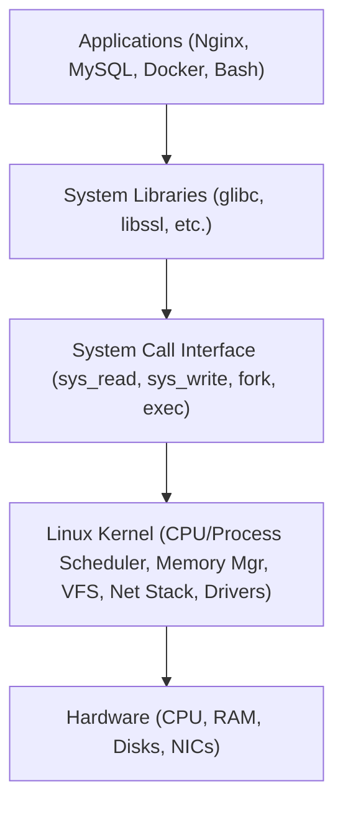
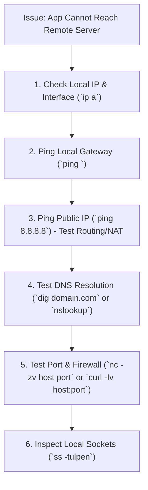

# 🐧 Linux Production Handbook: Complete Job & Interview Revision Guide

> A production-grade, highly structured reference manual covering foundational to advanced Linux concepts, administration, monitoring, troubleshooting, and interview questions.

---

## 📑 Table of Contents
1. [Linux Architecture & Distributions](#1-linux-architecture--distributions)
2. [Filesystem Hierarchy & Navigation](#2-filesystem-hierarchy--navigation)
3. [File & Directory Management (Inodes, Hard vs Soft Links)](#3-file--directory-management)
4. [File Viewing, Text Processing & Editing](#4-file-viewing--editing)
5. [Permissions, Ownership & Security (chmod, chown, ACLs)](#5-permissions--ownership)
6. [User & Group Management + Principle of Least Privilege](#6-user--group-management)
7. [Process Management & Lifecycle](#7-process-management--lifecycle)
8. [Systemd & Service Management](#8-systemd--service-management)
9. [Logging, Log Rotation & Analysis](#9-logging--analysis)
10. [Package Management (APT vs DNF/YUM vs RPM/DPKG)](#10-package-management)
11. [Storage & Disk Management (df, du, fstab, Inodes)](#11-storage--disk-management)
12. [Memory Management & OOM Killer](#12-memory-management--oom-killer)
13. [CPU Monitoring & Load Averages](#13-cpu-monitoring--load-averages)
14. [Networking Fundamentals & Diagnostic Tools](#14-networking-fundamentals--diagnostics)
15. [SSH Hardening & Remote Access](#15-ssh-hardening--remote-access)
16. [Bash Scripting Essentials & Production Automation](#16-bash-scripting-essentials)
17. [Systematic Troubleshooting Framework](#17-systematic-troubleshooting-framework)
18. [Top Production Pitfalls & Anti-Patterns](#18-top-production-pitfalls)
19. [Hands-On Production Mini-Project](#19-hands-on-production-mini-project)
20. [Top 20 Linux Interview Questions & Deep-Dive Answers](#20-top-20-linux-interview-questions)

---

## 1. Linux Architecture & Distributions

### What is Linux?
Linux is an open-source, Unix-like operating system kernel created by **Linus Torvalds in 1991**. Combined with GNU core utilities, system libraries, and userland applications, it forms a complete Operating System (OS).

### Architecture Stack Diagram


### Major Linux Families in Production
| Family | Distros | Package Manager | Primary Use Case |
|---|---|---|---|
| **Debian** | Ubuntu, Debian | `apt`, `dpkg` | Web servers, CI/CD runners, Cloud VMs, Containers |
| **Red Hat (RHEL)** | RHEL, Rocky Linux, AlmaLinux, CentOS Stream | `dnf`, `yum`, `rpm` | Enterprise infrastructure, banking, high-compliance environments |
| **SUSE** | openSUSE, SLES | `zypper`, `rpm` | Enterprise SAP workloads, European data centers |
| **Arch** | Arch Linux, Manjaro | `pacman` | Rolling releases, advanced workstations (rare in prod) |

---

## 2. Filesystem Hierarchy & Navigation

> **Core Philosophy**: *"Everything in Linux is a file"* (including devices, pipes, sockets, and processes).

### Filesystem Hierarchy Standard (FHS)
```text
/ (Root Directory)
├── bin -> usr/bin          (Essential user command binaries)
├── sbin -> usr/sbin        (System binaries for administration)
├── etc/                    (Configuration files e.g., nginx, sshd, fstab)
├── var/                    (Variable runtime data: /var/log, /var/lib, /var/www)
├── home/                   (Regular user home directories: /home/ubuntu)
├── root/                   (Home directory for the root superuser)
├── usr/                    (User programs, shareable libraries: /usr/bin, /usr/lib)
├── opt/                    (Optional 3rd-party self-contained software e.g., /opt/docker)
├── tmp/                    (Temporary files; cleared on reboot)
├── dev/                    (Device nodes: /dev/sda, /dev/null, /dev/zero)
├── proc/                   (Virtual filesystem representing kernel & process state)
├── sys/                    (Virtual filesystem exposing kernel subsystem parameters)
├── boot/                   (Kernel images, initramfs, GRUB bootloader files)
├── mnt/ & media/           (Mount points for temporary/removable storage)
└── run/                    (Runtime variable data since last boot: PID files, sockets)
```

### Essential Navigation & Discovery Commands
```bash
pwd                        # Print current working directory
ls -lah                    # List all files (including hidden), detailed permissions, human-readable sizes
cd /var/log                # Absolute navigation
cd ../                     # Go up one level
cd ~                       # Go to user's home directory
tree -L 2 /etc             # Visualize directory structure up to depth 2

# Finding Files
find /var/log -type f -name "*.log" -mtime -7    # Find log files modified in last 7 days
find / -size +100M 2>/dev/null                  # Find files > 100MB, silence permission errors
locate nginx.conf                               # Fast database-backed lookup (run 'sudo updatedb' first)
```

---

## 3. File & Directory Management

### Basic CRUD Operations
```bash
touch app.log                           # Create empty file or update timestamp
mkdir -p /opt/app/{bin,config,logs}     # Create nested directory tree in one shot
cp -r /etc/nginx /backup/nginx_$(date +%F) # Recursive copy with timestamp
mv old_name.txt new_name.txt            # Rename or move
rm -rf /tmp/scratch_dir                 # Recursive force delete (USE CAUTION)
```

### Hard Link vs Soft (Symbolic) Link
```text
  Hard Link                         Symbolic (Soft) Link
┌─────────────┐                    ┌─────────────┐
│ file1.txt   │──┐                 │ symlink.txt │─── points to ───► file.txt (path)
└─────────────┘  │                 └─────────────┘                      │
                 ▼                                                      ▼
┌─────────────┐ Inode: 1042        ┌─────────────┐                Inode: 1042
│ file2.txt   │──► [Data Blocks]   │  file.txt   │───────────────► [Data Blocks]
└─────────────┘                    └─────────────┘
```

| Feature | Hard Link (`ln file link`) | Soft Link (`ln -s /path/file link`) |
|---|---|---|
| **Points to** | Direct Inode number (same data) | File path string (like a shortcut) |
| **Across Filesystems** | ❌ No | ✅ Yes |
| **Link to Directories**| ❌ No (prevents loops) | ✅ Yes |
| **If Source is Deleted**| ✅ Data remains intact until link count = 0 | ❌ Becomes a broken (dangling) link |
| **Inode Number** | Same Inode | Unique Inode for the link |

---

## 4. File Viewing & Editing

### Inspection Commands Cheat Sheet
```bash
cat /etc/hosts             # Best for small files (< 50 lines)
less /var/log/syslog       # Interactive viewer with search (/term, n/N, G, g, q)
head -n 20 app.log         # View top 20 lines
tail -n 50 app.log         # View last 50 lines
tail -f /var/log/nginx/access.log  # Stream live updates in real time
```

### Text Editors: Nano vs Vim
- **Nano**: Simple, interactive, shortcut-driven (`Ctrl + O` to save, `Ctrl + X` to exit).
- **Vim**: Modal editor standard across all Linux servers.

```text
Vim Modes & Essential Commands:
┌─────────────────┐       i / a        ┌─────────────────┐
│   Normal Mode   ├───────────────────►│   Insert Mode   │
│  (Navigation)   │◄───────────────────┤   (Type text)   │
└────────┬────────┘        ESC         └─────────────────┘
         │
         │ : (Colon)
         ▼
┌─────────────────┐
│  Command Mode   │  :w (save) | :q (quit) | :wq (save & quit) | :q! (discard & quit)
└─────────────────┘  /pattern (search) | dd (delete line) | yy (copy) | p (paste)
```

---

## 5. Permissions & Ownership

### Permission String Breakdown
```text
  -  r w x  r - x  r - -
  ┬  ─────  ─────  ─────
  │    │      │      │
  │    │      │      └──── Others Permissions (Read only = 4)
  │    │      └─────────── Group Permissions  (Read + Execute = 5)
  │    └────────────────── User (Owner) Permissions (Read + Write + Exec = 7)
  └─────────────────────── File Type (- = file, d = directory, l = symlink)
```

### Octal Value Calculation
* **r (Read)** = `4`
* **w (Write)** = `2`
* **x (Execute)** = `1`

| Octal | Permissions | Common Production Usage |
|---|---|---|
| `755` | `rwxr-xr-x` | Executable scripts, Web directories (`/var/www/html`) |
| `644` | `rw-r--r--` | Standard text files, web assets, config files |
| `600` | `rw-------` | Private SSH keys (`~/.ssh/id_rsa`), SSL certificates |
| `700` | `rwx------` | User's `.ssh` directory, root scripts |
| `777` | `rwxrwxrwx` | ⚠️ **DANGEROUS** — Never use in production! |

### Permission & Ownership Management
```bash
chmod 755 deploy.sh                # Numeric permission update
chmod +x build.sh                  # Add execute bit to all
chmod u=rw,go=r config.json        # Symbolic permission update
chown deploy:webteam app.py        # Change owner to 'deploy' and group to 'webteam'
chown -R nginx:nginx /var/www/html # Recursive ownership change
```

---

## 6. User & Group Management

### Commands & Production Patterns
```bash
# 1. Create a dedicated application service user without login shell
sudo useradd -r -s /usr/sbin/nologin -d /opt/myapp myappuser

# 2. Create human user with home directory and bash shell
sudo useradd -m -s /bin/bash devops_lead
sudo passwd devops_lead

# 3. Add user to secondary groups (e.g., sudo / wheel, docker)
sudo usermod -aG sudo,docker devops_lead

# 4. Safe sudoers editing (Checks syntax before saving)
sudo visudo
# Syntax inside /etc/sudoers:
# username ALL=(ALL:ALL) ALL
# %developers ALL=(ALL) NOPASSWD: /usr/bin/systemctl restart nginx
```

> **Principle of Least Privilege (PoLP)**: Never run applications or daily tasks as `root`. Create single-purpose service users with minimum required file and execution rights.

---

## 7. Process Management & Lifecycle

### Process Lifecycle
```text
[ Fork/Exec ] ──► [ Ready (in CPU run queue) ] ◄───► [ Running (on CPU) ]
                                                            │
                                                     I/O or Event Wait
                                                            ▼
[ Terminated / Zombie ] ◄─────── [ Exit ] ◄──────── [ Sleeping / Blocked ]
```

### Process States
- **R (Running / Runnable)**: Actively executing or waiting in the CPU run queue.
- **S (Interruptible Sleep)**: Waiting for an event or I/O.
- **D (Uninterruptible Sleep)**: Waiting for disk I/O; cannot be killed by `kill -9`.
- **Z (Zombie)**: Process has completed execution, but parent has not read its exit status (`wait()` syscall).
- **T (Stopped/Traced)**: Suspended via `Ctrl+Z` or debugger.

### Monitoring & Signal Management
```bash
ps aux | grep nginx                    # List processes with user, PID, %CPU, %MEM
top                                    # Built-in live performance dashboard (Shift+P: CPU, Shift+M: MEM)
htop                                   # Enhanced interactive process viewer
pgrep -l node                          # Find PID by process name

# POSIX Signals
kill -15 <PID>                         # SIGTERM: Graceful shutdown request (Recommended)
kill -9  <PID>                         # SIGKILL: Force kill immediately by kernel (No cleanup)
kill -1  <PID>                         # SIGHUP: Reload config without dropping connections
killall -u baduser                     # Kill all processes owned by user
```

---

## 8. Systemd & Service Management

`systemd` is the standard init system (PID 1) responsible for bootstrapping user space and managing services.

### Systemctl Command Suite
```bash
sudo systemctl start nginx             # Start service
sudo systemctl stop nginx              # Stop service
sudo systemctl restart nginx           # Stop then start
sudo systemctl reload nginx            # Reload config without terminating worker connections
sudo systemctl enable nginx            # Enable start on boot (creates symlink in multi-user.target.wants)
sudo systemctl disable nginx           # Disable start on boot
sudo systemctl status nginx            # View service health, PID, recent logs
sudo systemctl is-active nginx         # Returns 'active' or 'inactive' (ideal for scripts)
sudo systemctl daemon-reload           # Reload unit files after editing .service definitions
```

### Production Systemd Unit File Structure (`/etc/systemd/system/myapp.service`)
```ini
[Unit]
Description=Production Node.js API Service
After=network.target mysql.service

[Service]
Type=simple
User=appuser
Group=appuser
WorkingDirectory=/opt/myapp
ExecStart=/usr/bin/node /opt/myapp/server.js
Restart=on-failure
RestartSec=5s
Environment=NODE_ENV=production PORT=3000
LimitNOFILE=65536

[Install]
WantedBy=multi-user.target
```

---

## 9. Logging & Analysis

### Common Log Paths (`/var/log/`)
* `/var/log/syslog` or `/var/log/messages`: General OS & system messages.
* `/var/log/auth.log` or `/var/log/secure`: Authentication, SSH logins, `sudo` usage.
* `/var/log/nginx/` or `/var/log/apache2/`: Access and error logs for web servers.
* `/var/log/dmesg`: Kernel ring buffer (hardware, drivers, OOM events).

### Journalctl Power Commands
```bash
journalctl -u nginx.service -f         # Follow live logs for specific unit
journalctl -u nginx --since "1 hour ago"
journalctl -xe                         # Show catalog explanations for recent errors
journalctl -p err..emerg               # Filter only error, critical, and emergency severity
journalctl --vacuum-time=7d            # Cleanup journal logs older than 7 days
```

### Log Rotation (`/etc/logrotate.conf` & `/etc/logrotate.d/`)
Compresses, truncates, and archives old log files automatically to prevent storage exhaustion.
```bash
sudo logrotate -f /etc/logrotate.d/nginx  # Force-test rotation logic
```

---

## 10. Package Management

| Task | Debian/Ubuntu (`apt`) | RHEL/Rocky (`dnf`/`yum`) | Low-Level Binary Tool |
|---|---|---|---|
| **Update Index** | `sudo apt update` | `sudo dnf makecache` | — |
| **Upgrade All** | `sudo apt upgrade -y` | `sudo dnf upgrade -y` | — |
| **Install** | `sudo apt install <pkg>` | `sudo dnf install <pkg>` | `dpkg -i` / `rpm -ivh` |
| **Remove** | `sudo apt remove <pkg>` | `sudo dnf remove <pkg>` | `dpkg -r` / `rpm -e` |
| **Search** | `apt search <keyword>` | `dnf search <keyword>` | — |
| **List Installed** | `dpkg -l` | `rpm -qa` | — |

---

## 11. Storage & Disk Management

### Disk & Inode Inspection
```bash
df -h                                  # Disk space usage per mount point (Human-readable)
df -i                                  # INODE usage (Crucial: 100% inode = "No space left on device" even if MBs remain!)
du -sh /var/log/* | sort -hr | head -10 # Top 10 largest folders in /var/log
lsblk -f                               # List block devices, partitions, filesystems, and UUIDs
sudo blkid                             # Print UUIDs and filesystem types
```

### Persistent Mounts: `/etc/fstab`
```text
# <file system>                          <mount point>  <type>  <options>       <dump>  <pass>
UUID=8f3c7e2b-1234-5678-abcd-ef0123456789 /data          ext4    defaults,nofail  0       2
```
> ⚠️ **Safe Testing Rule**: Always run `sudo mount -a` after editing `/etc/fstab` before rebooting. If there is a syntax error, `mount -a` catches it and prevents a boot failure (Emergency Mode).

---

## 12. Memory Management & OOM Killer

### Memory Metrics Breakdown (`free -h`)
```text
               total        used        free      shared  buff/cache   available
Mem:            16Gi       4.2Gi       1.8Gi       512Mi        10Gi        11Gi
Swap:          4.0Gi       128Mi       3.8Gi
```
* **used**: Memory actively held by running process code and heap.
* **buff/cache**: Linux caches disk reads/writes here. It is *automatically reclaimed* when applications request more RAM.
* **available**: The true metric to watch: `free + reclaimable buff/cache`.

### The Out Of Memory (OOM) Killer
When system RAM and swap are completely exhausted, the kernel invokes the OOM Killer to terminate highest-badness processes to preserve the OS.
```bash
# Check if OOM Killer struck:
dmesg -T | grep -i -E "oom|out of memory|killed process"
grep -i "killed process" /var/log/syslog

# Adjust Swappiness (0 = aggressive RAM preservation, 100 = aggressive swapping)
cat /proc/sys/vm/swappiness            # Default is usually 60
sudo sysctl vm.swappiness=10           # Recommended for production database servers
```

---

## 13. CPU Monitoring & Load Averages

### Understanding Load Average (`uptime` or `top`)
`load average: 2.50, 1.75, 0.90` (1 min, 5 min, 15 min intervals)
* **Load Average** = Number of processes running on CPU + processes waiting for CPU + processes waiting for uninterruptible disk I/O (`D` state).
* **Golden Rule**: Divide load by the number of CPU cores (`nproc`).
  * `Load / Cores < 1.0` ➡️ Healthy
  * `Load / Cores == 1.0` ➡️ Full saturation
  * `Load / Cores > 1.0` ➡️ Process queuing / bottleneck

### CPU Utilization States (`top`)
* `us` (User): CPU time spent running non-kernel application code.
* `sy` (System): CPU time spent executing kernel space / system calls.
* `wa` (iowait): CPU is idle waiting for pending disk/network I/O. (High `wa` = Storage/disk bottleneck!).
* `id` (Idle): Percentage of time CPU is not doing any work.
* `st` (Steal): CPU time taken by hypervisor for other virtual machines in cloud environments.

---

## 14. Networking Fundamentals & Diagnostics

### Network Troubleshooting Flowchart


### Essential Network Commands
```bash
ip addr show                           # Display IP addresses and link state
ip route show                          # Display default gateway and routing table
ss -tulpen                             # Modern replacement for netstat: TCP, UDP, Listening, Process details
traceroute -n 8.8.8.8                  # Hop-by-hop latency and packet routing analysis
dig google.com +short                  # Fast DNS lookup
curl -Iv https://api.example.com       # Inspect HTTP status code, headers, and SSL handshake
```

---

## 15. SSH Hardening & Remote Access

### Key-Based Authentication Workflow
```bash
# 1. Generate modern Ed25519 keypair on local machine
ssh-keygen -t ed25519 -C "admin@company.com"

# 2. Copy public key to remote host
ssh-copy-id -i ~/.ssh/id_ed25519.pub deploy@remote-server-ip

# 3. Quick client configuration (~/.ssh/config)
Host prod-web
    HostName 198.51.100.25
    User deploy
    Port 2222
    IdentityFile ~/.ssh/id_ed25519
```

### Production SSH Hardening Checklist (`/etc/ssh/sshd_config`)
```ini
Port 2222                          # Change default port to reduce brute-force noise
PermitRootLogin no                 # Never allow direct root login
PasswordAuthentication no          # Enforce SSH key-based authentication only
PubkeyAuthentication yes
MaxAuthTries 3                     # Drop connection after 3 failed attempts
ClientAliveInterval 300            # Send keep-alive every 5 mins
ClientAliveCountMax 2
AllowUsers deploy devops-admin     # Whitelist specific users
```
*Apply with*: `sudo sshd -t` (test configuration syntax) followed by `sudo systemctl restart sshd`.

---

## 16. Bash Scripting Essentials

### Best Practice Production Template
```bash
#!/usr/bin/env bash
# ==============================================================================
# Script: backup_cleaner.sh
# Purpose: Clean archives older than retention threshold and alert on failure
# ==============================================================================

# Fail immediately if any command fails (-e), unset variable used (-u), or pipeline fails (-o pipefail)
set -euo pipefail

# Constants
readonly BACKUP_DIR="/var/backups/app"
readonly RETENTION_DAYS=14
readonly LOG_FILE="/var/log/backup_cleaner.log"

log() {
    local message="$1"
    echo "[$(date '+%Y-%m-%d %H:%M:%S')] ${message}" | tee -a "${LOG_FILE}"
}

main() {
    log "INFO: Starting backup cleanup job..."
    
    if [[ ! -d "${BACKUP_DIR}" ]]; then
        log "ERROR: Target directory ${BACKUP_DIR} does not exist."
        exit 1
    fi

    local deleted_count
    deleted_count=$(find "${BACKUP_DIR}" -type f -name "*.tar.gz" -mtime +"${RETENTION_DAYS}" -delete -print | wc -l)
    
    log "SUCCESS: Cleaned up ${deleted_count} stale backup file(s)."
}

main "$@"
```

---

## 17. Systematic Troubleshooting Framework

### The 5-Step Production Debugging Loop
```text
1. OBSERVE & SCOPE
   ├── What is failing? (HTTP 502, timeout, slow response, crash)
   └── What changed recently? (Deployments, kernel updates, config edits)

2. SYSTEM HEALTH CHECK (The "Big 4" Metrics)
   ├── CPU:     uptime, top, mpstat
   ├── Memory:  free -h, dmesg | grep -i oom
   ├── Disk:    df -h, df -i, iostat -xz 1
   └── Network: ss -tulpen, ping, curl

3. LOG DRILL-DOWN
   ├── journalctl -u <service> -n 100 --no-pager
   └── tail -n 100 /var/log/nginx/error.log

4. HYPOTHESIZE & TEST IN ISOLATION
   └── Check config syntax (e.g., nginx -t, sshd -t) before restarting services

5. REMEDIATE, VERIFY & DOCUMENT
   └── Verify resolution with monitoring metrics and write incident post-mortem
```

---

## 18. Top Production Pitfalls

| # | Dangerous Mistake | Production Consequence | Safe Best Practice |
|---|---|---|---|
| 1 | `chmod -R 777 /var/www` | Critical security vulnerability; any local user can overwrite scripts | Use `755` for directories, `644` for files, correct ownership |
| 2 | `rm -rf /dir/*` with unset variable | If `$VAR` is empty, `rm -rf /$VAR/*` deletes entire root filesystem | Use `set -u` in scripts; check variable existence before `rm` |
| 3 | Editing `/etc/sudoers` with `nano` | Syntax typo locks all administrators out of `sudo` access | **Always** use `sudo visudo` (validates syntax before saving) |
| 4 | Rebooting without checking `/etc/fstab` | Typo in UUID or mount options drops server into rescue mode on boot | Always execute `sudo mount -a` after modifying `fstab` |
| 5 | `kill -9` as first resort | Leaves orphaned lock files, corrupted database tables, and unclosed connections | Send `kill -15` (SIGTERM) first; allow graceful cleanup |
| 6 | Unmonitored Inodes | Disk shows 40% free space, but applications crash with "No space left on device" | Monitor `df -i` alongside `df -h` |

---

## 19. Hands-On Production Mini-Project

### Objective: Provision a Secure, Monitored Nginx Web Server

```bash
# Step 1: Update system packages
sudo apt update && sudo apt upgrade -y

# Step 2: Create a dedicated non-root application user
sudo useradd -m -s /bin/bash webdeploy
sudo usermod -aG www-data webdeploy

# Step 3: Install Nginx & UFW Firewall
sudo apt install nginx ufw -y

# Step 4: Configure UFW Firewall rules
sudo ufw default deny incoming
sudo ufw default allow outgoing
sudo ufw allow 22/tcp comment 'SSH'
sudo ufw allow 80/tcp comment 'HTTP'
sudo ufw allow 443/tcp comment 'HTTPS'
sudo ufw --force enable

# Step 5: Setup document root with correct permissions
sudo mkdir -p /var/www/html/mysite
sudo chown -R webdeploy:www-data /var/www/html/mysite
sudo find /var/www/html/mysite -type d -exec chmod 755 {} \;
sudo find /var/www/html/mysite -type f -exec chmod 644 {} \;

# Step 6: Create sample index page
echo "<h1>Deployed via Linux Production Guide</h1>" | sudo tee /var/www/html/mysite/index.html

# Step 7: Validate and restart Nginx
sudo nginx -t
sudo systemctl restart nginx
sudo systemctl enable nginx

# Step 8: Verify health
curl -I http://localhost
```

---

## 20. Top 20 Linux Interview Questions

<details>
<summary><b>Q1: What is the difference between <code>df -h</code> and <code>du -sh</code>?</b></summary>

- `df -h` (Disk Free) reports filesystem-wide disk space usage directly from superblock metadata.
- `du -sh` (Disk Usage) recursively scans files and directories to calculate actual file space.
- *Gotcha*: If a large file is deleted while still held open by a running process, `du` will not see it, but `df` will still count the space as used until the process terminates or releases the file descriptor.
</details>

<details>
<summary><b>Q2: What causes "No space left on device" when <code>df -h</code> shows plenty of free gigabytes?</b></summary>

**Inode exhaustion.** Every file and directory consumes one inode. If millions of tiny files (like session files or cache) are created, all inodes will be consumed (`df -i` reaches 100%) even if only a few megabytes of physical disk space are used.
</details>

<details>
<summary><b>Q3: What is a Zombie process, and how do you remove it?</b></summary>

A zombie process (`Z` state in `ps`/`top`) has completed execution, but its exit code hasn't been read by its parent process via `wait()`.
- You **cannot** kill a zombie with `kill -9` because it is already dead.
- To clear it: Notify or kill the **parent process** (`kill -15 <PPID>`). The `init` / `systemd` process (PID 1) will adopt the zombie and reap it.
</details>

<details>
<summary><b>Q4: Explain the difference between Soft Links and Hard Links.</b></summary>

- **Hard Link**: Another directory entry pointing to the exact same inode. Cannot span different filesystems and cannot link directories. Deleting the original file keeps the data accessible via the hard link.
- **Soft Link**: A special file containing a text path string to the target file. Can cross filesystems and link directories. Deleting the target creates a broken link.
</details>

<details>
<summary><b>Q5: What does a Load Average of 4.0 mean on a 4-core machine vs a 2-core machine?</b></summary>

- On a **4-core machine**: 4.0 load average means 100% CPU utilization with zero queuing. Every core is fully utilized.
- On a **2-core machine**: 4.0 load average indicates severe CPU saturation; on average, 2 processes are waiting in queue for CPU time at any given moment.
</details>

<details>
<summary><b>Q6: What is the difference between <code>kill -15</code> (SIGTERM) and <code>kill -9</code> (SIGKILL)?</b></summary>

- `SIGTERM (15)`: Polite request sent to the process. The application can catch it, flush write buffers, close database connections, and delete PID files before exiting cleanly.
- `SIGKILL (9)`: Handled directly by the Linux kernel. The process is terminated immediately without running cleanup routines, potentially causing data corruption.
</details>

<details>
<summary><b>Q7: How does Linux handle free memory vs buff/cache?</b></summary>

Linux follows the philosophy *"Free RAM is wasted RAM."* Unused memory is automatically borrowed by the kernel for disk read/write caching (`buff/cache`). When applications need memory, the kernel instantly reclaims cached pages. Therefore, `available` memory (not `free`) is the true indicator of memory health.
</details>

<details>
<summary><b>Q8: How do you safely modify <code>/etc/sudoers</code>?</b></summary>

Always use the command `sudo visudo`. It opens the file in a locked buffer and validates syntax before committing changes. If a syntax error exists, it prevents saving, avoiding a catastrophic lockout of all administrative users.
</details>

<details>
<summary><b>Q9: What happens during the Linux boot process (from power-on to login)?</b></summary>

1. **BIOS/UEFI**: Performs POST (Power-On Self-Test) and selects boot device.
2. **Bootloader (GRUB2)**: Loads the Linux kernel and `initramfs` into RAM.
3. **Kernel Initialization**: Mounts virtual filesystems, detects hardware, mounts root `/` as read-only.
4. **Init System (systemd)**: Starts as PID 1, executes targets (`multi-user.target`), initializes services, mounts filesystems from `/etc/fstab`.
</details>

<details>
<summary><b>Q10: What is the purpose of <code>set -euo pipefail</code> in Bash scripts?</b></summary>

- `set -e`: Exits immediately if any command returns a non-zero exit status.
- `set -u`: Treats unset variables as an error and exits immediately (prevents accidental `rm -rf /$UNSET_VAR`).
- `set -o pipefail`: Causes a pipeline to return the exit status of the first command in the pipeline that failed, rather than the last one.
</details>

<details>
<summary><b>Q11: How do you find which process is listening on port 8080?</b></summary>

```bash
sudo ss -tulpen | grep 8080
# or
sudo lsof -i :8080
```
</details>

<details>
<summary><b>Q12: How do you safely check for syntax errors in Nginx and SSH configs before restarting?</b></summary>

- Nginx: `sudo nginx -t`
- SSH: `sudo sshd -t`
</details>

<details>
<summary><b>Q13: What is the sticky bit, SUID, and SGID?</b></summary>

- **SUID (`chmod 4755` / `u+s`)**: Executes the binary with the permissions of the file owner (e.g., `/usr/bin/passwd`).
- **SGID (`chmod 2755` / `g+s`)**: Files created in directory inherit the group ownership of the directory.
- **Sticky Bit (`chmod 1777` / `+t`)**: Applied to shared directories (e.g., `/tmp`); only the file owner or root can delete or rename files inside.
</details>

<details>
<summary><b>Q14: How do you troubleshoot a server experiencing high <code>iowait</code> (`%wa` in top)?</b></summary>

1. Run `iostat -xz 1 5` to inspect per-disk throughput, `%util` (utilization), and `await` latency.
2. Use `iotop -o` to identify the specific process generating heavy disk reads/writes.
3. Check `dmesg -T` for disk controller or hardware I/O errors.
</details>

<details>
<summary><b>Q15: What is the difference between <code>systemctl reload</code> and <code>systemctl restart</code>?</b></summary>

- `restart`: Completely stops the process, terminates active connections, and launches a fresh instance.
- `reload`: Sends a signal (usually SIGHUP) asking the running process to re-read its configuration files without dropping existing client connections.
</details>

<details>
<summary><b>Q16: How do you test DNS resolution from the command line without relying on the browser?</b></summary>

```bash
dig +trace example.com       # Full root-to-authoritative trace
dig @8.8.8.8 example.com     # Query specific DNS server directly
nslookup example.com         # Simple interactive lookup
```
</details>

<details>
<summary><b>Q17: Why should you avoid using <code>kill -9</code> directly on databases (e.g., MySQL / PostgreSQL)?</b></summary>

`kill -9` prevents the database engine from flushing write-ahead logs (WAL), completing ongoing transactions, and cleaning memory buffer pools, resulting in database corruption and prolonged crash recovery on next boot.
</details>

<details>
<summary><b>Q18: What is <code>/proc</code> in Linux?</b></summary>

`/proc` is a virtual pseudo-filesystem generated dynamically in memory by the kernel. It exposes system and kernel information as text files (e.g., `/proc/cpuinfo`, `/proc/meminfo`, `/proc/sys/`, and `/proc/<PID>/`).
</details>

<details>
<summary><b>Q19: How do you prevent SSH sessions from disconnecting due to inactivity?</b></summary>

- On server (`/etc/ssh/sshd_config`):
  ```ini
  ClientAliveInterval 60
  ClientAliveCountMax 3
  ```
- On client (`~/.ssh/config`):
  ```ini
  ServerAliveInterval 60
  ServerAliveCountMax 3
  ```
</details>

<details>
<summary><b>Q20: How do you identify whether a system issue is DNS, Routing, or Application layer?</b></summary>

1. `ping <IP>` works? ➡️ Routing & IP connectivity is OK.
2. `ping <domain>` fails but `ping <IP>` works? ➡️ **DNS Issue**.
3. `curl -Iv <domain>:<port>` hangs/refuses? ➡️ **Firewall / App is down**.
4. HTTP 502/504 returned? ➡️ **Upstream Application Layer failure**.
</details>

---

## 💡 Quick Recall Cheatsheet

```text
┌─────────────────┬────────────────────────────────────────────────────────┐
│ Area            │ Key Commands                                           │
├─────────────────┼────────────────────────────────────────────────────────┤
│ Performance     │ top, htop, uptime, vmstat 1, iostat -xz 1              │
│ Memory          │ free -h, cat /proc/meminfo, dmesg | grep -i oom        │
│ Storage         │ df -h, df -i, du -sh *, lsblk -f, blkid                │
│ Network         │ ip a, ip r, ss -tulpen, ping, traceroute, dig, curl    │
│ Services        │ systemctl status/restart/reload/enable, journalctl -u   │
│ Security        │ chmod, chown, visudo, ufw status, sshd -t              │
└─────────────────┴────────────────────────────────────────────────────────┘
```
