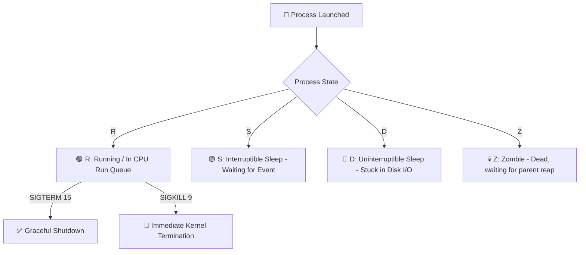

# 🐧 VERIQTA Linux Production Handbook: Top 500 Commands Master Guide
> **The Ultimate Linux Command & Architecture Reference for DevOps, SREs, Cloud Engineers & Platform Architects.**  
> *Structured for Long-Term Mental Retention, Daily Production Operations, and High-Frequency Technical Interviews.*

---

## 📑 Master Table of Contents
1. [Core Mental Models for Mastering 500+ Linux Commands](#1-core-mental-models-for-mastering-500-linux-commands)
2. [Module 1: File & Directory Management](#module-1-file--directory-management-page-1)
3. [Module 2: File Search & High-Performance Text Processing](#module-2-file-search--high-performance-text-processing-page-2)
4. [Module 3: Users, Groups, Access Control & POSIX Permissions](#module-3-users-groups-access-control--posix-permissions-page-3-11-17)
5. [Module 4: Process Management, Signals, Priority & Control](#module-4-process-management-signals-priority--control-page-4-10-16)
6. [Module 5: systemd Service Supervision & Target Management](#module-5-systemd-service-supervision--target-management-page-5)
7. [Module 6: Networking, Socket Analysis & Diagnostics](#module-6-networking-socket-analysis--diagnostics-page-6-12-18)
8. [Module 7: SSH Remote Administration & Server Hardening](#module-7-ssh-remote-administration--server-hardening-page-7)
9. [Module 8: Disks, Storage, Partitions & Filesystem Management](#module-8-disks-storage-partitions--filesystem-management-page-8-14)
10. [Module 9: Logging, `journalctl` Filtering & Logrotate](#module-9-logging-journalctl-filtering--logrotate-page-9-15)
11. [Module 10: System Performance, Resource Accounting & Monitoring](#module-10-system-performance-resource-accounting--monitoring-page-13)
12. [Module 11: Enterprise Package Management Across Distros](#module-11-enterprise-package-management-across-distros-page-19)
13. [Module 12: Housekeeping, Automation & System Maintenance](#module-12-housekeeping-automation--system-maintenance-page-20)
14. [Top Production Workflows & Cheat Sheet Matrices](#14-top-production-workflows--cheat-sheet-matrices)
15. [High-Yield Senior Interview Q&A Bank](#15-high-yield-senior-interview-qa-bank)

---

## 1. Core Mental Models for Mastering 500+ Linux Commands

```
                         THE 6 ESSENTIAL LINUX MENTAL MODELS
 ┌─────────────────────────────────────────────────────────────────────────────┐
 │ 1. Linux Pipeline Philosophy: Small, Focused Tools Chained Together         │
 │    • ps aux | grep nginx | awk '{print $2}' | xargs -r kill -15             │
 ├─────────────────────────────────────────────────────────────────────────────┤
 │ 2. The File Descriptor Rule: Everything is represented as an FD             │
 │    • Files, devices (/dev/sda), kernel state (/proc), network sockets.      │
 ├─────────────────────────────────────────────────────────────────────────────┤
 │ 3. Modern vs Legacy Tool Equivalence:                                       │
 │    • ifconfig ──▶ ip a | netstat ──▶ ss | top ──▶ htop / atop | init ──▶ systemd│
 ├─────────────────────────────────────────────────────────────────────────────┤
 │ 4. Permission Triad (User : Group : Others)                                 │
 │    • Read (4) + Write (2) + Execute (1) ──▶ 755 (rwxr-xr-x) / 644 (rw-r--r--)   │
 ├─────────────────────────────────────────────────────────────────────────────┤
 │ 5. Graceful First (SIGTERM 15), Forceful Last (SIGKILL 9)                   │
 │    • Always allow apps to flush buffers and close connections before -9.    │
 ├─────────────────────────────────────────────────────────────────────────────┤
 │ 6. Non-Destructive Investigation First:                                     │
 │    • Check read-only state (journalctl, ss, df, free, top) before writing. │
 └─────────────────────────────────────────────────────────────────────────────┘
```

---

## Module 1: File & Directory Management (Page 1)

```
                 DIRECTORY TRAVERSAL & LIFECYCLE
 ┌──────────────┐    ┌──────────────┐    ┌──────────────┐    ┌──────────────┐
 │ pwd (Where)  │───▶│  ls -lah     │───▶│  mkdir -p    │───▶│  touch / cp  │
 │ (Verify dir) │    │  (Inspect)   │    │  (Structure) │    │  (Populate)  │
 └──────────────┘    └──────────────┘    └──────────────┘    └──────────────┘
```

### 📋 Command Master Table
| # | Command | Syntax Example | Production Use Case |
|---|---|---|---|
| 1 | `ls` | `ls` | Quick directory listing |
| 2 | `ls -l` | `ls -l` | Long-format listing with permissions, owner, size, date |
| 3 | `ls -a` | `ls -a` | Show all files including hidden dotfiles (`.bashrc`, `.env`) |
| 4 | `ls -lah` | `ls -lah` | **Standard DevOps inspection:** Long, all files, human-readable sizes |
| 5 | `cd` | `cd /var/log` | Change directory to absolute or relative path |
| 6 | `cd ..` | `cd ..` | Move one directory up hierarchy (`cd ../..` moves 2 up) |
| 7 | `pwd` | `pwd` | Print working directory (essential in bash automation) |
| 8 | `mkdir` | `mkdir projects` | Create single directory |
| 9 | `mkdir -p` | `mkdir -p /opt/app/{bin,conf,logs,data}` | **Recursive creation:** Builds nested paths without erroring |
| 10| `rmdir` | `rmdir old_dir` | Remove directory (only works if directory is empty) |
| 11| `rm` | `rm file.txt` | Delete single file |
| 12| `rm -r` | `rm -r old_project` | Recursively delete directory and its contents |
| 13| `rm -rf` | `rm -rf /tmp/build_*` | **Force remove:** Deletes without prompting (Use with caution!) |
| 14| `cp` | `cp file.txt /backup/` | Copy single file to destination |
| 15| `cp -r` | `cp -r /app /backup/app_$(date +%F)` | Recursively copy directory tree preserving hierarchy |
| 16| `mv` | `mv source.txt dest.txt` | Move or rename file/directory |
| 17| `touch` | `touch app.log` | Create empty file or update timestamp of existing file |
| 18| `cat` | `cat file.txt` | Concatenate and display entire file on terminal |
| 19| `less` | `less /var/log/syslog` | Paginated file viewer (Nav: `/search`, `G` bottom, `q` quit) |
| 20| `head -n`| `head -n 20 file.txt` | View first $N$ lines of a file |

---

## Module 2: File Search & High-Performance Text Processing (Page 2)

```mermaid
graph LR
    DiskLogs[📂 Raw Logs / Files] -->|find / grep| Filtered[🔍 Matched Lines / Files]
    Filtered -->|awk / cut| Columns[📊 Extracted Columns / Metrics]
    Columns -->|sort | uniq -c| Summary[📈 Sorted Frequency Counts]
```

### 📋 Command Master Table
| # | Command | Syntax Example | Production Purpose |
|---|---|---|---|
| 21| `find -name` | `find / -name "*.conf"` | Search files by name pattern |
| 22| `find -type d` | `find /var -type d` | Find only directory nodes |
| 23| `find -mtime` | `find /var/log -type f -mtime -7` | Find files modified within the last 7 days |
| 24| `find -size` | `find / -type f -size +100M 2>/dev/null` | Find files larger than 100MB (suppress permission errors) |
| 25| `locate` | `locate nginx.conf` | Instant search using pre-built database index (`updatedb`) |
| 26| `which` | `which docker` | Show full path of command binary from `$PATH` |
| 27| `whereis` | `whereis bash` | Locate binary, source code, and man pages |
| 28| `grep` | `grep "ERROR" app.log` | Search for exact text pattern |
| 29| `grep -r` | `grep -r "500 Internal" /var/log/nginx/` | Recursive directory text search |
| 30| `grep -i` | `grep -ri "exception" /var/log/` | Case-insensitive search |
| 31| `grep -v` | `grep -v "DEBUG" app.log` | Invert match (exclude lines containing string) |
| 32| `awk '{print $1}'` | `awk '{print $1}' access.log` | Extract first column (e.g. client IP) |
| 33| `awk -F` | `awk -F: '$3 >= 1000 {print $1, $3}' /etc/passwd` | Parse custom delimited text (colon-separated) |
| 34| `sed 's/old/new/g'`| `sed 's/http/https/g' config.yml` | Stream edit: replace all occurrences in output |
| 35| `sed -i` | `sed -i 's/DEBUG=True/DEBUG=False/g' .env` | **In-place file editing:** Modifies file directly on disk |
| 36| `sed -n '10,20p'` | `sed -n '50,100p' server.log` | Print specific line slice (lines 50 to 100) |
| 37| `cut -d` | `cut -d',' -f1,3 data.csv` | Extract specific fields from delimited file |
| 38| `sort` | `sort names.txt` | Sort lines alphabetically |
| 39| `sort -nr` | `sort -nr -k2 counts.txt` | Sort numerically in reverse order |
| 40| `uniq -c` | `sort file.txt \| uniq -c` | Deduplicate lines and count occurrences |

---

## Module 3: Users, Groups, Access Control & POSIX Permissions (Page 3, 11, 17)

```
       10-CHARACTER PERMISSION STRING DECODER
  -   r w x   r - x   r - -
 ─── ─────── ─────── ───────
  │     │       │       │
 Type Owner   Group   Others
 (- = file, d = directory, l = symlink)
```

### 📋 Command Master Table
| # | Command | Syntax Example | Production Purpose |
|---|---|---|---|
| 41| `id` | `id deployer` | Show UID, GID, and supplementary group memberships |
| 42| `whoami` | `whoami` | Print active user name executing current shell |
| 43| `who` | `who` | Show all currently logged-in users and TTY sessions |
| 44| `w` | `w` | Show logged-in users, current tasks, and system load |
| 45| `last` | `last -n 10` | Show history of successful user logins and reboots |
| 46| `lastb` | `lastb` | Show history of **failed login attempts** (brute-force audit) |
| 47| `useradd -m` | `sudo useradd -m -s /bin/bash deployer` | Create user with home directory and default shell |
| 48| `passwd` | `sudo passwd deployer` | Set or update user password |
| 49| `usermod -aG`| `sudo usermod -aG docker,sudo deployer` | **Append** user to supplementary groups (never omit `-a`!) |
| 50| `userdel -r` | `sudo userdel -r olduser` | Delete user account AND remove `/home/olduser` directory |
| 51| `groupadd` | `sudo groupadd devops` | Create a new user group |
| 52| `chown -R` | `sudo chown -R www-data:www-data /var/www` | Recursively set file user and group ownership |
| 53| `chmod` | `chmod 755 script.sh` | Set standard octal permissions (`rwxr-xr-x`) |
| 54| `chage -l` | `chage -l deployer` | Inspect user password aging, expiration, and lock status |
| 55| `visudo` | `sudo visudo` | **Safely edit `/etc/sudoers`** with syntax lock protection |

---

## Module 4: Process Management, Signals, Priority & Control (Page 4, 10, 16)

```
        -20 (Highest CPU Priority) <─── 0 (Default) ───> +19 (Lowest CPU Priority)
```



### 📋 Command Master Table
| # | Command | Syntax Example | Production Purpose |
|---|---|---|---|
| 61| `ps aux` | `ps aux \| grep nginx` | BSD-style snapshot of all running processes |
| 62| `ps -ef` | `ps -ef` | Standard UNIX full-format process snapshot |
| 63| `ps -eo` | `ps -eo pid,ppid,user,%cpu,%mem,cmd --sort=-%cpu` | Custom column snapshot sorted by highest CPU |
| 64| `top` | `top` | Interactive real-time process & CPU viewer |
| 65| `htop` | `htop` | Visual process viewer with per-core CPU bars and search (`F3`) |
| 66| `pstree -p` | `pstree -p` | Tree-view showing parent-child hierarchy with PIDs |
| 67| `pgrep` | `pgrep -fl python` | Find PID(s) matching process name pattern |
| 68| `pidof` | `pidof mysqld` | Get exact PID of running executable |
| 69| `kill` | `kill 1234` | Send default `SIGTERM` (15) for graceful stop |
| 70| `kill -9` | `kill -9 1234` | Send uncatchable `SIGKILL` (9) for immediate kill |
| 71| `killall` | `killall -9 worker` | Kill all processes matching binary name |
| 72| `pkill -f` | `pkill -f "gunicorn.*app:main"` | Kill processes matching full command-line pattern |
| 73| `nice -n` | `nice -n 10 ./heavy_backup.sh` | Launch process with lowered CPU scheduling priority |
| 74| `renice` | `renice -n -5 -p 1234` | Change CPU priority of live running process |
| 75| `nohup &` | `nohup ./sync.sh > sync.log 2>&1 &` | Run job in background immune to terminal hangups (`SIGHUP`) |
| 76| `jobs -l` | `jobs -l` | List all background jobs in current shell session |
| 77| `fg` / `bg` | `fg %1` / `bg %1` | Bring job to foreground / Resume suspended job in background |

---

## Module 5: systemd Service Supervision & Target Management (Page 5)

```
                            SYSTEMD SERVICE WORKFLOW
 ┌──────────────┐    ┌──────────────┐    ┌──────────────┐    ┌──────────────┐
 │ Write Unit   │───▶│ daemon-reload│───▶│ enable --now │───▶│ journalctl -u│
 │ (/etc/systemd│    │ (Reload cache│    │ (Start & boot│    │ (Verify logs)│
 └──────────────┘    └──────────────┘    └──────────────┘    └──────────────┘
```

### 📋 Command Master Table
| # | Command | Syntax Example | Production Purpose |
|---|---|---|---|
| 81| `systemctl start` | `sudo systemctl start nginx` | Start service immediately |
| 82| `systemctl stop` | `sudo systemctl stop nginx` | Stop running service |
| 83| `systemctl restart`| `sudo systemctl restart nginx` | Full termination and respawn (causes downtime) |
| 84| `systemctl reload` | `sudo systemctl reload nginx` | **Hot-reload configuration** without dropping TCP connections |
| 85| `systemctl enable` | `sudo systemctl enable --now nginx`| Enable service on boot AND start immediately |
| 86| `systemctl disable`| `sudo systemctl disable nginx` | Remove boot autostart symlinks |
| 87| `systemctl status` | `systemctl status nginx` | Check active status, main PID, memory, and recent logs |
| 88| `systemctl is-active`| `systemctl is-active --quiet nginx`| Check status in scripts (returns exit code 0 if running) |
| 89| `systemctl --failed`| `systemctl --failed` | List all system services in failed state |
| 90| `daemon-reload` | `sudo systemctl daemon-reload` | **MANDATORY:** Reload systemd manager after editing `.service` files |

---

## Module 6: Networking, Socket Analysis & Diagnostics (Page 6, 12, 18)

```
                         TCP SOCKET STATE FLOW
 ┌──────────────┐    ┌──────────────┐    ┌──────────────┐    ┌──────────────┐
 │ LISTEN (80)  │───▶│ SYN_RECEIVED │───▶│ ESTABLISHED  │───▶│  TIME_WAIT   │
 │ (Awaiting)   │    │ (Handshake)  │    │ (Transfer)   │    │  (Closing)   │
 └──────────────┘    └──────────────┘    └──────────────┘    └──────────────┘
```

### 📋 Command Master Table
| # | Command | Syntax Example | Production Purpose |
|---|---|---|---|
| 101| `ip addr` (`ip a`)| `ip -br a` | Display network interfaces and IP addresses in brief table |
| 102| `ip route` (`ip r`)| `ip r` | Show active kernel routing table and default gateway |
| 103| `ip link set` | `sudo ip link set eth0 up/down`| Enable or disable physical/virtual network interface |
| 104| `ss -tulnp` | `ss -tulnp` | **Modern port inspection:** TCP (`-t`), UDP (`-u`), Listening (`-l`), Numeric (`-n`), Process/PID (`-p`) |
| 105| `ping -c` | `ping -c 4 8.8.8.8` | Test ICMP network reachability with limited packet count |
| 106| `traceroute` | `traceroute google.com` | Trace network packet routing hops |
| 107| `mtr` | `mtr google.com` | Interactive real-time traceroute and packet loss monitor |
| 108| `dig` | `dig api.example.com +short` | Query DNS records directly |
| 109| `curl -Iv` | `curl -Iv https://example.com`| Inspect HTTP headers, TLS certificate, and response codes |
| 110| `nc -zv` | `nc -zv 10.0.0.5 3306` | Test TCP port connectivity to remote database/host |
| 111| `tcpdump` | `sudo tcpdump -i eth0 port 80 -nn` | Live network packet sniffer |

---

## Module 7: SSH Remote Administration & Server Hardening (Page 7)

```ini
# Hardened /etc/ssh/sshd_config Baseline
Port 2222
PermitRootLogin no
PasswordAuthentication no
PubkeyAuthentication yes
MaxAuthTries 3
ClientAliveInterval 300
ClientAliveCountMax 2
```

### 📋 Command Master Table
| # | Command | Syntax Example | Production Purpose |
|---|---|---|---|
| 121| `ssh` | `ssh -p 2222 deployer@10.0.0.5` | Connect to remote server via SSH on custom port |
| 122| `ssh -i` | `ssh -i ~/.ssh/prod.pem user@host`| Authenticate using specific private key identity |
| 123| `ssh-keygen` | `ssh-keygen -t ed25519 -C "admin@corp"`| Generate modern secure Ed25519 public/private keypair |
| 124| `ssh-copy-id`| `ssh-copy-id -i ~/.ssh/id_ed25519.pub user@host`| Copy public key to remote `~/.ssh/authorized_keys` |
| 125| `scp -r` | `scp -P 2222 -r ./build user@host:/var/www/`| Secure copy recursive directory over SSH |
| 126| `rsync -avz` | `rsync -avzP --delete ./data/ user@host:/data/`| **High-performance delta sync:** Archive mode, verbose, compressed, sync deletes |

---

## Module 8: Disks, Storage, Partitions & Filesystem Management (Page 8, 14)

```
                            STORAGE INITIALIZATION
 ┌──────────────┐    ┌──────────────┐    ┌──────────────┐    ┌──────────────┐
 │ 1. lsblk     │───▶│  2. fdisk    │───▶│  3. mkfs.xfs │───▶│  4. mount /  │
 │ (Find disk)  │    │ (Partition)  │    │  (Format FS) │    │  /etc/fstab  │
 └──────────────┘    └──────────────┘    └──────────────┘    └──────────────┘
```

### 📋 Command Master Table
| # | Command | Syntax Example | Production Purpose |
|---|---|---|---|
| 141| `df -h` | `df -h` | Show filesystem disk space utilization in human units |
| 142| `df -i` | `df -i` | **Check Inode count:** Detect "No space left on device" when disk space is free |
| 143| `du -sh` | `du -sh /var/log` | Summary disk footprint of specific directory |
| 144| `du -ah` | `du -ah /var \| sort -hr \| head -n 10`| Find top 10 largest files/folders in directory |
| 145| `lsblk -f` | `lsblk -f` | Display storage block devices, mount points, and UUIDs |
| 146| `fdisk -l` | `sudo fdisk -l` | List partition tables on all attached drives |
| 147| `blkid` | `sudo blkid /dev/sdb1` | Print filesystem UUID and filesystem type (for `/etc/fstab`) |
| 148| `mkfs.xfs` | `sudo mkfs.xfs /dev/sdb1` | Format partition with high-performance XFS filesystem |
| 149| `mount -a` | `sudo mount -a` | **Validate and mount all entries in `/etc/fstab` without rebooting** |
| 150| `smartctl` | `sudo smartctl -a /dev/sda` | Check hardware health, bad sectors, and SMART disk telemetry |

---

## Module 9: Logging, `journalctl` Filtering & Logrotate (Page 9, 15)

```
                      JOURNALCTL PRIORITY MATRIX (-p)
 ┌──────────────┬───────┬─────────────────────────────────────────────────────┐
 │ Priority     │ Level │ Meaning                                             │
 ├──────────────┼───────┼─────────────────────────────────────────────────────┤
 │ emerg        │ 0     │ System is unusable (Kernel panic)                   │
 │ alert        │ 1     │ Action must be taken immediately                    │
 │ crit         │ 2     │ Critical conditions (Hardware/Driver failures)      │
 │ err          │ 3     │ Error conditions (Application crash, DB down)       │
 │ warning      │ 4     │ Warning conditions                                  │
 │ notice       │ 5     │ Normal but significant events                       │
 │ info         │ 6     │ Informational messages                              │
 │ debug        │ 7     │ Debug-level messages                                │
 └──────────────┴───────┴─────────────────────────────────────────────────────┘
```

### 📋 Command Master Table
| # | Command | Syntax Example | Production Purpose |
|---|---|---|---|
| 161| `journalctl` | `journalctl` | View entire systemd binary journal logs |
| 162| `journalctl -f` | `journalctl -u nginx -f` | Real-time live log follow (like `tail -f`) |
| 163| `journalctl -n` | `journalctl -u nginx -n 100 --no-pager` | View last 100 log lines without paginator |
| 164| `journalctl -p err`| `journalctl -p err..emerg -b` | Filter logs by priority (Errors, critical, panics) |
| 165| `journalctl --since`| `journalctl --since "1 hour ago"` | Time-bounded log extraction |
| 166| `journalctl -b -1` | `journalctl -b -1` | Inspect logs from the **previous system boot cycle** |
| 167| `journalctl -k` | `journalctl -k` | View kernel dmesg messages |
| 168| `--vacuum-size`| `sudo journalctl --vacuum-size=500M` | Clean old journal logs to reclaim disk space |
| 169| `logrotate -f` | `sudo logrotate -f /etc/logrotate.d/nginx`| Force manual execution of logrotate policy |

---

## Module 10: System Performance, Resource Accounting & Monitoring (Page 13)

```
               SYSTEM PERFORMANCE MONITORING MATRIX
 ┌──────────────────────┬─────────────────────────────────────────────────────┐
 │ Resource Layer       │ Primary Tools & Commands                            │
 ├──────────────────────┼─────────────────────────────────────────────────────┤
 │ CPU Utilization      │ top, htop, mpstat -P ALL 1, sar -u 1               │
 │ Memory & Swap        │ free -h, vmstat 1, cat /proc/meminfo                │
 │ Disk I/O & Latency   │ iostat -xz 1, iotop -oPa, pidstat -d 1              │
 │ Network Bandwidth    │ iftop, nethogs, sar -n DEV 1                        │
 └──────────────────────┴─────────────────────────────────────────────────────┘
```

### 📋 Command Master Table
| # | Command | Syntax Example | Production Purpose |
|---|---|---|---|
| 241| `uptime` | `uptime` | Print system uptime and 1, 5, 15 min Load Averages |
| 242| `free -h` | `free -h` | Inspect Total, Used, Free, Buff/Cache, and Available RAM |
| 243| `vmstat 1` | `vmstat 1 5` | Monitor run queue (`r`), blocked I/O (`b`), and swap (`si`/`so`) |
| 244| `iostat -xz 1`| `iostat -xz 1 5` | Measure disk throughput, latency (`await`), and saturation (`%util`) |
| 245| `mpstat -P ALL`| `mpstat -P ALL 1` | Per-core CPU utilization breakdown (`%usr`, `%sys`, `%iowait`) |
| 246| `pidstat -u 1` | `pidstat -u 1 5` | Per-process CPU consumption over time |
| 247| `sar -u 1` | `sar -u 1 5` | Historical system resource activity logging |

---

## Module 11: Enterprise Package Management Across Distros (Page 19)

| Task | Debian / Ubuntu (`apt`) | RHEL / Rocky (`dnf` / `yum`) | Arch Linux (`pacman`) | Alpine Linux (`apk`) |
|---|---|---|---|---|
| **Update Cache** | `sudo apt update` | `sudo dnf makecache` | `sudo pacman -Sy` | `apk update` |
| **Upgrade All** | `sudo apt upgrade -y`| `sudo dnf upgrade -y` | `sudo pacman -Syu` | `apk upgrade` |
| **Install** | `sudo apt install pkg`| `sudo dnf install pkg`| `sudo pacman -S pkg` | `apk add pkg` |
| **Remove** | `sudo apt remove pkg` | `sudo dnf remove pkg` | `sudo pacman -R pkg` | `apk del pkg` |
| **Purge (Configs)**| `sudo apt purge pkg` | `sudo dnf remove pkg` | `sudo pacman -Rns pkg`| N/A |
| **Clean Cache** | `sudo apt clean` | `sudo dnf clean all` | `sudo pacman -Sc` | `apk cache clean` |
| **Find File Owner**| `dpkg -S /path/file` | `dnf provides /path/file`| `pacman -Qo /path/file`| N/A |

---

## Module 12: Housekeeping, Automation & System Maintenance (Page 20)

### 🧹 Automated Maintenance Crontab
```bash
# /etc/cron.d/production_housekeeping
# Run journal cleanup every Sunday at 2 AM (Keep under 500MB)
0 2 * * 0 root /usr/bin/journalctl --vacuum-size=500M >/dev/null 2>&1

# Run daily logrotate at 3 AM
0 3 * * * root /usr/sbin/logrotate -f /etc/logrotate.conf >/dev/null 2>&1

# Clean temporary package caches every month
0 4 1 * * root /usr/bin/apt-get clean >/dev/null 2>&1
```

```bash
# Safe System Shutdown & Reboot
sudo shutdown -r +5 "Rebooting in 5 minutes for kernel update"
sudo shutdown -c   # Cancel scheduled shutdown
sudo shutdown -h now # Immediate shutdown
```

---

## 14. Top Production Workflows & Cheat Sheet Matrices

### 🔍 6-Stage Incident Triage Workflow
```
[1. DETECT] ──▶ [2. TRIAGE] ──▶ [3. ISOLATE] ──▶ [4. MITIGATE] ──▶ [5. VERIFY] ──▶ [6. RCA & PREVENT]
```

1. **System Reachability:** `ping <host>` $\rightarrow$ `ssh -v user@host`
2. **Saturation Check:** `uptime` (Load) $\rightarrow$ `top -c` (CPU) $\rightarrow$ `free -h` (RAM) $\rightarrow$ `iostat -xz 1` (Disk)
3. **Storage & Inodes:** `df -h` $\rightarrow$ `df -i`
4. **Service Health:** `systemctl status <svc>` $\rightarrow$ `systemctl --failed`
5. **Logs & Stack:** `journalctl -u <svc> -n 100 --no-pager` $\rightarrow$ `dmesg -T | tail -n 50`
6. **Network Ports:** `ss -tulnp | grep :<port>` $\rightarrow$ `curl -Iv localhost:<port>`

---

## 15. High-Yield Senior Interview Q&A Bank

| # | High-Frequency Interview Question | Senior Engineer Direct Answer |
|---|---|---|
| 1 | **What is the difference between `df` and `du`?** | `df` queries filesystem superblocks directly (counts disk blocks held by unlinked open files). `du` walks the live directory tree aggregating active file sizes. |
| 2 | **Why can a write fail with "No space left on device" when `df -h` shows 50% free?** | The filesystem is out of **Inodes** (`df -i` at 100%). Millions of small files have consumed all allocated inode metadata slots. |
| 3 | **How do you kill a Zombie process?** | You cannot kill a zombie with `kill -9` (it is already dead). You must restart its parent process so it collects the exit code via `waitpid()`, or kill the parent so `systemd` (PID 1) reaps it. |
| 4 | **Difference between `systemctl restart` and `reload`?** | `restart` terminates and restarts workers (causes brief downtime). `reload` sends `SIGHUP` to re-read configs without dropping active TCP connections. |
| 5 | **What does a high `%wa` in `top` indicate?** | The CPU is sitting idle waiting for disk or network storage I/O to return. |
| 6 | **What is the difference between `free` and `available` memory?** | `free` is unallocated RAM. `available` includes reclaimable Page Cache and Buffers that can be immediately given to apps without forcing swap. |
| 7 | **What is the difference between SUID, SGID, and the Sticky Bit?** | SUID (4000) runs binary as file owner; SGID (2000) inherits directory group for new files; Sticky Bit (1000) prevents users from deleting others' files in shared folders (`/tmp`). |
| 8 | **Why are UUIDs used in `/etc/fstab` instead of `/dev/sda1`?** | Device names (`/dev/sda1`) can change across reboots depending on hardware detection order. UUIDs are persistent cryptographic identifiers. |

---
*Created for Production Engineering Excellence, SRE Mastery & High-Impact Technical Interviews.*
