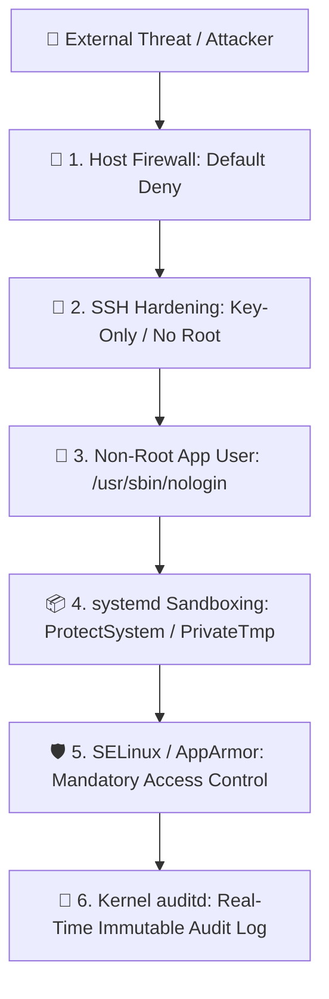

# 🛡️ Linux Security & Hardening Master Handbook
> **From Linux Hardening to Enterprise Production Security & Incident Response**  
> *Engineered for SREs, Security Engineers, DevOps Architects & Systems Administrators.*

---

## 📑 Table of Contents
1. [Core Security Mental Models & Defense-in-Depth](#1-core-security-mental-models--defense-in-depth)
2. [20-Module Production Security Deep Dive](#2-20-module-production-security-deep-dive)
   - [1. Linux Security Foundations & Architecture](#1-linux-security-foundations--architecture)
   - [2. Users, Groups & Identity Security](#2-users-groups--identity-security)
   - [3. Password, Authentication & PAM Security](#3-password-authentication--pam-security)
   - [4. File & Directory Permission Hardening](#4-file--directory-permission-hardening)
   - [5. SUID, SGID, Sticky Bit & POSIX ACLs](#5-suid-sgid-sticky-bit--posix-acls)
   - [6. Sudoers Privilege Escalation Security](#6-sudoers-privilege-escalation-security)
   - [7. SSH Server Hardening & Key Protection](#7-ssh-server-hardening--key-protection)
   - [8. Linux Services & systemd Sandboxing Security](#8-linux-services--systemd-sandboxing-security)
   - [9. Network Exposure, Listening Sockets & Port Auditing](#9-network-exposure-listening-sockets--port-auditing)
   - [10. Host Firewalls: nftables, iptables & UFW](#10-host-firewalls-nftables-iptables--ufw)
   - [11. Process & Runtime Execution Security](#11-process--runtime-execution-security)
   - [12. Security Logging, journalctl & Forensic Triage](#12-security-logging-journalctl--forensic-triage)
   - [13. Linux Kernel Auditing with `auditd`](#13-linux-kernel-auditing-with-auditd)
   - [14. Mandatory Access Control: SELinux & AppArmor](#14-mandatory-access-control-selinux--apparmor)
   - [15. Package, Repository & CVE Patch Security](#15-package-repository--cve-patch-security)
   - [16. File Integrity Monitoring (FIM) & Persistence Detection](#16-file-integrity-monitoring-fim--persistence-detection)
   - [17. Secrets Management & Credential Exposure Prevention](#17-secrets-management--credential-exposure-prevention)
   - [18. CIS Security Hardening Baseline Architecture](#18-cis-security-hardening-baseline-architecture)
   - [19. Live Production Security Incident Investigation Playbook](#19-live-production-security-incident-investigation-playbook)
   - [20. Master 20-Point Security Production Checklist](#20-master-20-point-security-production-checklist)
3. [Top Security & Hardening Interview Q&A Bank](#3-top-security--hardening-interview-qa-bank)

---

## 1. Core Security Mental Models & Defense-in-Depth

```
                         DEFENSE-IN-DEPTH SECURITY ONION
 ┌─────────────────────────────────────────────────────────────────────────────┐
 │ 1. PERIMETER & NETWORK: Host Firewall (nftables/UFW), Binding 127.0.0.1     │
 ├─────────────────────────────────────────────────────────────────────────────┤
 │ 2. ACCESS CONTROL: SSH Key-Only Auth, Sudoers Least-Privilege, PAM Lockouts │
 ├─────────────────────────────────────────────────────────────────────────────┤
 │ 3. IDENTITY & ACCOUNTS: Non-root Service Users, Disabled Shells (/nologin)  │
 ├─────────────────────────────────────────────────────────────────────────────┤
 │ 4. FILESYSTEM & STORAGE: UGO (640/750), Strict umask, No 777, No Rogue SUID│
 ├─────────────────────────────────────────────────────────────────────────────┤
 │ 5. SYSTEMD & CONTAINER SANDBOX: ProtectSystem=strict, PrivateTmp=true, NoNew│
 ├─────────────────────────────────────────────────────────────────────────────┤
 │ 6. KERNEL ENFORCEMENT: SELinux/AppArmor (MAC), auditd Kernel Syscall Audits │
 └─────────────────────────────────────────────────────────────────────────────┘
```

### 🧠 5 Non-Negotiable Linux Security Laws
1. **Never Run Apps as Root:** If an application running as `root` suffers a Remote Code Execution (RCE) vulnerability, the attacker immediately gains full root ownership of the OS.
2. **Authentication $\neq$ Authorization:** Authentication verifies *who you are* (SSH keys, passwords); Authorization dictates *what you can do* (`sudoers`, file permissions, SELinux).
3. **Minimize Attack Surface:** Disable every unused service, close every unneeded port, and remove unnecessary compiler/debugging binaries on production nodes.
4. **Assume Breach & Enforce Least Privilege:** Every daemon should have only the minimum access required to execute its core function.
5. **Always Preserve Forensic Evidence First:** When a server is compromised, do not reboot or blindly delete files. Capture logs and memory state first.

---

## 2. 20-Module Production Security Deep Dive

---

### 1. Linux Security Foundations & Architecture



* **Attack Surface Reduction:** Eliminate unneeded packages (`gcc`, `gdb`, `telnet`, `rsh`).
* **Defense-in-Depth:** Multiple redundant security controls ensure that if one layer fails (e.g. firewall misconfigured), inner layers (SELinux, systemd sandbox) stop the exploit.

---

### 2. Users, Groups & Identity Security

#### 📁 Critical Identity Configuration Files
| File | Permissions | Owner | Content & Purpose |
| :--- | :--- | :--- | :--- |
| `/etc/passwd` | `644` (`rw-r--r--`) | `root:root` | User account metadata (Username, UID, GID, Home Dir, Default Shell) |
| `/etc/shadow` | `000` or `640` | `root:shadow` | Cryptographically hashed passwords (SHA-512 / yescrypt), account aging rules |
| `/etc/group` | `644` (`rw-r--r--`) | `root:root` | Group names, GIDs, and supplementary user member lists |
| `/etc/sudoers`| `440` (`r--r-----`) | `root:root` | Sudo privilege delegation rules (Always edit via `visudo`) |

#### 🛡️ Identity Auditing Commands
```bash
# Find all accounts with UID 0 (Only root should ever have UID 0!)
awk -F: '($3 == 0) {print $1}' /etc/passwd

# Find accounts with valid interactive login shells (not /sbin/nologin or /bin/false)
grep -E -v "nologin|false" /etc/passwd

# Lock a compromised or dormant user account immediately
sudo usermod -L deployer      # Adds '!' to /etc/shadow password hash
sudo usermod -e 2026-12-31 user # Set account expiration date
```

---

### 3. Password, Authentication & PAM Security

* **Pluggable Authentication Modules (PAM):** Located in `/etc/pam.d/`. Enforces password complexity, lockout on repeated failed attempts (`pam_faillock.so` / `pam_tally2.so`), and session limits.

```bash
# Inspect password aging and expiration policy for a user
chage -l deployer

# Enforce 90-day password rotation and 7-day warning
sudo chage -M 90 -W 7 deployer

# Check failed login attempts (Brute-force audit)
sudo lastb -n 20
sudo grep -i "failed password" /var/log/auth.log
```

---

### 4. File & Directory Permission Hardening

#### 🧮 Permission Matrix
$$\text{Read (r)} = 4 \quad|\quad \text{Write (w)} = 2 \quad|\quad \text{Execute (x)} = 1$$

* **Directory `x` (Execute) vs File `x`:** On directories, `x` allows entering/traversing (`cd`). Without `x`, you cannot access any files inside, even if you have read (`r`) permission on the files!
* **`umask` (Default Permission Mask):**
  * System default: `022` $\implies$ Files created as `644` (`rw-r--r--`), Directories created as `755` (`rwxr-xr-x`).
  * Hardened server: `027` $\implies$ Files created as `640` (`rw-r-----`), Directories created as `750` (`rwxr-x---`).

#### 🔍 Auditing Dangerous Permissions
```bash
# Find all world-writable files (Major security risk: writable by anyone)
find / -xdev -type f -perm -0002 -ls 2>/dev/null

# Find world-writable directories missing the Sticky Bit
find / -xdev -type d -perm -0002 ! -perm -1000 -ls 2>/dev/null

# Trace full path permissions to detect traversal bypasses
namei -l /var/www/html/index.html
```

---

### 5. SUID, SGID, Sticky Bit & POSIX ACLs

```
                     SPECIAL PERMISSIONS SECURITY MAP
 ┌──────────────────────┬───────┬─────────────────────────────────────────────┐
 │ Bit                  │ Octal │ Security Risk & Hardening                   │
 ├──────────────────────┼───────┼─────────────────────────────────────────────┤
 │ SUID (Set User ID)   │ 4000  │ Executes as file OWNER (Risk: root privesc) │
 │ SGID (Set Group ID)  │ 2000  │ Inherits parent directory group             │
 │ Sticky Bit           │ 1000  │ Prevents users from deleting others' files  │
 └──────────────────────┴───────┴─────────────────────────────────────────────┘
```

#### 🔍 Auditing SUID/SGID Binaries
```bash
# Find all SUID root executables on the system
find / -xdev -type f -perm -4000 -ls 2>/dev/null

# Audit and remove SUID bit from non-essential binaries
sudo chmod u-s /usr/bin/unnecessary_binary

# Fine-grained Access Control Lists (ACLs)
setfacl -m u:appsvc:rw- /var/log/audit/app.log
getfacl /var/log/audit/app.log
```

---

### 6. Sudoers Privilege Escalation Security

> [!CAUTION]
> Never use `ALL=(ALL) NOPASSWD: ALL` in production. Never grant sudo to wildcard directories like `/bin/*` or interpreters like `/usr/bin/vim` (attackers can spawn root shells via `:!sh`).

#### 🛡️ Secure `/etc/sudoers` Configuration via `visudo`
```ini
# /etc/sudoers.d/deployer
# Grant granular restart permissions for a specific service ONLY
deployer ALL=(ALL) NOPASSWD: /usr/bin/systemctl restart nginx, /usr/bin/systemctl reload nginx

# Revoke all sudo token timestamps immediately upon logoff
Defaults timestamp_timeout=5
```

```bash
# Inspect allowed sudo privileges for current user
sudo -l

# Invalidate cached sudo credentials immediately
sudo -k
```

---

### 7. SSH Server Hardening & Key Protection

#### 🔒 Hardened `/etc/ssh/sshd_config` Configuration
```ini
# Core SSH Hardening
Port 2222                          # Non-default port stops generic automated bot scans
Protocol 2
PermitRootLogin no                 # Never allow direct root login; force named users + sudo
PasswordAuthentication no          # Enforce SSH key authentication only
PubkeyAuthentication yes
AuthenticationMethods publickey
MaxAuthTries 3                     # Drop connection after 3 failed attempts
LoginGraceTime 30s
ClientAliveInterval 300            # Terminate idle sessions after 10 minutes
ClientAliveCountMax 2
X11Forwarding no                   # Disable unnecessary graphical forwarding
AllowUsers deployer admin-lead     # Strict whitelist of allowed accounts
```

```bash
# Validate syntax before restarting to prevent accidental lockouts!
sudo sshd -t

# Secure permissions on client and server SSH directories
chmod 700 ~/.ssh
chmod 600 ~/.ssh/authorized_keys ~/.ssh/id_ed25519
chmod 644 ~/.ssh/id_ed25519.pub
```

---

### 8. Linux Services & systemd Sandboxing Security

Modern systemd allows building **declarative security sandboxes** directly inside service unit files without requiring external container engines:

```ini
# /etc/systemd/system/myapp.service
[Service]
User=appsvc
Group=appsvc

# Systemd Hardening Directives
ProtectSystem=strict               # Mounts /usr, /boot, /etc as read-only
ProtectHome=true                   # Denies access to /home, /root, /run/user
PrivateTmp=true                    # Gives the service its own isolated /tmp
NoNewPrivileges=true               # Prevents execution of SUID binaries
ProtectKernelTunables=true         # Denies writes to /proc/sys, /sys
ProtectKernelModules=true          # Blocks loading of kernel modules
MemoryMax=2G
```

```bash
# List all running and enabled services to find attack surfaces
systemctl list-unit-files --type=service --state=enabled

# Prevent an unused dangerous service from ever starting (even manually)
sudo systemctl mask telnet.service
```

---

### 9. Network Exposure, Listening Sockets & Port Auditing

```
                       SOCKET EXPOSURE SECURITY MATRIX
 ┌──────────────────────┬─────────────────────────────────────────────────────┐
 │ Binding IP           │ Exposure & Security Implication                     │
 ├──────────────────────┼─────────────────────────────────────────────────────┤
 │ 127.0.0.1 (Loopback) │ Accessible ONLY from inside local host (Secure)     │
 │ 0.0.0.0 (All IP)     │ Exposed to ALL internal and public interfaces       │
 │ 10.x.x.x / 172.x.x.x │ Exposed strictly to Private VPC / Subnet            │
 └──────────────────────┴─────────────────────────────────────────────────────┘
```

```bash
# Inspect all listening ports with PID and executable name
sudo ss -tulpen

# Find the exact process and open files holding port 8080
sudo lsof -i :8080 -sTCP:LISTEN
```

---

### 10. Host Firewalls: nftables, iptables & UFW

#### 🧱 Default-Deny Firewall Strategy
```bash
# UFW (Ubuntu/Debian) Production Setup
sudo ufw default deny incoming
sudo ufw default allow outgoing
sudo ufw allow 2222/tcp comment "SSH Hardened Port"
sudo ufw allow proto tcp from 10.0.0.0/8 to any port 3306 comment "MySQL Private VPC Only"
sudo ufw enable

# nftables (Modern Linux Standard)
sudo nft list ruleset
```

---

### 11. Process & Runtime Execution Security

#### 🔍 Detecting Anomalous Processes
* **Suspicious Paths:** Executables running out of `/tmp`, `/var/tmp`, or `/dev/shm` (classic malware staging areas).
* **Obfuscated Command Lines:** Base64-encoded strings, hidden spaces, or reverse shell patterns (`/dev/tcp/`).

```bash
# Find processes running binaries located in /tmp or /dev/shm
ls -l /proc/*/exe 2>/dev/null | grep -E "/tmp|/dev/shm|/var/tmp"

# Check process tree and thread lineage
ps --forest -eo pid,ppid,user,stat,cmd
```

---

### 12. Security Logging, journalctl & Forensic Triage

```bash
# Follow authentication logs in real-time
tail -f /var/log/auth.log          # Debian / Ubuntu
tail -f /var/log/secure            # RHEL / Rocky Linux

# Extract all sudo executions by user
grep "sudo:" /var/log/auth.log

# Extract kernel security violations and segfaults
dmesg -T | grep -E "segfault|traps|OOM|denied"
```

---

### 13. Linux Kernel Auditing with `auditd`

`auditd` operates at the kernel system call level to provide **tamper-evident audit trails**.

```bash
# Watch sensitive files for any read/write/modification
sudo auditctl -w /etc/shadow -p warx -k shadow_access
sudo auditctl -w /etc/sudoers -p wa -k sudoers_change

# Search audit logs for security events
ausearch -k shadow_access --interpret
ausearch -m USER_CMD -ts today

# Generate executive summary report of authentication and command events
aureport --auth --summary
```

---

### 14. Mandatory Access Control: SELinux & AppArmor

```
               DISCRETIONARY (DAC) vs MANDATORY (MAC)
 ┌──────────────────────────────┬──────────────────────────────┐
 │ DAC (Standard Linux UGO)     │ MAC (SELinux / AppArmor)     │
 ├──────────────────────────────┼──────────────────────────────┤
 │ • Owner defines access       │ • Kernel security policy wins│
 │ • Root user can bypass all   │ • Root is RESTRICTED by policy│
 │ • Vulnerable to RCE exploits │ • Confines compromised root  │
 └──────────────────────────────┴──────────────────────────────┘
```

#### 🛡️ SELinux Operations (RHEL / Enterprise)
* Modes: `Enforcing` (Blocks & logs violations), `Permissive` (Logs violations only), `Disabled`.
```bash
getenforce
sestatus

# Inspect SELinux security context of files and processes
ls -Z /var/www/html/
ps -eZ | grep nginx

# Search Access Vector Cache (AVC) audit logs for denials
sudo ausearch -m avc -ts recent
```

#### 🛡️ AppArmor Operations (Ubuntu / Debian)
```bash
sudo aa-status
sudo aa-enforce /etc/apparmor.d/usr.sbin.nginx
```

---

### 15. Package, Repository & CVE Patch Security

* **Trusted Repositories:** Verify GPG signature keys in `/etc/apt/trusted.gpg.d/` or `/etc/pki/rpm-gpg/`.
* **Automated Security Patching:**
  * Debian/Ubuntu: `unattended-upgrades`
  * RHEL/Rocky: `dnf-automatic`

```bash
# Audit upgradable packages with CVE security fixes
sudo apt list --upgradable
sudo dnf check-update --security
```

---

### 16. File Integrity Monitoring (FIM) & Persistence Detection

Attackers establish persistence in known Linux hooks:
1. **Cron Schedules:** `/etc/crontab`, `/etc/cron.*`, `/var/spool/cron/crontabs/`
2. **Systemd Services:** `/etc/systemd/system/`, `/lib/systemd/system/`
3. **Shell Profiles:** `~/.bashrc`, `~/.profile`, `/etc/profile.d/`

```bash
# Generate baseline SHA256 hashes of critical system binaries
sha256sum /bin/* /sbin/* /usr/bin/* > /root/binaries_baseline.sha256

# Verify integrity against baseline
sha256sum -c /root/binaries_baseline.sha256 | grep -v "OK"
```

---

### 17. Secrets Management & Credential Exposure Prevention

```
                     CREDENTIAL EXPOSURE RISKS
 ┌──────────────────────┬─────────────────────────────────────────────────────┐
 │ Risk Source          │ Prevention Best Practice                            │
 ├──────────────────────┼─────────────────────────────────────────────────────┤
 │ Shell History        │ Set HISTCONTROL=ignorespace; unset HISTFILE for runs│
 │ Process Table (ps)   │ Never pass passwords via CLI flags (e.g. -p Secret) │
 │ Environment Vars     │ Restrict /proc/<PID>/environ access; use Vault      │
 │ Hardcoded Code/Conf  │ Scan repos with TruffleHog / GitLeaks               │
 └──────────────────────┴─────────────────────────────────────────────────────┘
```

```bash
# Scan codebase and configs for exposed private keys and API tokens
grep -rni -E "AKIA[0-9A-Z]{16}|BEGIN RSA PRIVATE KEY|password=" /opt/app/
```

---

### 18. CIS Security Hardening Baseline Architecture

```
                    11-POINT CIS HARDENING BLUEPRINT
 ┌──┬─────────────────────────────┬────────────────────────────────────────────┐
 │1 │ Minimal OS Installation     │ No GUI, no build tools (gcc) on production │
 │2 │ Remove Legacy Protocols     │ Purge telnet, rsh, NIS, TFTP, FTP          │
 │3 │ Restrict Sudoers            │ Command-specific whitelist; no NOPASSWD:ALL│
 │4 │ SSH Hardening               │ Key-only, non-default port, PermitRootLogin│
 │5 │ Filesystem Partitioning     │ Separate /var, /tmp, /home with nosuid,nodev│
 │6 │ Kernel Sysctl Hardening     │ Disable IP forwarding, ignore ICMP broadcast│
 │7 │ Host Firewall Enforcement   │ Default-deny inbound; strict port whitelist│
 │8 │ SELinux / AppArmor Active   │ Enforcing mode; zero permissive bypasses   │
 │9 │ Kernel Syscall Auditing     │ auditd watching /etc/shadow, sudo, execve  │
 │10│ Automated Security Updates  │ Daily security updates via unattended-upgr │
 │11│ File Integrity Verification │ AIDE / Tripwire daily baseline checks      │
 └──┴─────────────────────────────┴────────────────────────────────────────────┘
```

---

### 19. Live Production Security Incident Investigation Playbook

```
                  13-STEP EMERGENCY INCIDENT TRIAGE
 ┌──────────────┐    ┌──────────────┐    ┌──────────────┐    ┌──────────────┐
 │ 1. Active    │───▶│ 2. Recent    │───▶│ 3. Failed    │───▶│ 4. Sudo Audit│
 │ Users: w     │    │ Logins: last │    │ Logins: lastb│    │ /var/log/auth│
 └──────────────┘    └──────────────┘    └──────────────┘    └──────────────┘
        │
        ▼
 ┌──────────────┐    ┌──────────────┐    ┌──────────────┐    ┌──────────────┐
 │ 5. Processes │───▶│ 6. Open Ports│───▶│ 7. Net Conns │───▶│ 8. Cron/Pers │
 │ ps --forest  │    │ ss -tulpen   │    │ ss -antp     │    │ /etc/cron.*  │
 └──────────────┘    └──────────────┘    └──────────────┘    └──────────────┘
        │
        ▼
 ┌──────────────┐    ┌──────────────┐    ┌──────────────┐    ┌──────────────┐
 │ 9. Modified  │───▶│ 10. Rogue    │───▶│ 11. New Users│───▶│ 12. PRESERVE │
 │ Files: find  │    │ SUID: perm   │    │ /etc/passwd  │    │ EVIDENCE!    │
 └──────────────┘    └──────────────┘    └──────────────┘    └──────────────┘
```

#### 🚨 Emergency Investigation Commands
```bash
# 1. Who is logged in right now?
w

# 2. Check active network connections to foreign IPs
ss -antp | grep ESTAB

# 3. Find files modified in the last 24 hours across the root filesystem
find / -xdev -type f -mtime -1 -ls 2>/dev/null

# 4. Search for newly added user accounts or UID 0 accounts
cat /etc/passwd | awk -F: '$3 == 0 || $3 >= 1000 {print $1, $3, $6, $7}'

# 5. PRESERVE FORENSIC EVIDENCE (Never reboot compromised server!)
cp /var/log/auth.log /root/evidence_auth_$(date +%F).log
dmesg -T > /root/evidence_dmesg_$(date +%F).log
```

---

### 20. Master 20-Point Security Production Checklist

```
                   PRODUCTION SECURITY AUDIT CHECKLIST
 ┌──┬─────────────────────────────┬────────────────────────────────────────────┐
 │  │ Verification Item           │ Security Criteria                          │
 ├──┼─────────────────────────────┼────────────────────────────────────────────┤
 │☐ │ 1. User Identity            │ No unauthorized accounts; UID 0 = root only│
 │☐ │ 2. Password Aging           │ Minimum password length >= 14, 90-day max  │
 │☐ │ 3. Privilege Delegation     │ visudo used; no NOPASSWD: ALL wildcards    │
 │☐ │ 4. SSH Hardening            │ PermitRootLogin no; PasswordAuth no        │
 │☐ │ 5. SSH Key Permissions      │ 700 on ~/.ssh, 600 on authorized_keys      │
 │☐ │ 6. Umask Baseline           │ umask 027 configured in /etc/profile       │
 │☐ │ 7. World-Writable Files     │ 0 world-writable files in /etc or /var     │
 │☐ │ 8. SUID Binaries Audited    │ Zero unauthorized SUID binaries            │
 │☐ │ 9. Unneeded Services        │ Disconnected and masked (systemctl mask)   │
 │☐ │ 10. Service Sandboxing      │ ProtectSystem=strict, PrivateTmp=true      │
 │☐ │ 11. Open Ports Audited      │ No unapproved listening sockets (ss -tulnp)│
 │☐ │ 12. Host Firewall           │ Default-deny inbound enabled (UFW/nftables)│
 │☐ │ 13. Auditd Active           │ Kernel audit rules watching /etc/shadow    │
 │☐ │ 14. MAC Enforcing           │ SELinux / AppArmor in Enforcing mode       │
 │☐ │ 15. Security Patches        │ Automatic unattended security updates on   │
 │☐ │ 16. Persistence Audited     │ Clean /etc/cron.*, crontabs, systemd units │
 │☐ │ 17. Secrets Sanitized       │ No plain text credentials in scripts/repos │
 │☐ │ 18. NTP Time Sync           │ chrony active (essential for log forensics)│
 │☐ │ 19. Remote Log Shipping     │ Logs forwarded to centralized SIEM/Loki    │
 │☐ │ 20. Incident Plan Ready     │ Documented runbooks & tested backup drills │
 └──┴─────────────────────────────┴────────────────────────────────────────────┘
```

---

## 3. Top Security & Hardening Interview Q&A Bank

| # | High-Frequency Security Interview Question | Senior Security Engineer Model Answer |
|---|---|---|
| 1 | **Why is running application containers/services as root dangerous?** | *Running as root removes privilege boundaries. If an attacker exploits an RCE vulnerability, they inherit root privileges, allowing them to install kernel rootkits, disable firewalls, modify `/etc/shadow`, and escape containers.* |
| 2 | **What is the difference between DAC and MAC?** | *DAC (Discretionary Access Control - standard UGO permissions) allows the file owner to set permissions, and root can bypass all rules. MAC (Mandatory Access Control - SELinux/AppArmor) enforces system-wide kernel security labels that even the root user cannot violate.* |
| 3 | **Why is `ALL=(ALL) NOPASSWD: ALL` considered a critical vulnerability?** | *It allows any compromised user account to elevate to full root privileges without password authentication, rendering all permission boundaries and audit authentication logs useless.* |
| 4 | **How does the Sticky Bit protect shared directories like `/tmp`?** | *The Sticky Bit (`chmod +t` / `1777`) allows any user to create and read files in `/tmp`, but restricts file deletion and renaming strictly to the file's owner or `root`.* |
| 5 | **What steps do you take when investigating an active security incident on a Linux server?** | *I follow a strict live forensics triage: (1) Identify active users (`w`), (2) Check foreign network sockets (`ss -antp`), (3) Inspect recently modified files (`find / -mtime -1`), (4) Audit persistence hooks (cron, systemd, shell rc), (5) Capture and preserve logs before remediation.* |

---
*Created for Enterprise Security Hardening, DevSecOps Mastery & Incident Response Excellence.*
