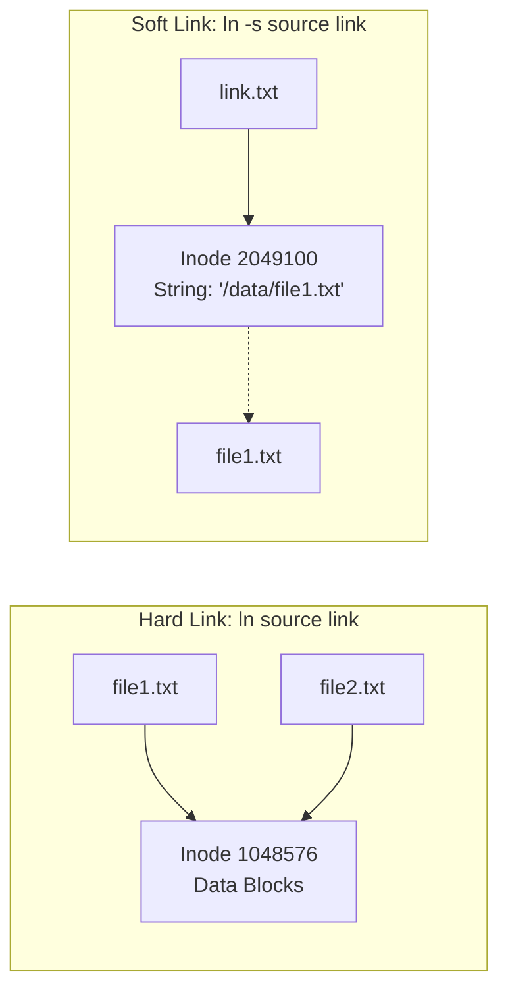

# 🚀 Ultimate Linux Cheat Sheet: The Complete 20-Module Production & Troubleshooting Master Guide
> **The Definitive Engineering Reference for DevOps, SREs, Cloud Architects, and Linux Administrators**  
> *Structured for High-Retention Memory, Day-to-Day Production Operations, and Senior Technical Interviews.*

---

## 📑 Master Table of Contents
1. [Core Production Mental Models & Diagnostic Framework](#1-core-production-mental-models--diagnostic-framework)
2. [The 20 Complete Modules (Pages 1 to 20)](#2-the-20-complete-modules)
   - [Module 1: Linux System Information & Hardware Telemetry](#module-1-linux-system-information--hardware-telemetry-page-1)
   - [Module 2: Filesystem Navigation & Path Mechanics](#module-2-filesystem-navigation--path-mechanics-page-2)
   - [Module 3: Files, Directories, Metadata (`stat`) & Links](#module-3-files-directories-metadata-stat--links-page-3)
   - [Module 4: Viewing, Live Tailing & Advanced Search](#module-4-viewing-live-tailing--advanced-search-page-4)
   - [Module 5: Text Processing Power Tools (`grep`, `awk`, `sed`, `xargs`)](#module-5-text-processing-power-tools-grep-awk-sed-xargs-page-5)
   - [Module 6: Users, Groups & Password Management](#module-6-users-groups--password-management-page-6)
   - [Module 7: Linux Permissions, UGO Model & Ownership](#module-7-linux-permissions-ugo-model--ownership-page-7)
   - [Module 8: Advanced Privileges: SUID, SGID, Sticky Bit & ACLs](#module-8-advanced-privileges-suid-sgid-sticky-bit--acls-page-8)
   - [Module 9: Process Management, Signals & CPU Scheduling](#module-9-process-management-signals--cpu-scheduling-page-9)
   - [Module 10: systemd Service Supervision, Dependencies & Targets](#module-10-systemd-service-supervision-dependencies--targets-page-10)
   - [Module 11: Enterprise Package Management (APT, DNF, RPM, DPKG)](#module-11-enterprise-package-management-apt-dnf-rpm-dpkg-page-11)
   - [Module 12: Storage, Disks, Partitions & Inode Management](#module-12-storage-disks-partitions--inode-management-page-12)
   - [Module 13: CPU, Memory, Load Average & Performance Diagnostics](#module-13-cpu-memory-load-average--performance-diagnostics-page-13)
   - [Module 14: Network Configuration, Sockets (`ss`) & DNS](#module-14-network-configuration-sockets-ss--dns-page-14)
   - [Module 15: SSH Remote Administration & Server Hardening](#module-15-ssh-remote-administration--server-hardening-page-15)
   - [Module 16: Archiving, Compression (GZIP, BZIP2, XZ) & Rsync](#module-16-archiving-compression-gzip-bzip2-xz--rsync-page-16)
   - [Module 17: Log Management, `journalctl` & Kernel Triage](#module-17-log-management-journalctl--kernel-triage-page-17)
   - [Module 18: Bash Environment, Redirection, Pipes & Exit Codes](#module-18-bash-environment-redirection-pipes--exit-codes-page-18)
   - [Module 19: Security Auditing & Production Hardening Baselines](#module-19-security-auditing--production-hardening-baselines-page-19)
   - [Module 20: Master Production Incident Troubleshooting Playbook](#module-20-master-production-incident-troubleshooting-playbook-page-20)
3. [Top 12 Production Outage Scenarios & Quick Fixes](#3-top-12-production-outage-scenarios--quick-fixes)
4. [High-Frequency Senior Engineer Interview Q&A](#4-high-frequency-senior-engineer-interview-qa)

---

## 1. Core Production Mental Models & Diagnostic Framework

```
                          THE 10-STAGE ROOT CAUSE FLOW
 ┌──────────────┐    ┌──────────────┐    ┌──────────────┐    ┌──────────────┐
 │  1. ALERT    │───▶│  2. SYSTEM   │───▶│   3. CPU     │───▶│  4. MEMORY   │
 │ (Notify SRE) │    │ uptime, free │    │ top, mpstat  │    │ free, vmstat │
 └──────────────┘    └──────────────┘    └──────────────┘    └──────────────┘
                                                                    │
                                                                    ▼
 ┌──────────────┐    ┌──────────────┐    ┌──────────────┐    ┌──────────────┐
 │ 8. SERVICE   │◀───│ 7. PROCESS   │◀───│  6. NETWORK  │◀───│   5. DISK    │
 │ systemctl    │    │ ps, pgrep    │    │ ss, ping, ip │    │ df, iostat   │
 └──────────────┘    └──────────────┘    └──────────────┘    └──────────────┘
        │
        ▼
 ┌──────────────┐    ┌──────────────┐
 │   9. LOGS    │───▶│10. ROOT CAUSE│
 │ journalctl   │    │ Fix & Verify │
 └──────────────┘    └──────────────┘
```

### 🧠 5 Core Axioms of Linux Systems
1. **Everything is a File Descriptor:** Disks (`/dev/sda`), system information (`/proc/cpuinfo`), and network sockets are all file handles.
2. **Never Kill Blindly:** Understand *why* a process is stuck before running `kill -9`. D-state processes ignore signals; Zombie processes are already dead.
3. **Available RAM is What Matters:** Linux caches disk blocks into RAM (`buff/cache`). `available` memory is the real metric, not `free`.
4. **Load Average Measures CPU + Storage:** Load average is the count of runnable tasks (`R`) plus uninterruptible I/O wait tasks (`D`).
5. **Always Test Sudoers & SSH Configs Before Exiting:** Always use `visudo` and `sshd -t` to prevent accidental administrative lockouts.

---

## 2. The 20 Complete Modules

---

### Module 1: Linux System Information & Hardware Telemetry (Page 1)

```bash
# 1. Kernel and OS Architecture
uname -a                  # Linux server 5.15.0-100-generic #110-Ubuntu SMP x86_64

# 2. Comprehensive OS and Host Identity
hostnamectl               # OS release, kernel, architecture, virtualization

# 3. CPU Architecture, Sockets, Cores & Flags
lscpu                     # Physical sockets, cores per socket, NUMA nodes, virtualization flags

# 4. Memory & Swap Capacity Overview
free -h                   # Total, used, free, buff/cache, available

# 5. System Uptime and Load Averages (1, 5, 15 min)
uptime                    # 14:32:10 up 23 days, 2 users, load average: 0.15, 0.21, 0.18

# 6. Active Logged-In Users and Sessions
who                       # user1 pts/0 (192.168.1.10), user2 pts/1
w                         # Shows logged-in users AND their active running foreground process
```

---

### Module 2: Filesystem Navigation & Path Mechanics (Page 2)

```
/ (Root of Filesystem)
├── etc/  ──▶ System and service configuration files (nginx, fstab, ssh)
├── var/  ──▶ Dynamic runtime data: logs (/var/log), databases (/var/lib/mysql)
├── home/ ──▶ Regular user home directories (/home/alice)
├── tmp/  ──▶ Ephemeral scratchpad storage (auto-cleared on reboot; Sticky Bit protected)
├── usr/  ──▶ User programs, shared libraries (/usr/lib), system binaries (/usr/bin)
└── opt/  ──▶ Third-party self-contained software packages (/opt/datadog)
```

```bash
# Navigation
pwd                       # Print active working directory
cd /var/log               # Absolute navigation
cd ../projects            # Relative navigation (up one directory)
cd ~                      # Jump to user home directory
cd -                      # Toggle back to previous working directory

# Listing Directory Contents
ls -lah                   # Long format, hidden dotfiles, human-readable sizes
ls -lt                    # Sort by modification time (newest first)
ls -lS                    # Sort by file size (largest first)
ls -R                     # Recursive subtree listing
tree -L 2 /etc            # Visual directory tree limited to depth 2
```

---

### Module 3: Files, Directories, Metadata (`stat`) & Links (Page 3)



```bash
# File and Directory Lifecycle
touch app.log             # Create empty file or update timestamp
mkdir -p /opt/app/{bin,conf,logs} # Create nested directories
cp -r /app /backup/       # Recursive copy
mv old.txt new.txt        # Rename or move file
rm -rf /tmp/build_*       # Force delete directory tree without prompt

# Inspect File Metadata
stat /etc/passwd          # View Inode number, UID, GID, exact timestamps (atime, mtime, ctime)
file /bin/bash            # ELF 64-bit LSB executable, x86-64, dynamically linked

# Link Creation
ln source.txt hard_link.txt      # Hard link (shares same inode; cannot span filesystems)
ln -s /opt/app/bin/start.sh /usr/local/bin/start # Soft symbolic link (path pointer)
```

---

### Module 4: Viewing, Live Tailing & Advanced Search (Page 4)

```bash
# Viewing File Content
cat file.txt              # Print full file content to terminal
less /var/log/syslog      # Interactive scrollable pager (Search: /pattern, Bottom: G, Quit: q)
head -n 20 app.log        # View first 20 lines
tail -n 50 app.log        # View last 50 lines
tail -f /var/log/nginx/access.log # Real-time live log stream

# Search Operations
find /var/log -name "*.log"            # Search files by name pattern
find /var -type d -name "config"       # Find directories only
find / -size +100M 2>/dev/null        # Find files larger than 100MB
find /var/log -type f -mtime -2       # Find files modified within last 48 hours

# Locate & Binary Path Discovery
locate nginx.conf         # Instant indexed search (database updated via updatedb)
which docker              # Returns executable path in $PATH (/usr/bin/docker)
whereis python3           # Locates binary, source code, and man pages
```

---

### Module 5: Text Processing Power Tools (`grep`, `awk`, `sed`, `xargs`) (Page 5)

```bash
# 1. Pattern Searching with grep
grep -ri "exception" /var/log/app/     # Recursive, case-insensitive search
grep -v "DEBUG" app.log                # Invert match (exclude DEBUG logs)
grep -n "ERROR" server.log             # Show matching line numbers

# 2. Field Processing with awk
awk '{print $1}' /var/log/nginx/access.log # Extract first column (IP addresses)
awk -F: '$3 >= 1000 {print $1, $3}' /etc/passwd # Parse colon-delimited text for user accounts
awk '{sum += $5} END {print "Total MB:", sum/1024/1024}' access.log # Calculate totals

# 3. Stream Editing with sed
sed 's/http/https/g' config.yml        # Output modified text
sed -i 's/DEBUG=True/DEBUG=False/g' .env # In-place disk modification
sed -n '50,100p' server.log            # Print specific line range (50 to 100)

# 4. Pipeline Sorting & Execution with xargs
cat access.log | awk '{print $1}' | sort | uniq -c | sort -nr | head -n 10
find /tmp -name "*.tmp" | xargs rm -f  # Pass search results as arguments to command
```

---

### Module 6: Users, Groups & Password Management (Page 6)

```bash
# User Identity & Inspection
whoami                    # Print current executing username
id alice                  # Show UID, GID, and supplementary group memberships

# User Account Lifecycle
sudo useradd -m -s /bin/bash alice # Create user with home directory and bash shell
sudo passwd alice                  # Set or change user password
sudo usermod -aG docker,sudo alice # Append user to docker and sudo groups (ALWAYS use -a!)
sudo userdel -r alice              # Delete user account AND wipe /home/alice directory

# Group Lifecycle
sudo groupadd devops               # Create group
sudo gpasswd -d alice devops       # Remove user from group

# Switch Context
su - alice                         # Switch user with complete environment login
```

---

### Module 7: Linux Permissions, UGO Model & Ownership (Page 7)

```
       10-CHARACTER PERMISSION STRING DECODER
  -   r w x   r - x   r - -
 ─── ─────── ─────── ───────
  │     │       │       │
 Type Owner   Group   Others
 (- = file, d = directory, l = symlink)
```

$$\text{Read (r)} = 4 \quad|\quad \text{Write (w)} = 2 \quad|\quad \text{Execute (x)} = 1$$

* `chmod 755 script.sh` $\implies \text{rwxr-xr-x}$ (Owner: `7` [rwx], Group: `5` [r-x], Others: `5` [r-x])
* `chmod 644 config.yml` $\implies \text{rw-r--r--}$ (Owner: `6` [rw-], Group/Others: `4` [r--])
* `chmod 600 id_ed25519` $\implies \text{rw-------}$ (Owner: `6` [rw-], Group/Others: `0` [---])

```bash
# Changing Ownership & Permissions
sudo chown alice:devops file.txt       # Change user owner and group
sudo chown -R www-data:www-data /var/www # Recursive ownership update
chmod -R 750 /opt/app                  # Recursive permissions update
```

---

### Module 8: Advanced Privileges: SUID, SGID, Sticky Bit & ACLs (Page 8)

```
 ┌──────────────────────┬───────┬─────────────────────────────────────────────┐
 │ Bit                  │ Octal │ Security Risk & Hardening                   │
 ├──────────────────────┼───────┼─────────────────────────────────────────────┤
 │ SUID (Set User ID)   │ 4000  │ Executes as file OWNER (Risk: root privesc) │
 │ SGID (Set Group ID)  │ 2000  │ Inherits parent directory group             │
 │ Sticky Bit           │ 1000  │ Prevents users from deleting others' files  │
 └──────────────────────┴───────┴─────────────────────────────────────────────┘
```

```bash
# Special Permissions Syntax
chmod u+s /usr/bin/custom_exec         # Enable SUID (chmod 4755)
chmod g+s /opt/devops_shared           # Enable SGID on directory (chmod 2770)
chmod +t /tmp                          # Enable Sticky Bit (chmod 1777)

# umask: Sets default permissions for newly created files
umask 027                              # Files: 640 (rw-r-----), Dirs: 750 (rwxr-x---)

# POSIX Access Control Lists (ACLs)
setfacl -m u:bob:rwx /data/shared_file # Grant specific user access without changing owner
getfacl /data/shared_file              # View ACL configuration
```

---

### Module 9: Process Management, Signals & CPU Scheduling (Page 9)

```
        -20 (Highest Priority) <─── 0 (Default) ───> +19 (Lowest Priority)
```

```bash
# Process Snapshot & Monitoring
ps aux | grep nginx                    # Process snapshot
ps -eo pid,ppid,user,%cpu,%mem,cmd --sort=-%cpu | head -n 10 # Custom snapshot
top                                    # Real-time process monitor (Sort: P=CPU, M=Mem)
htop                                   # Visual process viewer with per-core CPU bars

# Signal Handling
kill 1234                              # SIGTERM (15): Graceful termination request
kill -9 1234                           # SIGKILL (9): Uncatchable immediate termination
kill -1 1234                           # SIGHUP (1): Configuration reload
pkill -f "python.*worker"              # Kill matching command pattern

# Job Control & Priority
nice -n 10 ./heavy_backup.sh           # Launch with lower CPU scheduling priority
renice -n -5 -p 1234                   # Elevate priority of running PID 1234
./job.sh &                             # Launch directly in background
jobs -l                                # List background jobs in shell
fg %1                                  # Bring background Job #1 to foreground
```

---

### Module 10: systemd Service Supervision, Dependencies & Targets (Page 10)

```bash
# Service Lifecycle Control
sudo systemctl start nginx             # Start service immediately
sudo systemctl stop nginx              # Stop service
sudo systemctl restart nginx           # Terminate and respawn (causes brief downtime)
sudo systemctl reload nginx            # Hot-reload configuration without dropping TCP sockets
sudo systemctl enable --now nginx      # Enable on boot AND start immediately
sudo systemctl status nginx            # View state, PID, memory, and recent journal logs
sudo systemctl is-active nginx         # Check running status in scripts (exit code 0 = active)

# Troubleshooting & Dependencies
systemctl --failed                     # List all failing units on system
systemctl list-dependencies nginx      # Show dependency tree
sudo systemctl daemon-reload           # MANDATORY: Reload systemd manager after modifying unit files
```

---

### Module 11: Enterprise Package Management (APT, DNF, RPM, DPKG) (Page 11)

| Task | Debian / Ubuntu (`apt`) | RHEL / Rocky / AlmaLinux (`dnf` / `yum`) | Low-Level Direct Tool |
| :--- | :--- | :--- | :--- |
| **Refresh Index** | `sudo apt update` | `sudo dnf makecache` | N/A |
| **Upgrade Packages**| `sudo apt upgrade -y`| `sudo dnf upgrade -y` | N/A |
| **Install Package** | `sudo apt install nginx`| `sudo dnf install nginx` | `dpkg -i pkg.deb` / `rpm -ivh pkg.rpm` |
| **Remove Package**  | `sudo apt remove nginx` | `sudo dnf remove nginx` | `dpkg -r pkg` / `rpm -e pkg` |
| **Purge Configs**   | `sudo apt purge nginx`  | `sudo dnf remove nginx` | N/A |
| **Search Repos**    | `apt search nginx`      | `dnf search nginx`      | `dpkg -l` / `rpm -qa` |
| **Find File Owner** | `dpkg -S /bin/ls`       | `dnf provides /bin/ls`  | `rpm -qf /bin/ls` |

---

### Module 12: Storage, Disks, Partitions & Inode Management (Page 12)

```bash
# Capacity & Inode Inspection
df -h                                  # Filesystem space utilization in human-readable units
df -i                                  # Inode utilization (Detect "No space left on device" when disk space is free)
du -sh /var/log                        # Summary disk footprint of directory
du -ah /var | sort -hr | head -n 10    # Top 10 space-consuming files in /var

# Block Devices & Mounting
lsblk -f                               # List block devices with filesystem types and UUIDs
sudo blkid /dev/sdb1                   # View UUID for /etc/fstab configuration
sudo mount -t ext4 /dev/sdb1 /data     # Mount filesystem
sudo umount /data                      # Unmount filesystem
sudo mount -a                          # Test /etc/fstab syntax without rebooting!
```

---

### Module 13: CPU, Memory, Load Average & Performance Diagnostics (Page 13)

$$\text{Load Average per Core} = \frac{\text{Load Average}}{\text{Total Physical CPU Cores}}$$
* $\le 1.0$: Healthy throughput.
* $> 1.0$: System queue saturation (CPU compute bound or Storage I/O wait bound).

```bash
# 1. Real-Time Resource Diagnostics
free -h                                # Total, used, free, buff/cache, available RAM
vmstat 1 5                             # Monitor run queue (r), blocked I/O (b), swap (si/so)
iostat -xz 1 5                         # Measure disk IOPS, throughput, latency (await), and saturation (%util)
mpstat -P ALL 1 5                      # Per-core CPU utilization breakdown (%usr, %sys, %iowait)
pidstat -u 1 5                         # Per-process CPU attribution
```

---

### Module 14: Network Configuration, Sockets (`ss`) & DNS (Page 14)

```bash
# Network Interfaces & IP Addresses
ip -br a                               # Brief interface overview with IP allocations
ip route show                          # Display kernel routing table and default gateway

# Socket Statistics & Port Auditing
ss -tulnp                              # TCP (-t), UDP (-u), Listening (-l), Numeric (-n), Process/PID (-p)

# Connectivity & DNS Resolution
ping -c 4 8.8.8.8                      # Test reachability with 4 ICMP packets
traceroute google.com                  # Trace routing hops
dig api.example.com +short             # Direct DNS query
nc -zv 10.0.0.5 3306                   # Test TCP port reachability to database

# HTTP & Data Transfer
curl -Iv https://example.com           # Fetch HTTP headers, TLS certificate, and response status
wget -c https://example.com/app.tar.gz # Download file with resume support
```

---

### Module 15: SSH Remote Administration & Server Hardening (Page 15)

```bash
# Key Generation & Transfer
ssh-keygen -t ed25519 -C "admin@corp"  # Generate modern Ed25519 keypair
ssh-copy-id -i ~/.ssh/id_ed25519.pub deployer@10.0.0.5 # Copy public key to remote authorized_keys

# Remote Execution & Synchronization
ssh -p 2222 deployer@10.0.0.5 "df -h"  # Execute command on remote server
scp -P 2222 -r ./build deployer@10.0.0.5:/var/www/ # Secure recursive copy
rsync -avzP --delete ./data/ deployer@10.0.0.5:/data/ # High-performance delta sync

# File Permissions for SSH Security
chmod 700 ~/.ssh
chmod 600 ~/.ssh/id_ed25519 ~/.ssh/authorized_keys
chmod 644 ~/.ssh/id_ed25519.pub
```

---

### Module 16: Archiving, Compression (GZIP, BZIP2, XZ) & Rsync (Page 16)

```bash
# 1. GZIP Compression (.tar.gz - Fast, Standard)
tar -czvf archive.tar.gz /opt/app/     # Compress
tar -xzvf archive.tar.gz -C /opt/      # Extract

# 2. BZIP2 Compression (.tar.bz2 - Better Ratio)
tar -cjvf archive.tar.bz2 /opt/app/    # Compress
tar -xjvf archive.tar.bz2 -C /opt/     # Extract

# 3. XZ Compression (.tar.xz - Maximum Compression Ratio)
tar -cJvf archive.tar.xz /opt/app/     # Compress
tar -xJvf archive.tar.xz -C /opt/      # Extract

# 4. Standard Zip
zip -r archive.zip /opt/app/
unzip archive.zip -d /opt/
```

---

### Module 17: Log Management, `journalctl` & Kernel Triage (Page 17)

```bash
# systemd journalctl Operations
journalctl -u nginx -f                 # Real-time live log follow
journalctl -u nginx -n 100 --no-pager  # Show last 100 lines without pagination
journalctl -p err..emerg -b            # Filter logs by Error priority for current boot
journalctl --since "1 hour ago"        # Time-bounded extraction
journalctl -k                          # Kernel ring buffer logs (same as dmesg)
sudo journalctl --vacuum-size=500M     # Clean old logs to free disk space

# Traditional Log Files
tail -f /var/log/syslog                # System logs (Ubuntu/Debian)
tail -f /var/log/auth.log              # Authentication & sudo audit logs
dmesg -T | grep -E "OOM|segfault|error"# Kernel hardware messages with human timestamps
sudo logrotate -f /etc/logrotate.conf  # Force execution of logrotate rules
```

---

### Module 18: Bash Environment, Redirection, Pipes & Exit Codes (Page 18)

```bash
# Environment & Variables
env                                    # Display all exported environment variables
export PATH="$PATH:/opt/tools/bin"     # Append custom directory to system $PATH
echo $?                                # Exit code of last executed command (0 = Success, non-zero = Failure)

# Redirection & Pipes
ls -la > list.txt                      # Overwrite stdout to file
echo "log entry" >> app.log            # Append stdout to file
find / -name "*.conf" 2> error.log     # Redirect stderr to file
./script.sh > output.log 2>&1          # Redirect both stdout and stderr to file
ps aux | grep nginx | wc -l            # Pipe stdout of one command as stdin to next
```

---

### Module 19: Security Auditing & Production Hardening Baselines (Page 19)

```bash
# User & Sudo Security Audit
sudo -l                                # Review sudo privileges for current user
sudo grep -r "NOPASSWD" /etc/sudoers /etc/sudoers.d/ 2>/dev/null

# Port & Socket Exposure
ss -tuln                               # Check listening sockets (ensure internal services bind to 127.0.0.1)

# Dangerous Permissions & SUID Files
find / -xdev -type f -perm -0002 -ls 2>/dev/null  # Find world-writable files
find / -xdev -type f -perm -4000 -ls 2>/dev/null  # Find SUID root binaries

# Host Firewall Status
sudo ufw status verbose                # Ubuntu / Debian UFW status
sudo firewall-cmd --state              # RHEL / Rocky FirewallD status
```

---

### Module 20: Master Production Incident Troubleshooting Playbook (Page 20)

```
                            SRE INCIDENT TRIAGE SEQUENCE
 ┌──────────────┐    ┌──────────────┐    ┌──────────────┐    ┌──────────────┐
 │ 1. System    │───▶│   2. CPU &   │───▶│ 3. Storage & │───▶│ 4. Network & │
 │ Reachability │    │ Load Average │    │ Inode Health │    │ Socket State │
 └──────────────┘    └──────────────┘    └──────────────┘    └──────────────┘
    ping / ssh          uptime / top        df -h / df -i       ss -tulnp
                            │                   │                   │
                            ▼                   ▼                   ▼
 ┌──────────────┐    ┌──────────────┐    ┌──────────────┐    ┌──────────────┐
 │ 8. Verify &  │◀───│  7. Mitigate │◀───│ 6. Core Root │◀───│ 5. Service & │
 │  Post-Mortem │    │  (Rollback)  │    │ Cause Found  │    │ System Logs  │
 └──────────────┘    └──────────────┘    └──────────────┘    └──────────────┘
```

---

## 3. Top 12 Production Outage Scenarios & Quick Fixes

```
 ┌────┬──────────────────────────────────┬──────────────────────────────────────────────────────────────────┐
 │ #  │ Production Scenario              │ Step-by-Step Diagnostic & Remediation Command                   │
 ├────┼──────────────────────────────────┼──────────────────────────────────────────────────────────────────┤
 │ 1  │ Server is Slow / Unresponsive    │ Run `uptime` (Load) ──▶ `top -b -n1` ──▶ `free -h` ──▶ `vmstat 1`│
 ├────┼──────────────────────────────────┼──────────────────────────────────────────────────────────────────┤
 │ 2  │ CPU is at 100%                   │ `top -o %CPU` to find PID ──▶ `pidstat -u 1 5` ──▶ `perf top`    │
 ├────┼──────────────────────────────────┼──────────────────────────────────────────────────────────────────┤
 │ 3  │ Memory is Exhausted              │ `free -h` ──▶ `ps aux --sort=-%mem | head` ──▶ Check `dmesg -T` │
 ├────┼──────────────────────────────────┼──────────────────────────────────────────────────────────────────┤
 │ 4  │ Disk is 100% Full                │ `df -h` ──▶ `du -ah /var | sort -hr | head -n 10` ──▶ `lsof +L1` │
 ├────┼──────────────────────────────────┼──────────────────────────────────────────────────────────────────┤
 │ 5  │ Service Will Not Start           │ `systemctl status <svc>` ──▶ `journalctl -u <svc> -n 100 -e`     │
 ├────┼──────────────────────────────────┼──────────────────────────────────────────────────────────────────┤
 │ 6  │ Port is Not Listening            │ `ss -tulnp | grep :<port>` ──▶ Verify config & systemd status    │
 ├────┼──────────────────────────────────┼──────────────────────────────────────────────────────────────────┤
 │ 7  │ DNS Resolution is Failing        │ `dig google.com` ──▶ Check `/etc/resolv.conf` nameservers        │
 ├────┼──────────────────────────────────┼──────────────────────────────────────────────────────────────────┤
 │ 8  │ Network Connection Dropped       │ `ip route` ──▶ `ping -c 4 <gateway>` ──▶ `traceroute <ip>`       │
 ├────┼──────────────────────────────────┼──────────────────────────────────────────────────────────────────┤
 │ 9  │ Permission Denied on App File    │ `ls -l <file>` ──▶ `namei -l <path>` (verify directory `+x` bit) │
 ├────┼──────────────────────────────────┼──────────────────────────────────────────────────────────────────┤
 │ 10 │ Process Keeps Crashing           │ `coredumpctl info <PID>` ──▶ Search `/var/log/messages`          │
 ├────┼──────────────────────────────────┼──────────────────────────────────────────────────────────────────┤
 │ 11 │ Filesystem Mounted Read-Only     │ `dmesg -T | grep -E "EXT4|XFS|I/O"` ──▶ `fsck -y` / `xfs_repair` │
 ├────┼──────────────────────────────────┼──────────────────────────────────────────────────────────────────┤
 │ 12 │ SSH Connection Times Out         │ Check server firewall `ufw status` ──▶ Test local `ssh -v` port  │
 └────┴──────────────────────────────────┴──────────────────────────────────────────────────────────────────┘
```

---

## 4. High-Frequency Senior Engineer Interview Q&A

| # | High-Frequency Interview Question | Senior Production Engineer Model Answer |
|---|---|---|
| 1 | **What is the exact difference between `df` and `du`?** | `df` queries filesystem superblocks directly, reflecting allocated blocks including disk space held open by deleted-but-active file descriptors. `du` walks the live directory tree aggregating active file sizes. |
| 2 | **Why can a write fail with "No space left on device" when `df -h` shows 50% free?** | The filesystem is out of **Inodes** (`df -i` at 100%). Millions of tiny files (session tokens, unrotated logs) have exhausted all inode metadata slots. |
| 3 | **How do you resolve a Zombie process?** | A zombie is already dead and consumes 0 MB RAM / 0% CPU. You cannot kill it with `kill -9`. You must notify or restart its parent process so it collects the return code via `waitpid()`, or kill the parent so `systemd` (PID 1) inherits and reaps it. |
| 4 | **What is the difference between `systemctl restart` and `systemctl reload`?** | `restart` terminates the daemon and spawns a fresh process (brief downtime). `reload` sends `SIGHUP` to instruct the daemon to re-read configuration files without dropping existing TCP client connections (Zero Downtime). |
| 5 | **What is the difference between `free` and `available` memory?** | `free` is unallocated physical RAM doing nothing. `available` estimates how much memory can be granted to applications without forcing swap, by adding free memory to reclaimable Page Cache and Buffers. |
| 6 | **What does a high `%wa` in `top` indicate?** | The CPU is idle and blocked waiting for disk storage or network filesystem (NFS/SAN) I/O requests to return. |
| 7 | **What is the difference between SUID, SGID, and the Sticky Bit?** | SUID (`4000`) executes binary as file owner; SGID (`2000`) enforces group ownership inheritance on new files in directories; Sticky Bit (`1000`) prevents non-owners from deleting files in shared folders like `/tmp`. |
| 8 | **Why are UUIDs used in `/etc/fstab` instead of device names (`/dev/sda1`)?** | Device node names can dynamically change between reboot cycles depending on hardware bus discovery order. UUIDs are persistent cryptographic identifiers stored directly in the filesystem superblock. |

---
*Authored for Production Systems Engineering Excellence, DevOps Mastery & Technical Interview Success.*
