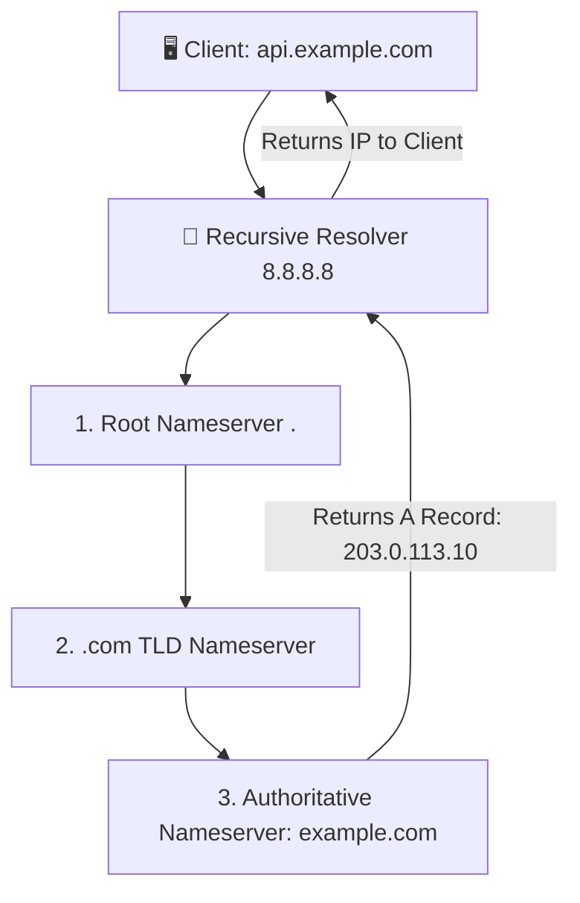

# 🌐 Networking for DevOps, Cloud & SRE Master Handbook
> **The Definitive Practical Architecture & Troubleshooting Guide for Cloud, DevOps & Site Reliability Engineers**  
> *Covering OSI/TCP-IP Foundations, Linux Kernel Networking, Firewalls, AWS VPC Architecture, Kubernetes CNI & Mesh, and Production Incident Triage.*

---

## 📑 Master Table of Contents
1. [Core Networking Mental Models for DevOps & SREs](#1-core-networking-mental-models-for-devops--sres)
2. [17-Module Enterprise Networking Curriculum Deep Dive](#2-17-module-enterprise-networking-curriculum-deep-dive)
   - [Module 1: OSI vs. TCP/IP Models & The Life of a Packet](#module-1-osi-vs-tcpip-models--the-life-of-a-packet)
   - [Module 2: IPv4 Addressing, Subnetting, CIDR Math & RFC 1918](#module-2-ipv4-addressing-subnetting-cidr-math--rfc-1918)
   - [Module 3: Layer 2 Data Link: Ethernet Frames, MAC & ARP Mechanics](#module-3-layer-2-data-link-ethernet-frames-mac--arp-mechanics)
   - [Module 4: Layer 3 Routing: Longest Prefix Match, BGP, OSPF & Linux Routes](#module-4-layer-3-routing-longest-prefix-match-bgp-ospf--linux-routes)
   - [Module 5: Domain Name System (DNS) Resolution & CoreDNS in K8s](#module-5-domain-name-system-dns-resolution--coredns-in-k8s)
   - [Module 6: Layer 4 Transport: TCP Handshake/Teardown vs. UDP & Ports](#module-6-layer-4-transport-tcp-handshaketeardown-vs-udp--ports)
   - [Module 7: Linux Network Stack, Network Namespaces & Kernel Sockets](#module-7-linux-network-stack-network-namespaces--kernel-sockets)
   - [Module 8: Linux Netfilter: `iptables` vs. Modern `nftables`](#module-8-linux-netfilter-iptables-vs-modern-nftables)
   - [Module 9: Enterprise Switching: VLANs (802.1Q) & Trunking](#module-9-enterprise-switching-vlans-8021q--trunking)
   - [Module 10: Load Balancing (Layer 4 vs. Layer 7) & High Availability (VRRP)](#module-10-load-balancing-layer-4-vs-layer-7--high-availability-vrrp)
   - [Module 11: NAT Architectures (SNAT, DNAT, PAT) & VPN Tunnels (IPsec, WireGuard)](#module-11-nat-architectures-snat-dnat-pat--vpn-tunnels-ipsec-wireguard)
   - [Module 12: Cloud Networking: AWS Multi-AZ VPC Architecture & Hybrid Transit](#module-12-cloud-networking-aws-multi-az-vpc-architecture--hybrid-transit)
   - [Module 13: Kubernetes Networking Deep Dive: CNI, Pods, Services & Ingress](#module-13-kubernetes-networking-deep-dive-cni-pods-services--ingress)
   - [Module 14: Kubernetes Zero-Trust Network Policies & Service Mesh (mTLS)](#module-14-kubernetes-zero-trust-network-policies--service-mesh-mtls)
   - [Module 15: Network Kernel Tuning (`sysctl`) & Observability (`tcpdump`, `ss`)](#module-15-network-kernel-tuning-sysctl--observability-tcpdump-ss)
   - [Module 16: Senior SRE Incident Runbooks (502 Bad Gateway, MTU Blackholes)](#module-16-senior-sre-incident-runbooks-502-bad-gateway-mtu-blackholes)
   - [Module 17: High-Frequency Senior Networking Interview Q&A](#module-17-high-frequency-senior-networking-interview-qa)
3. [Master Troubleshooting Flowchart for Network Outages](#3-master-troubleshooting-flowchart-for-network-outages)

---

## 1. Core Networking Mental Models for DevOps & SREs

```
                         THE 7 GOLDEN RULES OF NETWORKING
 ┌─────────────────────────────────────────────────────────────────────────────┐
 │ 1. Encapsulation Down, Decapsulation Up                                     │
 │    • Data (L7) ──▶ Segment (L4) ──▶ Packet (L3) ──▶ Frame (L2) ──▶ Bits (L1)│
 ├─────────────────────────────────────────────────────────────────────────────┤
 │ 2. Longest Prefix Match Always Wins in Routing                              │
 │    • /32 (Host route) beats /24 (Subnet) beats /16 beats 0.0.0.0/0 (Default)│
 ├─────────────────────────────────────────────────────────────────────────────┤
 │ 3. Stateful Security Groups vs. Stateless Network ACLs                      │
 │    • SGs track connection state (Return traffic auto-allowed).              │
 │    • NACLs evaluate every packet independently (Must allow ephemeral ports).│
 ├─────────────────────────────────────────────────────────────────────────────┤
 │ 4. Connection Refused vs. Connection Timed Out                              │
 │    • Connection Refused = Host reached, but no process listening (TCP RST). │
 │    • Connection Timed Out = Packet dropped silently (Firewall, SG, Routing).│
 ├─────────────────────────────────────────────────────────────────────────────┤
 │ 5. DNS is Hierarchical & Cached at Every Layer                              │
 │    • Browser Cache ──▶ OS Resolver ──▶ Recursive Resolver ──▶ Authoritative │
 ├─────────────────────────────────────────────────────────────────────────────┤
 │ 6. Layer 4 NLBs Forward Packets; Layer 7 ALBs Terminate & Re-Originate HTTP │
 ├─────────────────────────────────────────────────────────────────────────────┤
 │ 7. MTU Size Mismatches Cause Silent Packet Drops on Encapsulated CNI/VPNs   │
 └─────────────────────────────────────────────────────────────────────────────┘
```

---

## 2. 17-Module Enterprise Networking Curriculum Deep Dive

---

### Module 1: OSI vs. TCP/IP Models & The Life of a Packet

```
Sending Host (Encapsulation)                     Receiving Host (Decapsulation)
+--------------------------------+               +--------------------------------+
|  Application Data (HTTP/gRPC)  |               |  Application Data (HTTP/gRPC)  |
+--------------------------------+               +--------------------------------+
│                                                 ▲
▼                                                 │
+--------------------------------+               +--------------------------------+
| L4 Header (TCP/UDP) + Data     | (Segment)     | L4 Header (TCP/UDP) + Data     |
+--------------------------------+               +--------------------------------+
│                                                 ▲
▼                                                 │
+--------------------------------+               +--------------------------------+
| L3 Header (IP) + L4 + Data     | (Packet)      | L3 Header (IP) + L4 + Data     |
+--------------------------------+               +--------------------------------+
│                                                 ▲
▼                                                 │
+--------------------------------+               +--------------------------------+
| L2 Header (MAC) + L3 + FCS     | (Frame)       | L2 Header (MAC) + L3 + FCS     |
+--------------------------------+               +--------------------------------+
│                                                 ▲
▼                                                 │
+--------------------------------+               +--------------------------------+
| 0101010101010101010101010101   | (Bits/Wire)   | 0101010101010101010101010101   |
+--------------------------------+               +--------------------------------+
```

| OSI Layer | TCP/IP Layer | Primary Unit | Key Protocols | Real-World Hardware/Software |
| :--- | :--- | :--- | :--- | :--- |
| **7. Application** | Application | Message | HTTP, HTTPS, DNS, gRPC, SSH | NGINX, Envoy, Browser |
| **6. Presentation**| Application | Data | TLS, SSL, JSON, Protobuf | OpenSSL, Compression |
| **5. Session** | Application | Data | RPC, Sockets, NetBIOS | gRPC streams, Sockets |
| **4. Transport** | Transport | Segment / Datagram | TCP, UDP | HAProxy (TCP mode), NLB |
| **3. Network** | Internet | Packet | IPv4, IPv6, ICMP, BGP, IPsec | Linux Kernel, Routers |
| **2. Data Link** | Network Access | Frame | Ethernet, ARP, 802.1Q (VLAN) | L2 Switches, NICs, veth |
| **1. Physical** | Network Access | Bit | Electrical/Optical pulses | Fiber cables, SFP+ |

---

### Module 2: IPv4 Addressing, Subnetting, CIDR Math & RFC 1918

$$\text{Total Addresses} = 2^{(32 - n)}, \quad \text{Usable Hosts} = 2^{(32 - n)} - 2 \quad (\text{subtract Network ID and Broadcast ID})$$

```
Example: 192.168.1.10/24
Binary:  11000000.10101000.00000001 . 00001010
Mask:    11111111.11111111.11111111 . 00000000 (/24)
         [---- Network ID (24 bits) ----] [ Host ID (8 bits) ]
Network Address:   192.168.1.0
First Usable Host: 192.168.1.1
Last Usable Host:  192.168.1.254
Broadcast Address: 192.168.1.255
```

#### 🔒 RFC 1918 Private IP Address Spaces
* **Class A:** `10.0.0.0/8` (`10.0.0.0` – `10.255.255.255`) $\implies 16,777,216\text{ IPs}$
* **Class B:** `172.16.0.0/12` (`172.16.0.0` – `172.31.255.255`) $\implies 1,048,576\text{ IPs}$
* **Class C:** `192.168.0.0/16` (`192.168.0.0` – `192.168.255.255`) $\implies 65,536\text{ IPs}$

#### 📐 Production CIDR Cheat Sheet
| CIDR Prefix | Subnet Mask | Total IPs | Usable Hosts | Production Use Case |
| :--- | :--- | :--- | :--- | :--- |
| **/16** | `255.255.0.0` | 65,536 | 65,534 | Cloud VPC Supernet / Base CIDR |
| **/24** | `255.255.255.0` | 256 | 254 | Standard Application / Web Subnet |
| **/26** | `255.255.255.192` | 64 | 62 | Database Cluster Subnet |
| **/28** | `255.255.255.240` | 16 | 14 | NAT Gateway / Public Load Balancer Pool |
| **/30** | `255.255.255.252` | 4 | 2 | Point-to-Point Router Link / VPN Peering |
| **/32** | `255.255.255.255` | 1 | 1 (Host) | Security Group Rule / Host Route |

---

### Module 3: Layer 2 Data Link: Ethernet Frames, MAC & ARP Mechanics

```
+-------------------+------------------+-------------------+---------------------+---------------+
| Dest MAC (6 Bytes)| Src MAC (6 Bytes)| EtherType (2 Bytes| Payload (46-1500 B) | FCS (4 Bytes) |
+-------------------+------------------+-------------------+---------------------+---------------+
```

#### 🔄 ARP Resolution Cycle
1. **ARP Request:** Broadcast (`ff:ff:ff:ff:ff:ff`): *"Who has 192.168.1.50? Tell 192.168.1.10."*
2. **ARP Reply:** Unicast: *"192.168.1.50 is at 00:1A:2B:3C:4D:5E."*
3. **Neighbor Cache:** The sender stores the binding in its ARP table.

```bash
# Linux Neighbor (ARP) Management
ip neigh show                        # View current ARP table
sudo ip neigh flush dev eth0         # Clear stale ARP entries
```

---

### Module 4: Layer 3 Routing: Longest Prefix Match, BGP, OSPF & Linux Routes

#### 🎯 The Longest Prefix Match Rule
```
Routing Table Lookup for target 10.10.10.5:
  - 10.0.0.0/8       via 192.168.1.2  (8 bit match)
  - 10.10.0.0/16     via 192.168.1.3  (16 bit match)
  - 10.10.10.0/24    via 192.168.1.4  (24 bit match) ──▶ SELECTED (Longest Match)
  - 0.0.0.0/0        via 192.168.1.1  (Default gateway)
```

```bash
# Manage Linux Routing Table
ip route show
sudo ip route add 10.200.0.0/16 via 192.168.1.254 dev eth0
sudo ip route add default via 192.168.1.1 dev eth0
```

---

### Module 5: Domain Name System (DNS) Resolution & CoreDNS in K8s



```bash
# High-Yield DNS Diagnostics
dig +trace api.example.com           # Step-by-step hierarchical trace from root
dig @1.1.1.1 example.com A +short    # Query specific DNS server directly
dig -x 8.8.8.8                       # Reverse DNS (PTR) lookup
```

---

### Module 6: Layer 4 Transport: TCP Handshake/Teardown vs. UDP & Ports

```
  TCP 3-Way Handshake (Connection Setup)         TCP 4-Way Teardown (Graceful Close)
        Client               Server                  Client               Server
          │ ─── SYN ───────> │                         │ ─── FIN ───────> │
          │ <── SYN-ACK ───  │                         │ <── ACK ──────── │
          │ ─── ACK ───────> │                         │ <── FIN ──────── │
    [ESTABLISHED]      [ESTABLISHED]                   │ ─── ACK ───────> │
                                                    [TIME_WAIT]         [CLOSED]
```

#### 📦 Essential Production Ports Reference
* **22:** SSH / SFTP
* **53:** DNS (TCP/UDP)
* **80 / 443:** HTTP / HTTPS
* **3306:** MySQL / MariaDB
* **5432:** PostgreSQL
* **6379:** Redis In-Memory Cache
* **6443:** Kubernetes API Server

---

### Module 7: Linux Network Stack, Network Namespaces & Kernel Sockets

```bash
# 1. Socket and Port Inspection via ss (modern replacement for netstat)
ss -tulnp                            # -t (TCP), -u (UDP), -l (Listening), -n (Numeric), -p (PID/Process)
ss -tlnp sport = :8080               # Filter specifically for port 8080 bindings

# 2. Linux Network Namespaces (Container Isolation Mechanics)
sudo ip netns add blue
sudo ip netns add red
sudo ip link add veth-blue type veth peer name veth-red
sudo ip link set veth-blue netns blue
sudo ip link set veth-red netns red
sudo ip netns exec blue ip addr add 10.0.0.1/24 dev veth-blue
sudo ip netns exec blue ip link set veth-blue up
sudo ip netns exec red ip addr add 10.0.0.2/24 dev veth-red
sudo ip netns exec red ip link set veth-red up
sudo ip netns exec blue ping 10.0.0.2
```

---

### Module 8: Linux Netfilter: `iptables` vs. Modern `nftables`

```
Incoming Packet ──▶ [PREROUTING] ──▶ [Routing Decision] ──▶ [INPUT] ──▶ Local Process
                          │                                                 │
                          └──▶ [FORWARD] ─────────────────▶ [POSTROUTING] ──┘ (Outgoing)
                                                                  ▲
                                 [OUTPUT] ────────────────────────┘
```

#### 🛡️ Modern `nftables` Ruleset (`/etc/nftables.conf`)
```nft
table inet filter {
    chain input {
        type filter hook input priority 0; policy drop;

        # Allow established and related connections
        ct state established,related accept
        ct state invalid drop

        # Allow loopback interface
        iif "lo" accept

        # Production inbound services
        tcp dport 22 accept
        tcp dport { 80, 443 } accept

        # Rate-limited ICMP ping
        ip protocol icmp icmp type echo-request limit rate 5/second accept
    }
}
```

---

### Module 9: Enterprise Switching: VLANs (802.1Q) & Trunking

```
+-------------------------------------------------------------------------------+
|                       Standard 802.1Q Ethernet Frame Header                    |
+-------------------+-------------------+-------------------+-------------------+
|  Dest MAC (6B)    |  Src MAC (6B)     |  802.1Q Tag (4B)  |  EtherType (2B)   |
+-------------------+-------------------+-------------------+-------------------+
                                                  │
                ┌─────────────────────────────────┴─────────────────────────────────┐
                ▼                                                                   ▼
       TPID (0x8100 - 16 bits)   Priority (PCP - 3b)  DEI (1b)   VLAN ID (VID - 12 bits: 1-4094)
```

* **Access Port:** Untagged; connects end-user servers and compute nodes.
* **Trunk Port:** Carries traffic for multiple VLANs by adding the 802.1Q header tag between switches and hypervisors.

---

### Module 10: Load Balancing (Layer 4 vs. Layer 7) & High Availability (VRRP)

```
       Virtual IP (VIP): 10.0.0.1 (Floating High-Availability Gateway)
                 │
      ┌──────────┴──────────┐
      ▼                     ▼
[Node 1 (MASTER)]     [Node 2 (BACKUP)]
 Priority: 150         Priority: 100
 (Active VIP Owner)    (Monitors VRRP Heartbeat)
```

| Feature | Layer 4 Load Balancing (NLB / HAProxy TCP) | Layer 7 Load Balancing (ALB / NGINX / Envoy) |
| :--- | :--- | :--- |
| **Routing Decision**| IP address & TCP/UDP port | HTTP path (`/api`), Host header, Cookies, JWT |
| **TLS Handling** | TCP Pass-through | Full TLS Termination & HTTP decryption |
| **Performance** | Ultra-high throughput ($> 1\text{M RPS}$) | Higher latency (computes full HTTP stream) |

---

### Module 11: NAT Architectures (SNAT, DNAT, PAT) & VPN Tunnels (IPsec, WireGuard)

* **SNAT (Source NAT):** Rewrites private client source IP to public IP for outbound internet access.
* **DNAT (Destination NAT):** Rewrites public destination IP/port to internal private backend IP/port (Port Forwarding).
* **PAT (Port Address Translation / NAT Overload):** Maps thousands of private IPs to a single public IP using unique ephemeral source ports.

---

### Module 12: Cloud Networking: AWS Multi-AZ VPC Architecture & Hybrid Transit

```
+========================================================================================+
|                                AWS Cloud Region (VPC 10.0.0.0/16)                      |
|                                                                                        |
|  [ Internet Gateway (IGW) ] <───────────┐                                              |
|                                         │                                              |
|  +-----------------------------------+  │  +----------------------------------------+  |
|  | Public Subnet (AZ-A: 10.0.1.0/24) |  │  | Public Subnet (AZ-B: 10.0.2.0/24)      |  |
|  | - NAT Gateway AZ-A (Static EIP)   |──┘  | - NAT Gateway AZ-B (Static EIP)        |  |
|  | - Public Application Load Balancer|     | - Public Application Load Balancer     |  |
|  +-----------------------------------+     +----------------------------------------+  |
|                  │                                              │                      |
|                  ▼                                              ▼                      |
|  +-----------------------------------+     +----------------------------------------+  |
|  | Private App Subnet (10.0.11.0/24) |     | Private App Subnet (10.0.12.0/24)      |  |
|  | - EKS Worker Nodes / EC2 (No EIP) |     | - EKS Worker Nodes / EC2 (No EIP)      |  |
|  | - Default Route: 0.0.0.0/0 -> NAT |     | - Default Route: 0.0.0.0/0 -> NAT     |  |
|  +-----------------------------------+     +----------------------------------------+  |
|                  │                                              │                      |
|                  ▼                                              ▼                      |
|  +-----------------------------------+     +----------------------------------------+  |
|  | Isolated DB Subnet (10.0.21.0/24) |     | Isolated DB Subnet (10.0.22.0/24)      |  |
|  | - RDS / Aurora Database Engines   |     | - RDS / Aurora Database Engines        |  |
|  | - No Route to Internet / NAT      |     | - No Route to Internet / NAT           |  |
|  +-----------------------------------+     +----------------------------------------+  |
+========================================================================================+
```

#### 🛡️ Security Groups vs. Network ACLs (NACLs)
| Property | Security Group (SG) | Network ACL (NACL) |
| :--- | :--- | :--- |
| **Operating Level** | Instance / Virtual NIC level | Subnet boundary level |
| **State Nature** | **Stateful** (Return traffic automatically permitted) | **Stateless** (Must explicitly permit inbound & outbound) |
| **Rule Types** | Allow rules only | Allow and Explicit Deny rules |
| **Evaluation Order** | All rules evaluated collectively | Numbered order (Lowest rule number evaluated first) |

---

### Module 13: Kubernetes Networking Deep Dive: CNI, Pods, Services & Ingress

```
   [External User] ──▶ [Ingress Controller (NGINX / ALB)]
                                    │
                                    ▼
                         [Service (ClusterIP VIP)]
                                    │
                  ┌─────────────────┴─────────────────┐
                  ▼                                   ▼
          [Pod 1 (10.244.1.2)]                [Pod 2 (10.244.2.3)]
```

* **ClusterIP (Default):** Virtual cluster-internal IP; only accessible inside the cluster.
* **NodePort:** Exposes service on a static high-range port (`30000-32767`) on every cluster worker node IP.
* **LoadBalancer:** Automatically provisions an external cloud load balancer (AWS NLB/ALB) that routes to backend pods.

---

### Module 14: Kubernetes Zero-Trust Network Policies & Service Mesh (mTLS)

```yaml
apiVersion: networking.k8s.io/v1
kind: NetworkPolicy
metadata:
  name: allow-frontend-to-backend
  namespace: production
spec:
  podSelector:
    matchLabels:
      app: backend
  policyTypes:
    - Ingress
  ingress:
    - from:
        - podSelector:
            matchLabels:
              app: frontend
      ports:
        - protocol: TCP
          port: 8080
```

* **Service Mesh (Istio / Linkerd):** Envoy sidecar proxies transparently encrypt all pod-to-pod traffic via **Mutual TLS (mTLS)** and enforce fine-grained canary traffic splitting and distributed tracing.

---

### Module 15: Network Kernel Tuning (`sysctl`) & Observability (`tcpdump`, `ss`)

```ini
# /etc/sysctl.d/99-network-performance.conf
# Max socket buffer sizes (16MB)
net.core.rmem_max = 16777216
net.core.wmem_max = 16777216

# Connection backlog queues
net.core.somaxconn = 65535
net.core.netdev_max_backlog = 50000

# High-Performance TCP BBR Congestion Control
net.core.default_qdisc = fq
net.ipv4.tcp_congestion_control = bbr

# SYN Flood Defense
net.ipv4.tcp_syncookies = 1
```

```bash
# Capture raw HTTP traffic excluding SSH noise
sudo tcpdump -i eth0 -nn -v "port 80 or port 443" -w /tmp/capture.pcap
```

---

### Module 16: Senior SRE Incident Runbooks (502 Bad Gateway, MTU Blackholes)

```
 ┌────┬──────────────────────────────────┬──────────────────────────────────────────────────────────────────┐
 │ #  │ Outage Symptom                   │ Root Cause & Instant Fix                                         │
 ├────┼──────────────────────────────────┼──────────────────────────────────────────────────────────────────┤
 │ 1  │ 502 Bad Gateway on Load Balancer │ Backend instance Security Group blocked inbound traffic from ALB │
 │    │                                  │ Fix: Add Security Group rule allowing ALB SG on port 8080.       │
 ├────┼──────────────────────────────────┼──────────────────────────────────────────────────────────────────┤
 │ 2  │ K8s Pod timeouts to RDS Database │ CNI MTU mismatch caused packet drops on large TCP frames.        │
 │    │                                  │ Fix: Set CNI MTU to 8951 (accounting for VXLAN encapsulation).   │
 ├────┼──────────────────────────────────┼──────────────────────────────────────────────────────────────────┤
 │ 3  │ TCP Connection Refused           │ Target service daemon is crashed or listening on 127.0.0.1.      │
 │    │                                  │ Fix: Bind daemon to 0.0.0.0 and verify systemctl status.         │
 └────┴──────────────────────────────────┴──────────────────────────────────────────────────────────────────┘
```

---

### Module 17: High-Frequency Senior Networking Interview Q&A

| # | Interview Question | Senior DevOps / SRE Model Answer |
|---|---|---|
| 1 | **What happens when you type `https://api.example.com` into a browser?** | *1. **DNS Resolution:** Local cache $\rightarrow$ OS resolver $\rightarrow$ Recursive DNS $\rightarrow$ Authoritative server returns IP.<br>2. **TCP Handshake:** 3-way handshake (`SYN` $\rightarrow$ `SYN-ACK` $\rightarrow$ `ACK`) on port 443.<br>3. **TLS Handshake:** Certificate validation, cipher negotiation, session key exchange.<br>4. **HTTP Request:** Encrypted `GET /` sent; load balancer routes to backend worker which returns HTTP 200 payload.* |
| 2 | **What is the difference between a Stateful and Stateless Firewall?** | *A **Stateful Firewall** (e.g. AWS Security Groups, `iptables conntrack`) tracks active connection states in memory. Inbound allowed packets automatically allow return outbound response traffic. A **Stateless Firewall** (e.g. AWS NACLs) evaluates every packet independently; return traffic must be explicitly permitted through reverse rules covering ephemeral ports.* |
| 3 | **What causes "Connection Refused" vs. "Connection Timed Out"?** | *`Connection Refused` means the destination host was reached, but the kernel sent a `TCP RST` packet because no process is listening on that port. `Connection Timed Out` means the packet was dropped silently along the network path by a firewall, missing route, or security group (no response returned).* |
| 4 | **How does Kubernetes kube-proxy route traffic to Pods?** | *`kube-proxy` watches the Kubernetes API server for Service and EndpointSlice changes. In `iptables` mode, it creates probabilistic NAT rules to rewrite Service ClusterIPs to healthy Pod IPs. In `IPVS` mode, it uses kernel hash tables for $O(1)$ routing performance at large scale.* |
| 5 | **What is MTU, and why does an MTU mismatch cause silent connection hangs?** | *Maximum Transmission Unit (MTU) is the maximum payload size an interface can transmit without fragmentation (standard is 1500 bytes). When packets with the Don't Fragment (DF) bit traverse VPNs or CNI encapsulation tunnels (VXLAN/Geneve) that add extra header bytes without adjusting MTU, the packets exceed the link MTU and are silently dropped (MTU Blackhole).* |

---

## 3. Master Troubleshooting Flowchart for Network Outages

```
                          NETWORK OUTAGE TRIAGE FLOW
 ┌──────────────┐    ┌──────────────┐    ┌──────────────┐    ┌──────────────┐
 │ 1. REACHABLE │───▶│   2. DNS     │───▶│ 3. FIREWALL  │───▶│ 4. PROCESS   │
 │ ping, mtr    │    │ dig, nslookup│    │ ufw, SGs     │    │ ss -tulnp    │
 └──────────────┘    └──────────────┘    └──────────────┘    └──────────────┘
                                                                    │
                                                                    ▼
 ┌──────────────┐    ┌──────────────┐    ┌──────────────┐    ┌──────────────┐
 │ 8. CAPTURE   │◀───│   7. MTU     │◀───│ 6. PROBES    │◀───│ 5. REVERSES  │
 │ tcpdump      │    │ ping -M do   │    │ k8s probes   │    │ NAT / Routes │
 └──────────────┘    └──────────────┘    └──────────────┘    └──────────────┘
```

---
*Created for Enterprise Cloud Engineering, SRE Production Reliability & Senior Technical Interviews.*
