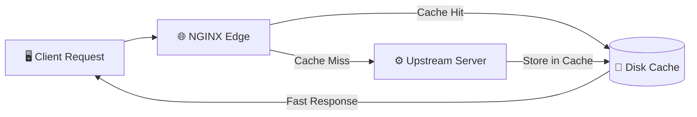

# 🌐 NGINX Production Engineering Master Handbook
> **The Complete Architectural Guide to Building, Securing, Scaling, and Troubleshooting NGINX in Real-World Production Environments**  
> *Engineered for DevOps Engineers, Site Reliability Engineers, Platform Architects, and Senior Technical Interviews.*

---

## 📑 Master Table of Contents
1. [Core NGINX Architecture & Mental Models](#1-core-nginx-architecture--mental-models)
2. [20-Module Enterprise NGINX Curriculum Deep Dive](#2-20-module-enterprise-nginx-curriculum-deep-dive)
   - [Module 1: NGINX in Production: Core Roles & Traffic Flow](#module-1-nginx-in-production-core-roles--traffic-flow-page-1)
   - [Module 2: Installation, Directory Layout & Configuration Hierarchy](#module-2-installation-directory-layout--configuration-hierarchy-page-2)
   - [Module 3: Master-Worker Architecture, Event Loop (`epoll`) & Concurrency Tuning](#module-3-master-worker-architecture-event-loop-epoll--concurrency-tuning-page-3)
   - [Module 4: Server Blocks, `listen`, `server_name` & Location Matching Engine](#module-4-server-blocks-listen-server_name--location-matching-engine-page-4)
   - [Module 5: NGINX as a Reverse Proxy: Headers, Buffering & Timeouts](#module-5-nginx-as-a-reverse-proxy-headers-buffering--timeouts-page-5)
   - [Module 6: Production Load Balancing Algorithms & Connection Reuse](#module-6-production-load-balancing-algorithms--connection-reuse-page-6)
   - [Module 7: Passive Health Checks, `max_fails` & `proxy_next_upstream`](#module-7-passive-health-checks-max_fails--proxy_next_upstream-page-7)
   - [Module 8: TLS/HTTPS Hardening, HSTS, OCSP Stapling & Let's Encrypt](#module-8-tlshttps-hardening-hsts-ocsp-stapling--lets-encrypt-page-8)
   - [Module 9: Enterprise Security Hardening, Security Headers & Access Control](#module-9-enterprise-security-hardening-security-headers--access-control-page-9)
   - [Module 10: Rate Limiting (`limit_req`), Burst, Nodelay & Connection Limits](#module-10-rate-limiting-limit_req-burst-nodelay--connection-limits-page-10)
   - [Module 11: High-Performance Caching & Static Asset Delivery](#module-11-high-performance-caching--static-asset-delivery-page-11)
   - [Module 12: Compression (`gzip`), Buffer Tuning & `sendfile` Optimization](#module-12-compression-gzip-buffer-tuning--sendfile-optimization-page-12)
   - [Module 13: WebSockets & Long-Lived HTTP Upgrade Connections](#module-13-websockets--long-lived-http-upgrade-connections-page-13)
   - [Module 14: Structured JSON Logging, Latency Observability & Prometheus](#module-14-structured-json-logging-latency-observability--prometheus-page-14)
   - [Module 15: Debugging HTTP Error Codes (400, 403, 413, 499, 500, 502, 504)](#module-15-debugging-http-error-codes-400-403-413-499-500-502-504-page-15)
   - [Module 16: Root Cause Playbooks: 502 Bad Gateway vs. 504 Gateway Timeout](#module-16-root-cause-playbooks-502-bad-gateway-vs-504-gateway-timeout-page-16)
   - [Module 17: Zero-Downtime Deployments, Canary Releases & Connection Draining](#module-17-zero-downtime-deployments-canary-releases--connection-draining-page-17)
   - [Module 18: NGINX in Docker Containers & Kubernetes Ingress Controllers](#module-18-nginx-in-docker-containers--kubernetes-ingress-controllers-page-18)
   - [Module 19: Real-World Production Outage Investigation Lab](#module-19-real-world-production-outage-investigation-lab-page-19)
   - [Module 20: Production Readiness Checklist & Master Command Cheat Sheet](#module-20-production-readiness-checklist--master-command-cheat-sheet-page-20)
3. [Senior Engineer Interview Quick-Fire Cheat Sheet](#3-senior-engineer-interview-quick-fire-cheat-sheet)

---

## 1. Core NGINX Architecture & Mental Models

```
                          NGINX EVENT-DRIVEN ARCHITECTURE
 ┌─────────────────────────────────────────────────────────────────────────────┐
 │ Master Process (PID 1)                                                      │
 │ • Reads & validates configuration (nginx -t)                                │
 │ • Binds privileged ports (80, 443)                                          │
 │ • Spawns, monitors, and gracefully reloads worker processes                 │
 └──────────────────────────────────────┬──────────────────────────────────────┘
                                        │ (Spawns worker processes)
          ┌─────────────────────────────┼─────────────────────────────┐
          ▼                             ▼                             ▼
 ┌─────────────────┐           ┌─────────────────┐           ┌─────────────────┐
 │ Worker 1 (CPU 0)│           │ Worker 2 (CPU 1)│           │ Worker N (CPU N)│
 │ Non-blocking    │           │ Non-blocking    │           │ Non-blocking    │
 │ epoll EventLoop │           │ epoll EventLoop │           │ epoll EventLoop │
 └────────┬────────┘           └────────┬────────┘           └────────┬────────┘
          │                             │                             │
          └─────────────────────────────┼─────────────────────────────┘
                                        ▼
                  [ Thousands of Concurrent Client Connections ]
```

### 🧠 The 6 Core Rules of NGINX
1. **Asynchronous & Non-Blocking (`epoll`):** Unlike Apache MPM-prefork which allocates one OS thread/process per connection, NGINX uses an asynchronous event loop on Linux (`epoll`), allowing a single worker to handle 10,000+ concurrent connections with minimal RAM (~2.5MB per 10k connections).
2. **Never Run `systemctl restart` in Production:** `restart` tears down the master process and forcibly severs active TCP connections. Always run `nginx -t && systemctl reload nginx` for **zero-downtime hot reloading** via `SIGHUP`.
3. **`root` Appends URI Path; `alias` Replaces Location Match:**
   * `location /images/ { root /var/www; }` $\implies$ Looks for `/var/www/images/pic.png`.
   * `location /images/ { alias /var/www/; }` $\implies$ Looks for `/var/www/pic.png`.
4. **Location Precedence Rule:** Exact (`=`) $\rightarrow$ Longest Prefix with stop (`^~`) $\rightarrow$ Regex (`~` / `~*` in file order) $\rightarrow$ Generic Prefix.
5. **Always Pass Original Client Identity:** Backends behind NGINX see `127.0.0.1` unless you set `Host`, `X-Real-IP`, and `X-Forwarded-For`.
6. **499 vs. 502 vs. 504:**
   * **499:** Client closed connection before NGINX could finish sending response.
   * **502 (Bad Gateway):** Backend server is dead, crashed, or actively refusing TCP connection on port.
   * **504 (Gateway Timeout):** Backend server accepted connection but took too long to generate response (`proxy_read_timeout` exceeded).

---

## 2. 20-Module Enterprise NGINX Curriculum Deep Dive

---

### Module 1: NGINX in Production: Core Roles & Traffic Flow (Page 1)

```
                                TYPICAL PRODUCTION TRAFFIC FLOW
  ┌─────────┐      HTTPS      ┌──────────────┐     HTTP / gRPC     ┌──────────────────┐
  │ Clients │ ───────────────▶│ NGINX Edge   │ ──────────────────▶ │ Upstream App     │
  │ (Users) │ ◀───────────────│ Reverse Proxy│ ◀────────────────── │ Servers (Node/Py)│
  └─────────┘                 └──────┬───────┘                     └──────────────────┘
                                     │
                                     ▼
                              [ Local Cache & ]
                              [ Static Assets ]
```

#### ⚖️ NGINX (Edge) vs. Application Servers (Compute)
| Feature | NGINX Edge Layer | Application Server (Gunicorn, Node, Tomcat) |
| :--- | :--- | :--- |
| **Primary Role** | Traffic routing, TLS termination, static caching, DDoS rate limits | Business logic, database transactions, dynamic HTML/JSON |
| **Concurrency Model** | Asynchronous event-driven (`epoll`), lightweight | Thread/Process pool, heavier memory footprint |
| **Memory Footprint** | ~2–5 MB per worker process | 50–500 MB per application worker |
| **TLS Offloading** | Hardware-accelerated OpenSSL/TLS termination | High CPU cost if terminating TLS directly |

---

### Module 2: Installation, Directory Layout & Configuration Hierarchy (Page 2)

```
                               CONFIGURATION HIERARCHY
 ┌─────────────────────────────────────────────────────────────────────────────┐
 │ main context (Global settings: user, worker_processes, pid, error_log)      │
 │ ├── events { } (Connection processing: worker_connections, use epoll)       │
 │ └── http { } (HTTP server engine: mime.types, gzip, timeouts, upstream)     │
 │     ├── upstream backend_pool { } (Cluster definitions & load balancing)    │
 │     └── server { } (Virtual hosts: listen 80/443, server_name)              │
 │         └── location / { } (URI routing rules, proxy_pass, caching)         │
 └─────────────────────────────────────────────────────────────────────────────┘
```

#### 📁 Key Directories & Files
* `/etc/nginx/nginx.conf`: Top-level master configuration file.
* `/etc/nginx/conf.d/*.conf`: Modular configuration files included automatically.
* `/etc/nginx/sites-available/` & `sites-enabled/`: Debian/Ubuntu virtual host management (symlink pattern).
* `/var/log/nginx/`: Default log directory (`access.log` and `error.log`).
* `/usr/share/nginx/html` or `/var/www/html`: Default static web document roots.

```bash
# Test configuration syntax before reloading (MANDATORY IN PRODUCTION)
sudo nginx -t

# Dump the full assembled configuration
sudo nginx -T

# Safe Zero-Downtime Hot Reload
sudo nginx -t && sudo systemctl reload nginx
```

---

### Module 3: Master-Worker Architecture, Event Loop (`epoll`) & Concurrency Tuning (Page 3)

$$\text{Max Concurrent Connections} = \text{worker\_processes} \times \text{worker\_connections}$$

```nginx
# /etc/nginx/nginx.conf
user www-data;
worker_processes auto;               # 1 worker per CPU core automatically
worker_rlimit_nofile 65535;          # Increase OS file descriptor limit for NGINX

events {
    worker_connections 10240;        # Max connections per worker
    use epoll;                       # High-performance I/O multiplexing on Linux
    multi_accept on;                 # Accept all new connections immediately
}
```

```bash
# Verify system-level file descriptor limits
ulimit -n
# Set permanently in /etc/security/limits.conf:
# www-data soft nofile 65535
# www-data hard nofile 65535
```

---

### Module 4: Server Blocks, `listen`, `server_name` & Location Matching Engine (Page 4)

```
                            LOCATION MATCHING PRECEDENCE
 ┌────┬──────────────┬────────────────────────┬────────────────────────────────────────────┐
 │Rank│ Modifier     │ Example Syntax         │ Description & Behavior                     │
 ├────┼──────────────┼────────────────────────┼────────────────────────────────────────────┤
 │ 1  │ =            │ location = /login      │ Exact Match: Instant match, stops search   │
 │ 2  │ ^~           │ location ^~ /images/   │ Preferential Prefix: Stops regex matching  │
 │ 3  │ ~ or ~*      │ location ~* \.(jpg|png)│ Regex: (Case-sensitive ~ / Insensitive ~*) │
 │ 4  │ None (Prefix)│ location /api/         │ Longest Prefix Match (Continues checking)  │
 │ 5  │ /            │ location /             │ Default Fallback Catch-all                 │
 └────┴──────────────┴────────────────────────┴────────────────────────────────────────────┘
```

#### 🚨 `root` vs. `alias` Directive Pitfall
```nginx
# ROOT DIRECTORY: Appends full URI to the root path
location /static/ {
    root /var/www/app;
    # Request: GET /static/css/style.css
    # Disk Path: /var/www/app/static/css/style.css
}

# ALIAS DIRECTORY: Replaces location match with alias path
location /static/ {
    alias /var/www/assets/;
    # Request: GET /static/css/style.css
    # Disk Path: /var/www/assets/css/style.css
}
```

---

### Module 5: NGINX as a Reverse Proxy: Headers, Buffering & Timeouts (Page 5)

```nginx
location / {
    proxy_pass http://app_backend;
    
    # 1. Preserve Original Client Metadata
    proxy_set_header Host $host;
    proxy_set_header X-Real-IP $remote_addr;
    proxy_set_header X-Forwarded-For $proxy_add_x_forwarded_for;
    proxy_set_header X-Forwarded-Proto $scheme;
    
    # 2. HTTP/1.1 & Keepalive Support
    proxy_http_version 1.1;
    proxy_set_header Connection "";
    
    # 3. Timeout Configuration (Prevent 504 Gateway Timeouts)
    proxy_connect_timeout 5s;        # Time to establish TCP connection with upstream
    proxy_send_timeout 60s;          # Time to transmit request to upstream
    proxy_read_timeout 60s;          # Time to wait for upstream response
    
    # 4. Response Buffering
    proxy_buffering on;
    proxy_buffers 16 16k;
    proxy_buffer_size 32k;
}
```

---

### Module 6: Production Load Balancing Algorithms & Connection Reuse (Page 6)

```nginx
upstream app_cluster {
    # Algorithm Choices:
    # (Default: Round Robin)
    least_conn;                      # Route to server with fewest active connections
    # ip_hash;                       # Sticky sessions based on client IP hash
    
    server 10.0.0.11:8080 weight=5 max_fails=3 fail_timeout=30s;
    server 10.0.0.12:8080 weight=3 max_fails=3 fail_timeout=30s;
    server 10.0.0.13:8080 weight=1 max_fails=3 fail_timeout=30s;
    server 10.0.0.14:8080 backup;   # Only receives traffic if all others fail
    
    # TCP Connection Pool Reuse (Drastically reduces latency & port exhaustion)
    keepalive 64;
}
```

---

### Module 7: Passive Health Checks, `max_fails` & `proxy_next_upstream` (Page 7)

```nginx
upstream backend_api {
    server 10.0.1.10:8000 max_fails=3 fail_timeout=30s;
    server 10.0.1.11:8000 max_fails=3 fail_timeout=30s;
}

server {
    listen 80;
    location / {
        proxy_pass http://backend_api;
        
        # Automatically retry next server if current upstream fails or times out
        proxy_next_upstream error timeout http_502 http_503 http_504;
        proxy_next_upstream_tries 3;
        proxy_next_upstream_timeout 10s;
    }
}
```
> [!WARNING]
> Be careful using `proxy_next_upstream` with non-idempotent HTTP methods (`POST`, `PATCH`, `DELETE`). If a backend processed an order creation before timing out, retrying could trigger **duplicate charges or database writes**.

---

### Module 8: TLS/HTTPS Hardening, HSTS, OCSP Stapling & Let's Encrypt (Page 8)

```nginx
server {
    listen 80;
    server_name api.production.com;
    # 301 Permanent Redirect all HTTP traffic to HTTPS
    return 301 https://$host$request_uri;
}

server {
    listen 443 ssl http2;
    server_name api.production.com;

    # SSL Certificates (Fullchain + Private Key)
    ssl_certificate /etc/letsencrypt/live/api.production.com/fullchain.pem;
    ssl_certificate_key /etc/letsencrypt/live/api.production.com/privkey.pem;

    # Modern TLS Protocols & Cipher Suites
    ssl_protocols TLSv1.2 TLSv1.3;
    ssl_ciphers ECDHE-ECDSA-AES128-GCM-SHA256:ECDHE-RSA-AES128-GCM-SHA256:ECDHE-ECDSA-AES256-GCM-SHA384:ECDHE-RSA-AES256-GCM-SHA384;
    ssl_prefer_server_ciphers off;

    # SSL Session Caching & Optimization
    ssl_session_cache shared:SSL:10m;
    ssl_session_timeout 1d;
    ssl_session_tickets off;

    # OCSP Stapling (Speeds up client TLS handshake)
    ssl_stapling on;
    ssl_stapling_verify on;
    resolver 8.8.8.8 1.1.1.1 valid=300s;
    resolver_timeout 5s;

    # HTTP Strict Transport Security (HSTS - 2 Years)
    add_header Strict-Transport-Security "max-age=63072000; includeSubDomains; preload" always;
}
```

```bash
# Automated Let's Encrypt Certificate Issuance & Renewal
sudo apt install certbot python3-certbot-nginx
sudo certbot --nginx -d api.production.com
sudo certbot renew --dry-run
```

---

### Module 9: Enterprise Security Hardening, Security Headers & Access Control (Page 9)

```nginx
# 1. Hide NGINX Version in HTTP Headers and Error Pages
server_tokens off;

# 2. Mandatory Enterprise Security Headers
add_header X-Frame-Options "SAMEORIGIN" always;
add_header X-Content-Type-Options "nosniff" always;
add_header X-XSS-Protection "1; mode=block" always;
add_header Referrer-Policy "strict-origin-when-cross-origin" always;
add_header Content-Security-Policy "default-src 'self' http: https: data: blob: 'unsafe-inline'" always;

# 3. Block Hidden Files & Sensitive Assets (.git, .env, .yaml)
location ~ /\.(?!well-known) {
    deny all;
    return 404;
}

# 4. Restrict HTTP Methods
location /api/ {
    limit_except GET POST PUT DELETE {
        deny all;
    }
}

# 5. IP Allowlisting for Admin Interfaces
location /admin/ {
    allow 10.0.0.0/8;
    allow 192.168.1.50;
    deny all;
    
    auth_basic "Restricted Administrator Area";
    auth_basic_user_file /etc/nginx/.htpasswd;
}
```

---

### Module 10: Rate Limiting (`limit_req`), Burst, Nodelay & Connection Limits (Page 10)

```nginx
http {
    # Allocate 10MB memory zone (holds ~160,000 IP states) with rate of 10 req/sec
    limit_req_zone $binary_remote_addr zone=api_limit:10m rate=10r/s;
    limit_conn_zone $binary_remote_addr zone=conn_limit:10m;
    
    # Custom response code on rate limiting (Standard: HTTP 429 Too Many Requests)
    limit_req_status 429;
    limit_conn_status 429;

    server {
        listen 80;
        
        # Apply Rate Limiting to sensitive login endpoint
        location /api/v1/auth/login {
            # Allow burst of 5 requests; process immediately without queuing (nodelay)
            limit_req zone=api_limit burst=5 nodelay;
            limit_conn conn_limit 10; # Max 10 concurrent TCP connections per IP
            
            proxy_pass http://auth_service;
        }
    }
}
```

---

### Module 11: High-Performance Caching & Static Asset Delivery (Page 11)



```nginx
http {
    # Define cache storage path, directory depth, memory key zone, and disk max size
    proxy_cache_path /var/cache/nginx levels=1:2 keys_zone=api_cache:50m max_size=10g inactive=60m use_temp_path=off;

    server {
        listen 80;
        
        # 1. Browser Caching for Static Files
        location ~* \.(jpg|jpeg|png|gif|ico|css|js|woff2)$ {
            root /var/www/assets;
            expires 30d;
            add_header Cache-Control "public, no-transform, immutable";
            access_log off;
        }

        # 2. Reverse Proxy Micro-Caching
        location /api/products {
            proxy_pass http://product_service;
            proxy_cache api_cache;
            proxy_cache_valid 200 302 5m;
            proxy_cache_valid 404 1m;
            proxy_cache_use_stale error timeout updating http_500 http_502 http_503;
            proxy_cache_lock on; # Avoid cache stampedes
            
            # Send cache status header to client (HIT, MISS, BYPASS, EXPIRED)
            add_header X-Cache-Status $upstream_cache_status;
        }
    }
}
```

---

### Module 12: Compression (`gzip`), Buffer Tuning & `sendfile` Optimization (Page 12)

```nginx
http {
    # Zero-Copy Static File Transfer directly from kernel page cache to socket
    sendfile on;
    tcp_nopush on;                   # Send full TCP packets (works with sendfile)
    tcp_nodelay on;                  # Disable Nagle's algorithm for low latency

    # GZIP Compression Engine
    gzip on;
    gzip_vary on;
    gzip_proxied any;
    gzip_comp_level 5;               # Optimal CPU-to-compression ratio (1-9)
    gzip_min_length 1024;            # Do not compress tiny payloads (< 1KB)
    gzip_types
        text/plain
        text/css
        text/xml
        application/json
        application/javascript
        application/xml+rss
        image/svg+xml;

    # Buffer Limits to Protect Against Memory Exhaustion & Slowloris
    client_body_buffer_size 128k;
    client_max_body_size 50m;        # Max upload size (Avoids 413 Payload Too Large)
    client_header_buffer_size 1k;
    large_client_header_buffers 4 8k;
}
```

---

### Module 13: WebSockets & Long-Lived HTTP Upgrade Connections (Page 13)

```nginx
http {
    # WebSocket Connection Upgrade Map
    map $http_upgrade $connection_upgrade {
        default upgrade;
        '' close;
    }

    upstream websocket_cluster {
        ip_hash;                     # Session affinity for stateful connections
        server 10.0.0.21:3000;
        server 10.0.0.22:3000;
    }

    server {
        listen 80;

        location /ws/ {
            proxy_pass http://websocket_cluster;
            proxy_http_version 1.1;
            
            # Hop-by-hop upgrade headers
            proxy_set_header Upgrade $http_upgrade;
            proxy_set_header Connection $connection_upgrade;
            proxy_set_header Host $host;

            # Extended Timeouts for Long-Lived Sockets (24 Hours)
            proxy_read_timeout 86400s;
            proxy_send_timeout 86400s;
        }
    }
}
```

---

### Module 14: Structured JSON Logging, Latency Observability & Prometheus (Page 14)

```nginx
http {
    # High-Resolution Structured JSON Logging
    log_format json_analytics escape=json '{'
        '"timestamp":"$time_iso8601",'
        '"client_ip":"$remote_addr",'
        '"x_forwarded_for":"$http_x_forwarded_for",'
        '"request_id":"$request_id",'
        '"request_method":"$request_method",'
        '"request_uri":"$request_uri",'
        '"status":$status,'
        '"body_bytes_sent":$body_bytes_sent,'
        '"request_time":$request_time,'
        '"upstream_response_time":"$upstream_response_time",'
        '"upstream_addr":"$upstream_addr",'
        '"upstream_status":"$upstream_status",'
        '"http_referrer":"$http_referer",'
        '"http_user_agent":"$http_user_agent"'
    '}';

    access_log /var/log/nginx/access.json.log json_analytics;
    error_log /var/log/nginx/error.log warn;
}
```

---

### Module 15: Debugging HTTP Error Codes (400, 403, 413, 499, 500, 502, 504) (Page 15)

```
 ┌────┬────────────────────────┬──────────────────────────────────┬────────────────────────────────────────────┐
 │Code│ Error Name             │ Primary Root Cause               │ Diagnostic Action / Fix                    │
 ├────┼────────────────────────┼──────────────────────────────────┼────────────────────────────────────────────┤
 │400 │ Bad Request            │ Malformed headers / URI length   │ Check client request syntax & buffer sizes │
 │403 │ Forbidden              │ OS permissions / IP deny rules   │ Check file permissions & directory index   │
 │404 │ Not Found              │ Wrong root/alias path or missing │ Verify file on disk vs location match rule │
 │413 │ Payload Too Large      │ Body exceeds client_max_body_size│ Increase `client_max_body_size 100m;`      │
 │429 │ Too Many Requests      │ Rate limiting threshold exceeded │ Check `limit_req_zone` and burst settings  │
 │499 │ Client Closed Request  │ Client timed out before response │ Optimize backend query / upstream speed    │
 │500 │ Internal Server Error  │ Lua script bug / rewrite loop    │ Inspect `/var/log/nginx/error.log`         │
 │502 │ Bad Gateway            │ Backend is down / connection refused│ Check if upstream app process is running│
 │503 │ Service Unavailable    │ All upstreams failing or rate lim│ Check backend health and capacity          │
 │504 │ Gateway Timeout        │ Backend too slow to respond      │ Increase `proxy_read_timeout` / fix DB     │
 └────┴────────────────────────┴──────────────────────────────────┴────────────────────────────────────────────┘
```

---

### Module 16: Root Cause Playbooks: 502 Bad Gateway vs. 504 Gateway Timeout (Page 16)

```
                     502 BAD GATEWAY vs. 504 GATEWAY TIMEOUT
 ┌──────────────────────────────────────┬──────────────────────────────────────┐
 │ 502 Bad Gateway                      │ 504 Gateway Timeout                  │
 ├──────────────────────────────────────┼──────────────────────────────────────┤
 │ • Backend process is DEAD / CRASHED  │ • Backend is ALIVE but TOO SLOW      │
 │ • Backend not listening on port/sock │ • Database query / API bottleneck    │
 │ • SELinux / Firewall blocked connect │ • Worker thread pool saturated       │
 │ • Instant TCP RST received by NGINX  │ • proxy_read_timeout exceeded        │
 └──────────────────────────────────────┴──────────────────────────────────────┘
```

#### 🚨 502 Bad Gateway Triage Workflow
```bash
# 1. Inspect NGINX error logs for upstream refusal
sudo tail -n 50 /var/log/nginx/error.log
# Look for: "connect() failed (111: Connection refused) while connecting to upstream"

# 2. Check if backend application service is running
sudo systemctl status backend-app
ps aux | grep node

# 3. Check if backend port is actively listening
ss -tulnp | grep :8080

# 4. Test connectivity directly to backend bypass NGINX
curl -Iv http://127.0.0.1:8080/health
```

#### ⏳ 504 Gateway Timeout Triage Workflow
```bash
# 1. Identify slow upstream response times in access logs
awk -F'"' '$10 > 30.0 {print $0}' /var/log/nginx/access.json.log

# 2. Profile upstream backend performance and database query latencies
# 3. Temporarily increase proxy timeout if legitimate long-running job:
# proxy_read_timeout 120s;
```

---

### Module 17: Zero-Downtime Deployments, Canary Releases & Connection Draining (Page 17)

#### 🕊️ Weighted Canary Traffic Splitting (80% v1 / 20% v2)
```nginx
upstream app_backend {
    # 80% of client traffic routed to stable v1
    server 10.0.0.10:8080 weight=80;
    
    # 20% of client traffic routed to canary v2
    server 10.0.0.20:8080 weight=20;
}
```

#### 🔄 Zero-Downtime Hotfix Reload Protocol
```bash
# 1. Validate configuration
sudo nginx -t

# 2. Issue SIGHUP graceful reload (Old workers finish active requests before exiting)
sudo systemctl reload nginx

# 3. Verify process transition
ps aux | grep nginx
```

---

### Module 18: NGINX in Docker Containers & Kubernetes Ingress Controllers (Page 18)

#### 🐳 Production Docker Run
```bash
docker run -d \
  --name nginx-prod \
  -p 80:80 -p 443:443 \
  -v $(pwd)/nginx.conf:/etc/nginx/nginx.conf:ro \
  -v $(pwd)/html:/usr/share/nginx/html:ro \
  -v $(pwd)/logs:/var/log/nginx \
  --restart unless-stopped \
  nginx:1.25-alpine
```

#### ☸️ Kubernetes Ingress Architecture
```yaml
apiVersion: networking.k8s.io/v1
kind: Ingress
metadata:
  name: app-ingress
  namespace: production
  annotations:
    kubernetes.io/ingress.class: "nginx"
    nginx.ingress.kubernetes.io/proxy-body-size: "50m"
    nginx.ingress.kubernetes.io/ssl-redirect: "true"
spec:
  rules:
    - host: api.corp.com
      http:
        paths:
          - path: /
            pathType: Prefix
            backend:
              service:
                name: api-service
                port:
                  number: 8080
```

---

### Module 19: Real-World Production Outage Investigation Lab (Page 19)

```
                            INCIDENT INVESTIGATION LAB
 ┌──────────────┐    ┌──────────────┐    ┌──────────────┐    ┌──────────────┐
 │ 1. CONFIRM   │───▶│ 2. LOGS      │───▶│ 3. ISOLATE   │───▶│ 4. DRAIN &   │
 │ curl -I test │    │ 502/504 scan │    │ Unhealthy IP │    │ RELOAD       │
 └──────────────┘    └──────────────┘    └──────────────┘    └──────────────┘
```

```bash
# Real-time triage script to isolate failing upstream
tail -f /var/log/nginx/access.json.log | grep --line-buffered '"status":502' | jq '{client_ip, upstream_addr, request_time}'
```

---

### Module 20: Production Readiness Checklist & Master Command Cheat Sheet (Page 20)

```
                    PRODUCTION NGINX AUDIT CHECKLIST
 ┌──┬─────────────────────────────┬────────────────────────────────────────────┐
 │  │ Verification Area           │ Production Standard                        │
 ├──┼─────────────────────────────┼────────────────────────────────────────────┤
 │☐ │ Syntax Check                │ Tested via `nginx -t` before every reload  │
 │☐ │ Worker Optimization         │ `worker_processes auto;`, `worker_rlimit`  │
 │☐ │ Security Headers            │ HSTS, X-Frame, X-Content-Type, CSP active  │
 │☐ │ TLS Best Practices          │ TLSv1.2 & TLSv1.3 only; OCSP Stapling on   │
 │☐ │ Version Masking             │ `server_tokens off;` set globally          │
 │☐ │ Reverse Proxy Headers       │ Host, X-Real-IP, X-Forwarded-For passed    │
 │☐ │ Upstream Keepalives         │ `keepalive 32;` configured in upstreams    │
 │☐ │ Rate Limiting               │ `limit_req` active on auth/login routes    │
 │☐ │ Max Body Sizing             │ `client_max_body_size` configured properly │
 │☐ │ Structured Logging          │ JSON logging with `$request_time` active   │
 └──┴─────────────────────────────┴────────────────────────────────────────────┘
```

---

## 3. Senior Engineer Interview Quick-Fire Cheat Sheet

| # | High-Frequency Interview Question | Senior DevOps / SRE Model Answer |
|---|---|---|
| 1 | **What is the difference between `nginx -s reload` and `systemctl restart nginx`?** | *`systemctl restart` kills the master process and worker threads immediately, dropping in-flight client TCP connections and causing downtime. `reload` sends a `SIGHUP` signal to the master process, which verifies configuration syntax, spawns new worker processes with the new config, and allows old workers to gracefully finish active connections before terminating (Zero Downtime).* |
| 2 | **What is the difference between `root` and `alias` directives?** | *`root` appends the full request URI to the root path on disk (e.g. `/static/` under root `/var/www` resolves to `/var/www/static/`). `alias` replaces the matching location block with the target path (e.g. `/static/` under alias `/var/www/assets/` resolves to `/var/www/assets/`).* |
| 3 | **What does HTTP 499 mean in NGINX logs, and how do you fix it?** | *HTTP 499 is an NGINX-specific status code meaning **"Client Closed Request"**. The client browser or calling service timed out and closed the TCP connection while NGINX was still waiting for the upstream backend to respond. Fix by optimizing slow backend processing, database query latencies, or increasing client-side timeout thresholds.* |
| 4 | **How does NGINX handle the C10K problem (10,000 concurrent connections)?** | *Unlike traditional web servers that spawn a thread or process per connection, NGINX uses an **event-driven, non-blocking asynchronous event loop** powered by Linux `epoll` (or BSD `kqueue`). A small number of single-threaded worker processes multiplex thousands of connections simultaneously using minimal CPU and memory.* |
| 5 | **Why should you configure `keepalive` inside an upstream block?** | *By default, NGINX opens and closes a new TCP connection to the backend for every incoming client request. Adding `keepalive 32;` maintains an open cache of TCP connections to the upstream servers, eliminating repetitive 3-way TCP and TLS handshakes, reducing latency, and preventing ephemeral port exhaustion.* |

---
*Created for Enterprise Web Architecture, High-Performance Traffic Management & Senior Technical Interviews.*
