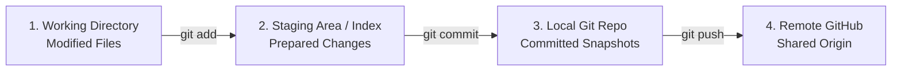
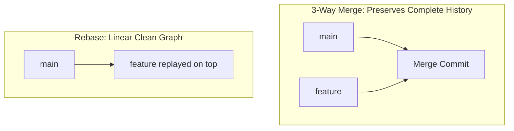
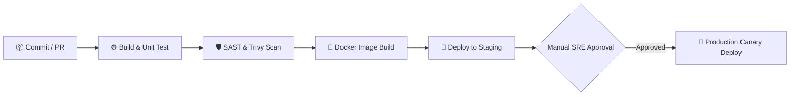

# 🐙 Git & GitHub Production Engineering Master Handbook
> **From Core Fundamentals to Enterprise Branching, CI/CD, Disaster Recovery & Security**  
> *Engineered for DevOps Engineers, SREs, Software Architects, and High-Impact Technical Interviews.*

---

## 📑 Master Table of Contents
1. [Core Git Mental Models & Architecture](#1-core-git-mental-models--architecture)
2. [20-Module Enterprise Curriculum Deep Dive](#2-20-module-enterprise-curriculum-deep-dive)
   - [Module 1: Introduction to Git & Distributed Version Control](#module-1-introduction-to-git--distributed-version-control-page-1)
   - [Module 2: Installation, Identity Configuration & Preferences](#module-2-installation-identity-configuration--preferences-page-2)
   - [Module 3: Git Architecture & The Three Areas of Git](#module-3-git-architecture--the-three-areas-of-git-page-3)
   - [Module 4: Recording Changes, Atomic Commits & History Graph](#module-4-recording-changes-atomic-commits--history-graph-page-4)
   - [Module 5: History Inspection, `git diff`, `git blame` & Pickaxe Search](#module-5-history-inspection-git-diff-git-blame--pickaxe-search-page-5)
   - [Module 6: Branching Models (GitFlow vs GitHub Flow vs Trunk-Based)](#module-6-branching-models-gitflow-vs-github-flow-vs-trunk-based-page-6)
   - [Module 7: Merging vs Rebasing & Interactive Rebase Mastery](#module-7-merging-vs-rebasing--interactive-rebase-mastery-page-7)
   - [Module 8: Merge & Rebase Conflict Resolution Playbook](#module-8-merge--rebase-conflict-resolution-playbook-page-8)
   - [Module 9: Remote Repositories (`origin` vs `upstream`, `fetch` vs `pull`)](#module-9-remote-repositories-origin-vs-upstream-fetch-vs-pull-page-9)
   - [Module 10: GitHub Repository Essentials, Licenses & `.gitignore`](#module-10-github-repository-essentials-licenses--gitignore-page-10)
   - [Module 11: Pull Requests, Code Reviews & Enterprise Approval Gates](#module-11-pull-requests-code-reviews--enterprise-approval-gates-page-11)
   - [Module 12: Team Collaboration, RBAC & `CODEOWNERS` Architecture](#module-12-team-collaboration-rbac--codeowners-architecture-page-12)
   - [Module 13: Project Management: Issues, Milestones & Kanban Boards](#module-13-project-management-issues-milestones--kanban-boards-page-13)
   - [Module 14: GitHub Actions CI/CD Fundamentals](#module-14-github-actions-cicd-fundamentals-page-14)
   - [Module 15: Production CI/CD Pipelines, Security Scanning & Deployment](#module-15-production-cicd-pipelines-security-scanning--deployment-page-15)
   - [Module 16: Git & GitHub Security Best Practices (GPG, Secrets, OIDC)](#module-16-git--github-security-best-practices-gpg-secrets-oidc-page-16)
   - [Module 17: Enterprise Release Engineering & Semantic Versioning (SemVer)](#module-17-enterprise-release-engineering--semantic-versioning-semver-page-17)
   - [Module 18: Git Disaster Recovery, `reflog`, Reset vs Revert](#module-18-git-disaster-recovery-reflog-reset-vs-revert-page-18)
   - [Module 19: Real Production Simulation Labs](#module-19-real-production-simulation-labs-page-19)
   - [Module 20: Enterprise Best Practices & Final Production Readiness Checklist](#module-20-enterprise-best-practices--final-production-readiness-checklist-page-20)
3. [Senior Engineer Interview Quick-Fire Cheat Sheet](#3-senior-engineer-interview-quick-fire-cheat-sheet)

---

## 1. Core Git Mental Models & Architecture

```
                          THE THREE TREE ARCHITECTURE OF GIT
 ┌───────────────────────────┬───────────────────────────┬───────────────────────────┐
 │ 1. WORKING DIRECTORY      │ 2. STAGING AREA (INDEX)   │ 3. LOCAL REPOSITORY (.git)│
 │ (Sandbox / Unstaged Files)│ (Snapshot Preparation)    │ (Immutable Commit History)│
 └───────────────────────────┴───────────────────────────┴───────────────────────────┘
               │                           ▲                           ▲
               │──────── git add ─────────▶│                           │
               │                           │──────── git commit ──────▶│
               │◀────── git checkout / git restore ────────────────────│
               │◀────────────── git reset --hard HEAD ─────────────────│
```

### 🧠 5 Core Rules of Git
1. **Git Stores Snapshots, Not Diffs:** Unlike legacy VCS (SVN/CVS) which store delta file changes, Git stores a complete cryptographic snapshot (Merkle tree of SHA-1/SHA-256 hashes) for every commit.
2. **`git reflog` is Your Safety Net:** As long as a commit was created locally, Git never deletes it immediately. `reflog` tracks every movement of `HEAD`.
3. **Never Force-Push to Shared Branches:** Always prefer `git revert` on public branches (`main`, `develop`) and use `git push --force-with-lease` on private feature branches.
4. **`Merge` Preserves History; `Rebase` Rewrites History for a Linear Graph:** Use merge for shared feature boundaries; use rebase for local branch cleanup.
5. **Atomic Commits Make Rollbacks Trivial:** Each commit should represent one logical, testable unit of work with a descriptive imperative commit message.

---

## 2. 20-Module Enterprise Curriculum Deep Dive

---

### Module 1: Introduction to Git & Distributed Version Control (Page 1)

```
                 CENTRALIZED (SVN) vs DISTRIBUTED (GIT)
 ┌──────────────────────────────┬──────────────────────────────┐
 │ Centralized (SVN / CVS)      │ Distributed (Git)            │
 ├──────────────────────────────┼──────────────────────────────┤
 │ • Single central server      │ • Every dev has full history │
 │ • Single point of failure    │ • Complete offline capability│
 │ • Requires constant network  │ • Fast, local operations     │
 │ • Slow branching & merging   │ • Lightweight branching      │
 └──────────────────────────────┴──────────────────────────────┘
```

#### 🚀 High-Level Enterprise Lifecycle
$$\text{Create Branch} \longrightarrow \text{Develop \& Commit} \longrightarrow \text{Push Remote} \longrightarrow \text{Open PR} \longrightarrow \text{Peer Review} \longrightarrow \text{Merge to Main} \longrightarrow \text{CI/CD Deploy}$$

---

### Module 2: Installation, Identity Configuration & Preferences (Page 2)

#### 📁 Configuration Scope Levels
1. **System (`/etc/gitconfig`):** Applied to all users and all repositories on the machine.
2. **Global (`~/.gitconfig`):** Applied to current user's repositories (`--global`).
3. **Local (`.git/config`):** Applied strictly to the active repository.

```bash
# Set author identity (attached to every commit)
git config --global user.name "Your Name"
git config --global user.email "your.email@corp.com"

# Set default main branch name (Industry standard)
git config --global init.defaultBranch main

# Set default pull strategy to rebase (avoids messy merge bubble commits)
git config --global pull.rebase true

# Auto line-ending handling (CRLF on Windows, LF on Linux/macOS)
git config --global core.autocrlf true   # On Windows
git config --global core.autocrlf input  # On Linux/macOS

# View all effective configurations
git config --list --show-origin
```

---

### Module 3: Git Architecture & The Three Areas of Git (Page 3)



* **`.git/` Structure:** Contains `HEAD`, `objects/` (blobs, trees, commits, annotated tags), `refs/` (branch pointers), `config`, and `hooks/`.

```bash
# Initialize and clone repositories
git init                          # Initialize new repo in current folder
git clone https://github.com/org/repo.git # Clone over HTTPS
git clone git@github.com:org/repo.git     # Clone over SSH (Recommended)
```

---

### Module 4: Recording Changes, Atomic Commits & History Graph (Page 4)

```bash
# Check working tree status
git status

# Stage specific files vs all changes
git add app.py
git add .                         # Stage all changes in current directory
git add -p                        # Interactively review and stage code hunk-by-hunk

# Create atomic commit
git commit -m "feat(auth): add JWT token refresh endpoint"

# Combined stage & commit for tracked files
git commit -am "fix(api): correct timeout handler"

# Pretty log history with branch graphs
git log --oneline --graph --all --decorate
```

#### ✍️ Conventional Commit Message Structure
```text
feat(auth): implement OAuth2 token rotation

- Add token refresh middleware
- Implement Redis token blacklist for revoked sessions
- Add unit and integration tests

Closes #142
```

---

### Module 5: History Inspection, `git diff`, `git blame` & Pickaxe Search (Page 5)

```bash
# 1. Inspecting Differences
git diff                          # Unstaged changes vs Staging Area
git diff --staged                 # Staged changes vs Last Commit (HEAD)
git diff main..feature/auth       # Compare two branches
git diff 1a2b3c 4d5e6f            # Compare two specific commit SHAs

# 2. Forensic Code Attribution (git blame)
git blame -L 40,60 app/server.py  # Blame specific lines (author, date, commit)
git blame -w -C app/server.py     # Ignore whitespace (-w) and detect moved code (-C)

# 3. Pickaxe Search (Find where a function/string was added or removed)
git log -S "generate_jwt_token" --source --all
git log -G "regex_pattern" --oneline
```

---

### Module 6: Branching Models (GitFlow vs GitHub Flow vs Trunk-Based) (Page 6)

```
                       ENTERPRISE BRANCHING STRATEGIES
 ┌──────────────────────┬──────────────────────┬──────────────────────────────┐
 │ GitFlow              │ GitHub Flow          │ Trunk-Based Development      │
 ├──────────────────────┼──────────────────────┼──────────────────────────────┤
 │ • feature/* branches │ • feature/* branches │ • Developers commit directly │
 │ • develop branch     │ • PR directly to main│   to trunk/main or short-    │
 │ • release/* branches │ • Deploy on merge    │   lived branches (< 1 day)   │
 │ • main & hotfix/*    │ • Continuous Delivery│ • Heavy feature flags        │
 │ • Heavy release cycle│ • Simple web apps    │ • High-velocity CI/CD teams  │
 └──────────────────────┴──────────────────────┴──────────────────────────────┘
```

```bash
# Branch Operations
git checkout -b feature/user-profile   # Create and switch to new branch
git switch -c feature/user-profile     # Modern alternative syntax
git branch -d feature/user-profile     # Safe delete (checks if merged)
git branch -D feature/user-profile     # Force delete unmerged branch
```

---

### Module 7: Merging vs Rebasing & Interactive Rebase Mastery (Page 7)



#### 🔄 Interactive Rebase (`git rebase -i HEAD~4`)
| Command | Action in Interactive Rebase |
| :--- | :--- |
| **`pick`** | Keep the commit as is |
| **`reword`**| Keep the commit but edit the commit message |
| **`edit`** | Pause rebase to amend files/contents in the commit |
| **`squash`**| Combine commit into the previous commit and merge messages |
| **`fixup`** | Combine commit into previous commit and discard message |
| **`drop`** | Completely delete the commit |

```bash
# Safely push a rebased branch
git push origin feature/auth --force-with-lease
```

---

### Module 8: Merge & Rebase Conflict Resolution Playbook (Page 8)

```text
<<<<<<< HEAD (Current Branch - e.g. main)
const API_URL = "https://api.production.com";
=======
const API_URL = "https://api.v2.staging.com";
>>>>>>> feature/new-api (Incoming Branch)
```

#### 🛠️ Resolution Workflow
1. Identify conflicting files via `git status`.
2. Open files in editor / merge tool (`git mergetool`).
3. Remove conflict markers (`<<<<<<<`, `=======`, `>>>>>>>`) and keep desired code.
4. Mark resolved and complete:
   * **For Merge:** `git add app.js` $\rightarrow$ `git commit -m "fix(merge): resolve api url conflict"`
   * **For Rebase:** `git add app.js` $\rightarrow$ `git rebase --continue` (or `git rebase --abort`)

---

### Module 9: Remote Repositories (`origin` vs `upstream`, `fetch` vs `pull`) (Page 9)

```
                 UPSTREAM (Original Repo)
                            │
                      Fork  │  Pull Request (PR)
                            ▼
                  ORIGIN (Your Forked Repo)
                       ▲         │
                 Push  │         │  Fetch / Clone
                       │         ▼
                 LOCAL DEVELOPER MACHINE
```

* **`git fetch`:** Downloads new branches and commit objects from remote, but **does NOT touch your local working files**.
* **`git pull`:** Executes `git fetch` immediately followed by `git merge` (or `git rebase`).

```bash
# Add upstream remote to keep fork synchronized
git remote add upstream https://github.com/corp/main-repo.git
git remote -v

# Sync local main with original upstream
git fetch upstream
git checkout main
git merge upstream/main
git push origin main
```

---

### Module 10: GitHub Repository Essentials, Licenses & `.gitignore` (Page 10)

```
 ┌──────────────────────┬─────────────────────────────────────────────────────┐
 │ Open-Source License  │ Permitted Use & Commercial Rights                   │
 ├──────────────────────┼─────────────────────────────────────────────────────┤
 │ MIT License          │ Extremely permissive; allows commercial use/reuse   │
 │ Apache 2.0           │ Permissive with explicit patent protection rights   │
 │ GPL v3 (Copyleft)    │ Derivatives MUST also be open-sourced under GPL     │
 └──────────────────────┴─────────────────────────────────────────────────────┘
```

#### 🚫 `.gitignore` Best Practice Baseline
```gitignore
# Environment & Secrets
.env
*.pem
*.key

# Dependencies & Build Artefacts
node_modules/
dist/
build/
target/
__pycache__/

# IDE & OS Noise
.DS_Store
Thumbs.db
.vscode/
.idea/
```

---

### Module 11: Pull Requests, Code Reviews & Enterprise Approval Gates (Page 11)

```
                           PR APPROVAL LIFECYCLE
 ┌──────────────┐    ┌──────────────┐    ┌──────────────┐    ┌──────────────┐
 │ 1. OPEN PR   │───▶│ 2. CI CHECKS │───▶│ 3. CODE      │───▶│ 4. MERGE &   │
 │ Feature Br   │    │ Tests & Lint │    │ REVIEW & APP │    │ DEPLOY       │
 └──────────────┘    └──────────────┘    └──────────────┘    └──────────────┘
```

#### 🛡️ PR Review Checklist
* [ ] **Correctness:** Does the code solve the problem without regressions?
* [ ] **Security:** Are there SQL injections, unvalidated inputs, or hardcoded secrets?
* [ ] **Performance:** Are there $O(N^2)$ loops or unindexed DB queries?
* [ ] **Testing:** Are there unit and integration tests covering edge cases?

---

### Module 12: Team Collaboration, RBAC & `CODEOWNERS` Architecture (Page 12)

#### 📄 `.github/CODEOWNERS` Configuration
```ini
# Global owners for everything in repository
*                   @corp/platform-engineers

# Specific team directory assignments
/src/auth/          @corp/security-team
/src/frontend/      @corp/ui-team
/infra/terraform/   @corp/devops-sre
Dockerfile          @corp/devops-sre
package.json        @corp/frontend-leads
```

* **Branch Protection Rules:**
  * Require a pull request before merging
  * Require at least 2 approvals
  * Require review from Code Owners
  * Require status checks to pass (CI tests, SonarQube, security scans)
  * Restrict force pushes and branch deletions

---

### Module 13: Project Management: Issues, Milestones & Kanban Boards (Page 13)

* **Issues:** Work items for bugs, feature requests, and refactoring tasks.
* **Labels:** Categorization (`bug`, `security`, `p1-blocker`, `help-wanted`).
* **Milestones:** Target delivery sprints (e.g. `v2.4.0 Release`).
* **Kanban Workflow:** `Backlog` $\rightarrow$ `Ready` $\rightarrow$ `In Progress` $\rightarrow$ `In Review` $\rightarrow$ `Done`.

---

### Module 14: GitHub Actions CI/CD Fundamentals (Page 14)

```yaml
# .github/workflows/ci.yml
name: Continuous Integration

on:
  push:
    branches: [ main, develop ]
  pull_request:
    branches: [ main ]

jobs:
  build-and-test:
    runs-on: ubuntu-latest
    steps:
      - name: Checkout Code
        uses: actions/checkout@v4

      - name: Setup Node.js
        uses: actions/setup-node@v4
        with:
          node-version: '20'
          cache: 'npm'

      - name: Install Dependencies
        run: npm ci

      - name: Run Linter & Tests
        run: |
          npm run lint
          npm test -- --coverage
```

---

### Module 15: Production CI/CD Pipelines, Security Scanning & Deployment (Page 15)



* **Key SRE CI/CD Metrics:**
  * **Build Success Rate:** $> 95\%$
  * **Pipeline Duration:** $< 10\text{ minutes}$
  * **Change Failure Rate:** $< 5\%$
  * **Mean Time to Recovery (MTTR):** $< 1\text{ hour}$

---

### Module 16: Git & GitHub Security Best Practices (GPG, Secrets, OIDC) (Page 16)

1. **SSH Key Auth:** Use `ed25519` cryptographic keys.
2. **Commit Signing:** Sign all commits with GPG or SSH keys to earn the **Verified** badge.
3. **Secret Zero:** Never store API keys or passwords in Git history. Use **GitHub Encrypted Secrets** or AWS/Vault OIDC integration.
4. **Supply Chain Security:** Enable **Dependabot** alerts and automated security pull requests.

```bash
# Configure Git to sign commits with SSH key
git config --global gpg.format ssh
git config --global user.signingkey ~/.ssh/id_ed25519.pub
git config --global commit.gpgsign true
```

---

### Module 17: Enterprise Release Engineering & Semantic Versioning (SemVer) (Page 17)

$$\text{Version Number} = \mathbf{\text{MAJOR}} \,.\, \mathbf{\text{MINOR}} \,.\, \mathbf{\text{PATCH}} \quad (\text{e.g. } \mathbf{2.4.1})$$

* **MAJOR (`2.0.0`):** Incompatible, breaking API changes.
* **MINOR (`2.1.0`):** Backward-compatible new features.
* **PATCH (`2.1.1`):** Backward-compatible bug fixes.

```bash
# Create annotated, cryptographically signed release tag
git tag -a v2.4.1 -m "Release v2.4.1: Fix memory leak in auth middleware"
git push origin v2.4.1
```

---

### Module 18: Git Disaster Recovery, `reflog`, Reset vs Revert (Page 18)

```
                     RECOVERY TOOL DECISION MATRIX
 ┌──────────────────────┬──────────────────────┬──────────────────────────────┐
 │ Command              │ Modifies History?    │ Best Use Case                │
 ├──────────────────────┼──────────────────────┼──────────────────────────────┤
 │ git reset --soft     │ ❌ No (keeps staged) │ Redo last commit message/files│
 │ git reset --mixed    │ ❌ No (keeps unstage)│ Unstage files                │
 │ git reset --hard     │ ⚠️ Yes (wipes code) │ Local throwaway (Dangerous!) │
 │ git revert <SHA>     │ ✅ Safe (new commit) │ Rollback on SHARED branches  │
 │ git reflog           │ 🛡️ Master history   │ Recover deleted branches/SHAs│
 └──────────────────────┴──────────────────────┴──────────────────────────────┘
```

#### 🚨 Disaster Recovery Scenarios
```bash
# Scenario 1: Accidental hard reset or deleted branch
git reflog                     # Find the commit SHA before the disaster (e.g. 7f3a1b2)
git checkout -b recovered_branch 7f3a1b2

# Scenario 2: Safe rollback of a bad commit on main
git revert 7f3a1b2             # Creates a new inverted commit cleanly
git push origin main
```

---

### Module 19: Real Production Simulation Labs (Page 19)

#### 🧪 Lab 1: Zero-Downtime Hotfix Rollback
```bash
# 1. Production alert fires due to bad commit 9a8b7c
git fetch origin
git checkout main
git pull origin main

# 2. Revert bad commit cleanly
git revert 9a8b7c -m 1 --no-edit

# 3. Push and trigger automated deployment pipeline
git push origin main
```

---

### Module 20: Enterprise Best Practices & Final Production Readiness Checklist (Page 20)

```
                    PRODUCTION GIT AUDIT CHECKLIST
 ┌──┬─────────────────────────────┬────────────────────────────────────────────┐
 │  │ Domain                      │ Enterprise Production Standard             │
 ├──┼─────────────────────────────┼────────────────────────────────────────────┤
 │☐ │ Branch Protection           │ Main branch protected; min 2 PR approvals  │
 │☐ │ Code Owners                 │ .github/CODEOWNERS defined for all modules │
 │☐ │ CI Automation               │ Unit tests, linting, SAST security pass    │
 │☐ │ Commit Signing              │ GPG / SSH signature enforcement active     │
 │☐ │ Clean History               │ Feature branches rebased / squashed on PR  │
 │☐ │ Secrets Protection          │ Secret scanning active; no .env in repos   │
 │☐ │ Release Tagging             │ Semantic version tags on all releases      │
 │☐ │ Disaster Recovery Plan      │ Team trained on git reflog & git revert    │
 └──┴─────────────────────────────┴────────────────────────────────────────────┘
```

---

## 3. Senior Engineer Interview Quick-Fire Cheat Sheet

| # | High-Frequency Git Interview Question | Senior Engineer Model Answer |
|---|---|---|
| 1 | **What is the difference between `git merge` and `git rebase`?** | *`git merge` combines branches by creating a 3-way merge commit, preserving the exact non-linear history. `git rebase` rewrites history by replaying commits one by one on top of the target base, creating a clean linear history. Merge is used for shared boundaries; rebase is used on private feature branches.* |
| 2 | **What is the difference between `git reset` and `git revert`?** | *`git reset` moves the `HEAD` pointer backward and rewrites commit history (unsafe for shared branches). `git revert` creates a new commit that applies the inverse diff of the target commit, safely rolling back changes without rewriting shared history.* |
| 3 | **How do you recover a deleted branch that was not pushed to remote?** | *I use `git reflog` to view the local HEAD execution log, locate the commit SHA where the deleted branch head was pointing, and run `git checkout -b <branch_name> <SHA>`.* |
| 4 | **What does `git pull` do under the hood?** | *`git pull` is a combination of two commands: `git fetch` (which downloads remote objects and updates remote tracking branches like `origin/main`) followed immediately by `git merge` (or `git rebase` if `pull.rebase` is configured).* |
| 5 | **Why should you use `git push --force-with-lease` instead of `git push --force`?** | *`--force` blindly overwrites the remote branch even if teammates pushed new commits. `--force-with-lease` checks if your local remote-tracking branch matches the remote state before overwriting, preventing accidental destruction of colleagues' work.* |

---
*Created for Enterprise Version Control Excellence, CI/CD Mastery & Senior Technical Interviews.*
