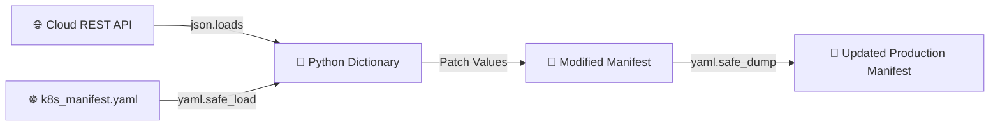
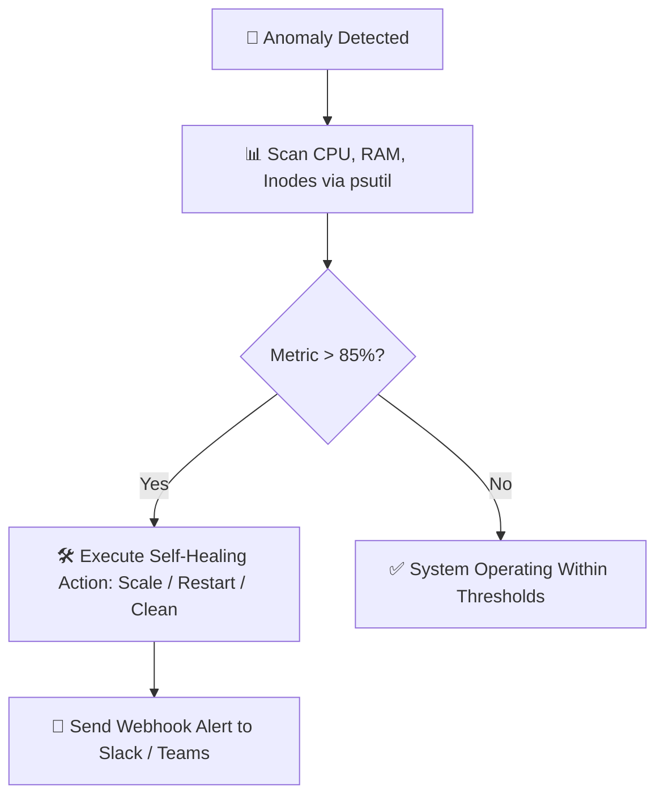

# 🐍 Python for DevOps & Cloud Automation Master Handbook
> **The Practical Engineering Guide to Python for DevOps, SREs, Platform Engineers, and Cloud Architects**  
> *Covering Linux OS Automation, AWS Boto3, Docker SDK, Kubernetes Client, CI/CD REST APIs, and Self-Healing Systems.*

---

## 📑 Master Table of Contents
1. [Core Python Mental Models for DevOps](#1-core-python-mental-models-for-devops)
2. [10-Module Enterprise Curriculum Deep Dive](#2-10-module-enterprise-curriculum-deep-dive)
   - [Module 1: Python in the Modern DevOps Lifecycle & Environment Isolation](#module-1-python-in-the-modern-devops-lifecycle--environment-isolation)
   - [Module 2: Configuration & Data Processing (JSON, YAML, CSV)](#module-2-configuration--data-processing-json-yaml-csv)
   - [Module 3: Linux OS Automation, Safe Subprocesses & Log Rotation](#module-3-linux-os-automation-safe-subprocesses--log-rotation)
   - [Module 4: Network Health Checks & SSH Remote Automation (`paramiko`)](#module-4-network-health-checks--ssh-remote-automation-paramiko)
   - [Module 5: AWS Cloud Automation with Boto3 (EC2, S3, CloudWatch)](#module-5-aws-cloud-automation-with-boto3-ec2-s3-cloudwatch)
   - [Module 6: Container & Kubernetes Orchestration (`docker-py`, `kubernetes`)](#module-6-container--kubernetes-orchestration-docker-py-kubernetes)
   - [Module 7: CI/CD Pipeline & GitHub / Jenkins REST API Automation](#module-7-cicd-pipeline--github--jenkins-rest-api-automation)
   - [Module 8: Self-Healing Incident Response & Metrics Engine (`psutil`)](#module-8-self-healing-incident-response--metrics-engine-psutil)
   - [Module 9: Enterprise Python Architecture & Production Readiness Checklist](#module-9-enterprise-python-architecture--production-readiness-checklist)
   - [Module 10: High-Frequency Senior Python for DevOps Interview Q&A](#module-10-high-frequency-senior-python-for-devops-interview-qa)
3. [Production Incident Self-Healing Playbook](#3-production-incident-self-healing-playbook)
4. [Master Interview Quick-Fire Cheat Sheet](#4-master-interview-quick-fire-cheat-sheet)

---

## 1. Core Python Mental Models for DevOps

```
                         THE 6 GOLDEN RULES OF DEVOPS PYTHON
 ┌─────────────────────────────────────────────────────────────────────────────┐
 │ 1. Idempotency is King                                                      │
 │    • Running the script 1 time or 100 times MUST result in the same state.  │
 ├─────────────────────────────────────────────────────────────────────────────┤
 │ 2. Never Use shell=True in subprocess.run()                                 │
 │    • Avoid command injection attacks. Pass commands as tokenized lists:     │
 │      subprocess.run(["systemctl", "restart", "nginx"], check=True)          │
 ├─────────────────────────────────────────────────────────────────────────────┤
 │ 3. yaml.safe_load() Over yaml.load()                                        │
 │    • yaml.load() allows arbitrary Python object execution (critical CVE).   │
 ├─────────────────────────────────────────────────────────────────────────────┤
 │ 4. Always Specify Network Timeouts: requests.get(url, timeout=(3.05, 10))   │
 │    • Prevent hung threads from exhausting connection pools in production.   │
 ├─────────────────────────────────────────────────────────────────────────────┤
 │ 5. Never Log Bare Exceptions: Use logger.exception("Contextual info")       │
 ├─────────────────────────────────────────────────────────────────────────────┤
 │ 6. Zero Hardcoded Secrets: Use IAM Roles, STS, or External Vault Secrets    │
 └─────────────────────────────────────────────────────────────────────────────┘
```

---

## 2. 10-Module Enterprise Curriculum Deep Dive

---

### Module 1: Python in the Modern DevOps Lifecycle & Environment Isolation

```
+-----------------------------------------------------------------------------------+
|                            Python in the DevOps Lifecycle                         |
+-----------------------------------------------------------------------------------+
|  [Plan & Code]   | Scaffolding, linting, secret scanning                          |
|  [Build & Test]  | Test execution, artifact packaging, dependency validation      |
|  [Deploy]        | Terraform execution, Kubernetes manifest patching, Helm/Boto3  |
|  [Operate]       | Dynamic inventory, log rotation, user provisioning, cron jobs  |
|  [Monitor]       | Metrics scrapers, health checks, anomaly detection, alert bots |
+-----------------------------------------------------------------------------------+
```

#### 📦 Virtual Environment Isolation (`venv`)
```bash
# Initialize isolated virtual environment
python3 -m venv .venv
source .venv/bin/activate       # On Linux / macOS
# .venv\Scripts\activate        # On Windows

pip install --upgrade pip
pip install -r requirements.txt
pip freeze > requirements.txt
```

#### 🛡️ Structured Logging Baseline
```python
import logging
import sys

logging.basicConfig(
    level=logging.INFO,
    format='%(asctime)s [%(levelname)s] [%(name)s]: %(message)s',
    handlers=[
        logging.FileHandler("automation.log"),
        logging.StreamHandler(sys.stdout)
    ]
)
logger = logging.getLogger("DevOpsCore")
```

---

### Module 2: Configuration & Data Processing (JSON, YAML, CSV)



#### 📝 Patching Kubernetes YAML Files Dynamically
```python
import yaml
from pathlib import Path

def patch_k8s_deployment(manifest_path: str, new_image: str, replicas: int) -> None:
    path = Path(manifest_path)
    if not path.exists():
        raise FileNotFoundError(f"Manifest not found at {manifest_path}")

    with open(path, "r", encoding="utf-8") as stream:
        manifest = yaml.safe_load(stream)

    # Apply configuration mutations
    manifest["spec"]["replicas"] = replicas
    manifest["spec"]["template"]["spec"]["containers"][0]["image"] = new_image

    with open(path, "w", encoding="utf-8") as stream:
        yaml.safe_dump(manifest, stream, sort_keys=False, indent=2)
    print(f"Successfully patched {manifest['metadata']['name']} to image {new_image}")
```

#### 📊 Server Inventory Parsing with CSV
```python
import csv

def get_failing_nodes(inventory_file: str) -> list[dict]:
    unhealthy = []
    with open(inventory_file, mode="r", newline="", encoding="utf-8") as f:
        reader = csv.DictReader(f)
        for row in reader:
            if row.get("status", "").upper() != "HEALTHY":
                unhealthy.append(row)
    return unhealthy
```

---

### Module 3: Linux OS Automation, Safe Subprocesses & Log Rotation

```
Python Script (subprocess.run) ──▶ Fork System Call ──▶ Executable Binary ──▶ Capture stdout/stderr/returncode
```

#### 🛡️ Hardened Subprocess Execution Helper
```python
import subprocess
import sys

def execute_system_command(cmd_tokens: list[str], timeout: int = 30) -> str:
    """Executes a system command safely without shell=True to prevent command injection."""
    try:
        result = subprocess.run(
            cmd_tokens,
            capture_output=True,
            text=True,
            check=True,
            timeout=timeout
        )
        return result.stdout.strip()
    except subprocess.CalledProcessError as err:
        print(f"[ERROR] Command {' '.join(cmd_tokens)} failed (Code {err.returncode}): {err.stderr}", file=sys.stderr)
        raise
    except subprocess.TimeoutExpired:
        print(f"[TIMEOUT] Command {' '.join(cmd_tokens)} exceeded {timeout}s", file=sys.stderr)
        raise
```

#### 🧹 Enterprise Log Rotation Script
```python
import shutil
from pathlib import Path

def rotate_log_file(log_file: str, max_bytes: int = 10 * 1024 * 1024, backups: int = 5) -> None:
    p = Path(log_file)
    if not p.exists() or p.stat().st_size < max_bytes:
        return

    for i in range(backups - 1, 0, -1):
        src = Path(f"{log_file}.{i}")
        dest = Path(f"{log_file}.{i + 1}")
        if src.exists():
            shutil.move(src, dest)

    shutil.move(p, Path(f"{log_file}.1"))
    p.touch(mode=0o640)
    print(f"Rotated {log_file} successfully.")
```

---

### Module 4: Network Health Checks & SSH Remote Automation (`paramiko`)

#### 🌐 Robust HTTP Endpoint Health Checker
```python
import requests
from requests.adapters import HTTPAdapter
from urllib3.util import Retry

def create_resilient_session() -> requests.Session:
    session = requests.Session()
    retries = Retry(total=3, backoff_factor=1, status_forcelist=[500, 502, 503, 504])
    session.mount("https://", HTTPAdapter(max_retries=retries))
    return session

def check_endpoint_health(url: str) -> bool:
    session = create_resilient_session()
    try:
        res = session.get(url, timeout=(3.05, 10), headers={"User-Agent": "HealthChecker/2.0"})
        return res.status_code == 200
    except requests.RequestException as e:
        print(f"Health check failed for {url}: {e}")
        return False
```

#### 🔒 Remote Server Management with `paramiko`
```python
import paramiko

def execute_remote_ssh(hostname: str, username: str, key_path: str, command: str) -> tuple[str, str, int]:
    client = paramiko.SSHClient()
    client.set_missing_host_key_policy(paramiko.RejectPolicy())
    client.load_system_host_keys()

    try:
        client.connect(hostname=hostname, username=username, key_filename=key_path, timeout=10)
        stdin, stdout, stderr = client.exec_command(command)
        exit_code = stdout.channel.recv_exit_status()
        return stdout.read().decode().strip(), stderr.read().decode().strip(), exit_code
    finally:
        client.close()
```

---

### Module 5: AWS Cloud Automation with Boto3 (EC2, S3, CloudWatch)

```
   [Boto3 SDK Client]
           │
           ▼  (IAM Role / STS Assumed Role Authentication)
+=========================================================+
|                    AWS Cloud Services                   |
|  +--------------------+  +----------------------------+ |
|  | EC2 Management     |  | S3 Bucket & Lifecycle      | |
|  | - run_instances    |  | - upload_file / multipart  | |
|  | - stop / terminate |  | - put_bucket_versioning    | |
|  +--------------------+  +----------------------------+ |
|  +--------------------+  +----------------------------+ |
|  | CloudWatch Alarms  |  | EventBridge Event Rules    | |
|  | - put_metric_alarm |  | - list_rules / triggers    | |
|  +--------------------+  +----------------------------+ |
+=========================================================+
```

#### 🛑 EC2 Idle Dev Instances Auto-Stop Engine
```python
import boto3

def stop_idle_dev_instances(region: str = "us-east-1") -> list[str]:
    ec2 = boto3.client("ec2", region_name=region)
    filters = [
        {"Name": "tag:Environment", "Values": ["Development", "dev"]},
        {"Name": "instance-state-name", "Values": ["running"]}
    ]
    response = ec2.describe_instances(Filters=filters)
    instance_ids = [
        inst["InstanceId"]
        for res in response.get("Reservations", [])
        for inst in res.get("Instances", [])
    ]
    if instance_ids:
        ec2.stop_instances(InstanceIds=instance_ids)
        print(f"Stopped idle development instances: {instance_ids}")
    return instance_ids
```

#### ☁️ S3 Server-Side Encrypted Upload
```python
import boto3

def upload_secure_artifact(file_path: str, bucket: str, s3_key: str) -> None:
    s3 = boto3.client("s3")
    s3.upload_file(
        Filename=file_path,
        Bucket=bucket,
        Key=s3_key,
        ExtraArgs={
            "ServerSideEncryption": "AES256",
            "ContentType": "application/octet-stream"
        }
    )
    print(f"Uploaded {file_path} to s3://{bucket}/{s3_key}")
```

---

### Module 6: Container & Kubernetes Orchestration (`docker-py`, `kubernetes`)

#### 🐳 Docker Engine Pruning Script
```python
import docker

def cleanup_docker_host() -> None:
    client = docker.from_env()
    # Prune stopped containers
    pruned_containers = client.containers.prune()
    print(f"Containers deleted: {pruned_containers.get('ContainersDeleted', [])}")

    # Prune dangling unused images
    pruned_images = client.images.prune(filters={"dangling": True})
    print(f"Dangling images deleted: {pruned_images.get('ImagesDeleted', [])}")
```

#### ☸️ Kubernetes Pod Auto-Recovery Engine
```python
from kubernetes import client, config

def terminate_crashloop_pods(namespace: str = "production") -> None:
    try:
        config.load_incluster_config()   # In-cluster execution
    except config.ConfigException:
        config.load_kube_config()        # Local kubeconfig execution

    v1 = client.CoreV1Api()
    pods = v1.list_namespaced_pod(namespace=namespace)

    for pod in pods.items:
        for status in (pod.status.container_statuses or []):
            if status.state.waiting and status.state.waiting.reason == "CrashLoopBackOff":
                print(f"[REMEDIATION] Terminating CrashLoopBackOff Pod: {pod.metadata.name}")
                v1.delete_namespaced_pod(
                    name=pod.metadata.name,
                    namespace=namespace,
                    body=client.V1DeleteOptions(grace_period_seconds=0)
                )
```

---

### Module 7: CI/CD Pipeline & GitHub / Jenkins REST API Automation

#### 🐙 GitHub API Pull Request Creation
```python
import os
import requests

def open_github_pr(repo_full_name: str, title: str, head_branch: str, base_branch: str = "main") -> str:
    token = os.environ["GITHUB_TOKEN"]
    headers = {
        "Authorization": f"Bearer {token}",
        "Accept": "application/vnd.github+json"
    }
    url = f"https://api.github.com/repos/{repo_full_name}/pulls"
    payload = {
        "title": title,
        "head": head_branch,
        "base": base_branch,
        "body": "Automated PR generated by DevOps Platform Tooling."
    }
    response = requests.post(url, headers=headers, json=payload, timeout=10)
    response.raise_for_status()
    return response.json()["html_url"]
```

---

### Module 8: Self-Healing Incident Response & Metrics Engine (`psutil`)



#### 🔍 Full Diagnostic Collector
```python
import psutil
from datetime import datetime

def collect_system_telemetry() -> dict:
    return {
        "timestamp": datetime.utcnow().isoformat() + "Z",
        "cpu_percent": psutil.cpu_percent(interval=1),
        "memory_percent": psutil.virtual_memory().percent,
        "disk_percent": psutil.disk_usage("/").percent,
        "open_connections": len(psutil.net_connections())
    }

def audit_and_alert(threshold: float = 85.0) -> None:
    metrics = collect_system_telemetry()
    for metric, val in metrics.items():
        if isinstance(val, (int, float)) and val > threshold:
            print(f"[CRITICAL INCIDENT] {metric} breached threshold: {val}% > {threshold}%")
```

---

### Module 9: Enterprise Python Architecture & Production Readiness Checklist

```
devops-automation-project/
├── app/
│   ├── __init__.py
│   ├── core/              (Business logic engines)
│   ├── services/          (Boto3, Kubernetes, Jenkins, Git clients)
│   └── utils/             (System command helpers, loggers)
├── config/
│   ├── base.yaml
│   ├── production.yaml
│   └── staging.yaml
├── tests/
│   ├── unit/              (pytest suites with unittest.mock)
│   └── integration/
├── scripts/               (Cron wrappers, entry points)
├── requirements.txt
├── Dockerfile
└── README.md
```

#### ✅ Production Readiness Checklist
* [ ] **Zero Hardcoded Secrets:** Credentials loaded via AWS Secrets Manager, Vault, or `.env` files.
* [ ] **Idempotence Enforced:** Automation scripts produce the same desired state regardless of how many times they run.
* [ ] **Strict Error Handlers:** External API requests bounded by `timeout` and wrapped in `try-except` blocks.
* [ ] **Unit Tests & Mocks:** Test suites utilize `pytest` and `unittest.mock` / `moto` to avoid executing actual mutations during CI/CD.
* [ ] **Structured Logging:** Output written as structured JSON or timestamped streams rather than raw `print()` statements.

---

### Module 10: High-Frequency Senior Python for DevOps Interview Q&A

| # | Interview Question | Senior DevOps Engineer Model Answer |
|---|---|---|
| 1 | **Why should you avoid `shell=True` in `subprocess.run()`?** | *Passing `shell=True` invokes the system shell (`/bin/sh`), exposing the script to **command injection vulnerabilities** if unvalidated inputs are included. Passing a list of strings (`["systemctl", "status", "nginx"]`) directly invokes the executable binary via the `execve` syscall without shell expansion.* |
| 2 | **What is the difference between `json.load()` and `json.loads()`?** | *`json.load()` reads and deserializes JSON directly from a **file-like stream/handle**. `json.loads()` (Load String) deserializes JSON data from an in-memory **string object**.* |
| 3 | **Why should you use `yaml.safe_load()` instead of `yaml.load()`?** | *`yaml.load()` can instantiate arbitrary Python objects and execute arbitrary code embedded in YAML payloads (CVE risk). `yaml.safe_load()` resolves standard YAML primitives (maps, lists, strings, numbers) safely.* |
| 4 | **What is the difference between a Session, Client, and Resource in Boto3?** | *`Session` stores configuration state (credentials, region). `Client` provides a 1-to-1 low-level mapping to AWS REST APIs returning raw dictionaries. `Resource` is a higher-level object-oriented abstraction representing AWS components as Python objects with methods.* |
| 5 | **How do you unit test a script that interacts with external APIs or AWS?** | *I use `unittest.mock.patch` to mock external HTTP calls or the `moto` mock library for AWS Boto3 calls. This ensures unit tests run offline, rapidly, and deterministically without mutating cloud infrastructure.* |

---
*Created for Enterprise DevOps Engineering, Cloud Automation & Senior Technical Interviews.*
