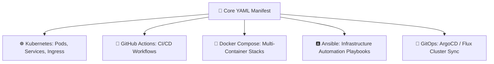
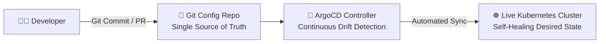

# 📄 YAML for DevOps & Cloud Engineering Master Handbook
> **From Syntax Fundamentals to Kubernetes, GitHub Actions, Docker Compose, Ansible & GitOps**  
> *Engineered for DevOps Engineers, SREs, Cloud Architects, and Technical Interviews.*

---

## 📑 Master Table of Contents
1. [Core Mental Models for DevOps Configuration](#1-core-mental-models-for-devops-configuration)
2. [20-Module Enterprise Curriculum Deep Dive](#2-20-module-enterprise-curriculum-deep-dive)
   - [Module 1: YAML in Modern DevOps Architecture](#module-1-yaml-in-modern-devops-architecture-page-1)
   - [Module 2: YAML Syntax, Indentation Rules & Structure](#module-2-yaml-syntax-indentation-rules--structure-page-2)
   - [Module 3: Lists (Sequences), Maps (Dictionaries) & Complex Nesting](#module-3-lists-sequences-maps-dictionaries--complex-nesting-page-3)
   - [Module 4: Strings, Quotes, Literal (`|`) vs Folded (`>`) Multiline Blocks](#module-4-strings-quotes-literal--vs-folded--multiline-blocks-page-4)
   - [Module 5: Data Types & The 5 Deadliest Type Pitfalls](#module-5-data-types--the-5-deadliest-type-pitfalls-page-5)
   - [Module 6: DRY Configurations with Anchors (`&`), Aliases (`*`) & Merges (`<<`)](#module-6-dry-configurations-with-anchors--aliases--merges--page-6)
   - [Module 7: Reading Complex YAML Architectures Like a Senior Engineer](#module-7-reading-complex-yaml-architectures-like-a-senior-engineer-page-7)
   - [Module 8: YAML Validation, Schema Enforcement & Troubleshooting](#module-8-yaml-validation-schema-enforcement--troubleshooting-page-8)
   - [Module 9: YAML for Kubernetes Architecture & Deployment Anatomy](#module-9-yaml-for-kubernetes-architecture--deployment-anatomy-page-9)
   - [Module 10: Kubernetes Services, Ingress, Probes, Secrets & ConfigMaps](#module-10-kubernetes-services-ingress-probes-secrets--configmaps-page-10)
   - [Module 11: YAML for GitHub Actions CI/CD Pipelines](#module-11-yaml-for-github-actions-cicd-pipelines-page-11)
   - [Module 12: Declarative CI/CD Pipelines-as-Code Patterns](#module-12-declarative-cicd-pipelines-as-code-patterns-page-12)
   - [Module 13: YAML for Docker Compose Multi-Container Stacks](#module-13-yaml-for-docker-compose-multi-container-stacks-page-13)
   - [Module 14: YAML for Ansible Playbooks, Roles & Automation](#module-14-yaml-for-ansible-playbooks-roles--automation-page-14)
   - [Module 15: Environment-Specific YAML (Kustomize Overlays & Helm Values)](#module-15-environment-specific-yaml-kustomize-overlays--helm-values-page-15)
   - [Module 16: Secrets Management & Sensitive Data Protection in YAML](#module-16-secrets-management--sensitive-data-protection-in-yaml-page-16)
   - [Module 17: GitOps Declarative Workflows (ArgoCD & Flux)](#module-17-gitops-declarative-workflows-argocd--flux-page-17)
   - [Module 18: Production YAML Design & Style Standards](#module-18-production-yaml-design--style-standards-page-18)
   - [Module 19: Real-World YAML Troubleshooting Lab (6 Classic Outages)](#module-19-real-world-yaml-troubleshooting-lab-6-classic-outages-page-19)
   - [Module 20: Production YAML Master Checklist & Interview Challenge](#module-20-production-yaml-master-checklist--interview-challenge-page-20)
3. [Senior Engineer Interview Quick-Fire Cheat Sheet](#3-senior-engineer-interview-quick-fire-cheat-sheet)

---

## 1. Core Mental Models for DevOps Configuration

```
                         THE 6 GOLDEN RULES OF YAML
 ┌─────────────────────────────────────────────────────────────────────────────┐
 │ 1. YAML is Declarative Configuration, NOT Programming                       │
 │    • You describe WHAT the state should look like, not HOW to build it.     │
 ├─────────────────────────────────────────────────────────────────────────────┤
 │ 2. Spaces are Syntax, Tabs are Fatal Syntax Errors                          │
 │    • Always use exactly 2 spaces per indentation level. NEVER use TABs.     │
 ├─────────────────────────────────────────────────────────────────────────────┤
 │ 3. Colon Rule: key: value requires a space after the colon                  │
 │    • Correct: port: 8080 | Invalid: port:8080 (Parsed as string)           │
 ├─────────────────────────────────────────────────────────────────────────────┤
 │ 4. The Norway / Boolean Trap: Quote yes/no/on/off and version strings       │
 │    • country: NO ──▶ Evaluates to boolean false. Must write: country: "NO"  │
 │    • version: 1.0 ──▶ Evaluates to float 1. Must write: version: "1.0"      │
 ├─────────────────────────────────────────────────────────────────────────────┤
 │ 5. Multiline Strings: Pipe (|) Keeps Newlines; Arrow (>) Folds into Space   │
 ├─────────────────────────────────────────────────────────────────────────────┤
 │ 6. Secrets Never Belong in YAML: Use Vault, K8s Secrets, or GitHub Secrets  │
 └─────────────────────────────────────────────────────────────────────────────┘
```

---

## 2. 20-Module Enterprise Curriculum Deep Dive

---

### Module 1: YAML in Modern DevOps Architecture (Page 1)

YAML (*YAML Ain't Markup Language*) is a human-readable data serialization format that has become the universal language of modern cloud infrastructure and DevOps pipelines:



#### 🔍 How to Read Any Unfamiliar YAML File
1. **Identify the Tool & Purpose:** Check top-level keys (e.g. `apiVersion` $\rightarrow$ Kubernetes; `on:` $\rightarrow$ GitHub Actions; `services:` $\rightarrow$ Docker Compose; `hosts:` $\rightarrow$ Ansible).
2. **Find the Root Keys:** Group sections by root keys before reading details.
3. **Follow the Indentation Tree:** Work down level by level.

---

### Module 2: YAML Syntax, Indentation Rules & Structure (Page 2)

```
                            INDENTATION HIERARCHY
 Level 0 (Root) ──▶ app:
 Level 1 (Child)──▶   name: payment-service
 Level 1 (Child)──▶   config:
 Level 2 (Grand)──▶     timeout: 30s
 Level 2 (Grand)──▶     features:
 Level 3 (List) ──▶       - retry_on_failure
 Level 3 (List) ──▶       - log_payloads
```

#### ⚠️ Common Syntax Mistakes
```yaml
# ❌ WRONG (Syntax Errors)
name: myapp
port:8080           # Error: Missing space after colon
<TAB>host: localhost # Error: Tab character used instead of 2 spaces
skills:
YAML                # Error: List items require leading dash (-)

# ✅ CORRECT
name: myapp
port: 8080
  host: localhost
skills:
  - YAML
```

---

### Module 3: Lists (Sequences), Maps (Dictionaries) & Complex Nesting (Page 3)

```yaml
# 1. YAML Mapping (Key-Value Dictionary)
database:
  host: 10.0.0.5
  port: 5432
  name: production_db

# 2. YAML Sequence (List of Strings)
fruits:
  - apple
  - banana
  - orange

# 3. Sequence of Mappings (List of Complex Objects)
servers:
  - name: web-01
    ip: 10.0.0.10
    role: frontend
  - name: db-01
    ip: 10.0.0.20
    role: database
```

---

### Module 4: Strings, Quotes, Literal (`|`) vs Folded (`>`) Multiline Blocks (Page 4)

```
                   MULTILINE BLOCK BEHAVIOR
 ┌──────────────────────┬────────┬────────────────────────────────────────────┐
 │ Block Type           │ Syntax │ Newline Handling                           │
 ├──────────────────────┼────────┼────────────────────────────────────────────┤
 │ Literal Block        │   |    │ Preserves exact line breaks and formatting │
 │ Folded Block         │   >    │ Converts line breaks into single spaces    │
 └──────────────────────┴────────┴────────────────────────────────────────────┘
```

#### 📝 Examples
```yaml
# Literal Block (|) - Ideal for shell scripts, certificates, configs
startup_script: |
  #!/bin/bash
  echo "Initializing database..."
  systemctl start postgresql
  echo "Database online."

# Folded Block (>) - Ideal for long descriptions, release notes
release_notes: >
  This is a very long description
  that spans multiple lines in the source YAML
  but will be parsed as a single continuous paragraph.
```

---

### Module 5: Data Types & The 5 Deadliest Type Pitfalls (Page 5)

```
                       THE 5 DEADLIEST YAML TRAPS
 ┌────┬──────────────────────────┬──────────────────┬─────────────────────────┐
 │ #  │ Unquoted Value in YAML   │ Evaluated As     │ Safe Hardened Fix       │
 ├────┼──────────────────────────┼──────────────────┼─────────────────────────┤
 │ 1  │ country: NO              │ boolean (false)  │ country: "NO"           │
 │ 2  │ enabled: yes             │ boolean (true)   │ flag: "yes"             │
 │ 3  │ version: 1.0             │ float (1)        │ version: "1.0"          │
 │ 4  │ port: 08080              │ octal number     │ port: "8080"            │
 │ 5  │ account_id: 0123456      │ octal number     │ account_id: "0123456"   │
 └────┴──────────────────────────┴──────────────────┴─────────────────────────┘
```

---

### Module 6: DRY Configurations with Anchors (`&`), Aliases (`*`) & Merges (`<<`) (Page 6)

```yaml
# Define base reusable anchor (&defaults)
defaults: &defaults
  image: nginx:1.25
  restart: unless-stopped
  environment:
    LOG_LEVEL: info
    TZ: UTC

# Consume and override with Merge Key (<<: *defaults)
services:
  web:
    <<: *defaults
    ports:
      - "80:80"

  api:
    <<: *defaults
    environment:
      LOG_LEVEL: debug     # Overrides the anchor's default info level
    ports:
      - "8080:8080"
```

---

### Module 7: Reading Complex YAML Architectures Like a Senior Engineer (Page 7)

```
                            KUBERNETES MANIFEST ANATOMY
 ┌─────────────────────────────────────────────────────────────────────────────┐
 │ apiVersion: apps/v1          ──▶ Defines API group and schema version       │
 │ kind: Deployment             ──▶ Type of Kubernetes resource to manage      │
 ├─────────────────────────────────────────────────────────────────────────────┤
 │ metadata:                    ──▶ Object identification                      │
 │   name: payment-api          ──▶ Unique name in namespace                   │
 │   labels:                    ──▶ Search/filter metadata tags                │
 │     app: payment-api         ──▶ Must match selector below                  │
 ├─────────────────────────────────────────────────────────────────────────────┤
 │ spec:                        ──▶ Desired State                              │
 │   replicas: 3                ──▶ Number of Pod instances                    │
 │   selector:                  ──▶ How controller finds its Pods              │
 │     matchLabels:             ──▶ Target label selector                      │
 │       app: payment-api       ──▶ Must match template metadata labels        │
 │   template:                  ──▶ Pod blueprint                              │
 │     metadata:                ──▶ Pod labels                                 │
 │     spec:                    ──▶ Pod specification (Containers, Volumes)    │
 └─────────────────────────────────────────────────────────────────────────────┘
```

---

### Module 8: YAML Validation, Schema Enforcement & Troubleshooting (Page 8)

```bash
# 1. Command-Line YAML Parsers & Linters
pip install yamllint
yamllint deployment.yaml

# 2. Query and Modify YAML via CLI (yq - lightweight jq for YAML)
yq eval '.spec.replicas = 5' deployment.yaml -i
yq eval '.spec.template.spec.containers[0].image' deployment.yaml

# 3. Kubernetes Schema Validation
kubeconform -strict deployment.yaml
kubectl apply -f deployment.yaml --dry-run=client
```

---

### Module 9: YAML for Kubernetes Architecture & Deployment Anatomy (Page 9)

```yaml
# Full Production Kubernetes Deployment Manifest
apiVersion: apps/v1
kind: Deployment
metadata:
  name: web-app
  namespace: production
  labels:
    app.kubernetes.io/name: web-app
spec:
  replicas: 3
  selector:
    matchLabels:
      app: web-app
  template:
    metadata:
      labels:
        app: web-app
    spec:
      containers:
        - name: web
          image: nginx:1.25-alpine
          ports:
            - containerPort: 80
          resources:
            requests:
              cpu: "100m"
              memory: "128Mi"
            limits:
              cpu: "500m"
              memory: "512Mi"
```

---

### Module 10: Kubernetes Services, Ingress, Probes, Secrets & ConfigMaps (Page 10)

```yaml
# 1. ConfigMap (Non-sensitive Config)
apiVersion: v1
kind: ConfigMap
metadata:
  name: app-config
data:
  APP_ENV: "production"
  LOG_LEVEL: "info"
---
# 2. Production Health Probes & Resource Limits
apiVersion: apps/v1
kind: Deployment
metadata:
  name: api-service
spec:
  template:
    spec:
      containers:
        - name: api
          image: myorg/api:v2.1
          env:
            - name: APP_ENV
              valueFrom:
                configMapKeyRef:
                  name: app-config
                  key: APP_ENV
            - name: DB_PASSWORD
              valueFrom:
                secretKeyRef:
                  name: app-secret
                  key: password
          readinessProbe:
            httpGet:
              path: /ready
              port: 8080
            initialDelaySeconds: 5
            periodSeconds: 10
          livenessProbe:
            httpGet:
              path: /health
              port: 8080
            initialDelaySeconds: 15
            periodSeconds: 20
```

---

### Module 11: YAML for GitHub Actions CI/CD Pipelines (Page 11)

```yaml
name: Production CI/CD Pipeline

on:
  push:
    branches: [ main ]
  pull_request:
    branches: [ main ]

env:
  NODE_VERSION: '20'

jobs:
  build-and-test:
    runs-on: ubuntu-latest
    steps:
      - name: Checkout Code
        uses: actions/checkout@v4

      - name: Setup Node
        uses: actions/setup-node@v4
        with:
          node-version: ${{ env.NODE_VERSION }}
          cache: 'npm'

      - name: Install & Test
        run: |
          npm ci
          npm test

  deploy:
    needs: [ build-and-test ]
    runs-on: ubuntu-latest
    if: github.ref == 'refs/heads/main'
    environment: production
    steps:
      - name: Deploy to Cloud
        run: echo "Deploying version ${{ github.sha }} to production..."
```

---

### Module 12: Declarative CI/CD Pipelines-as-Code Patterns (Page 12)

```
                            CI/CD PIPELINE STAGES
 ┌──────────────┐    ┌──────────────┐    ┌──────────────┐    ┌──────────────┐
 │ 1. LINT/TEST │───▶│ 2. SAST SCAN │───▶│ 3. CONTAINER │───▶│ 4. DEPLOY    │
 │ (Parallel)   │    │ (Security)   │    │ BUILD (Push) │    │ (Gated Prod) │
 └──────────────┘    └──────────────┘    └──────────────┘    └──────────────┘
```

---

### Module 13: YAML for Docker Compose Multi-Container Stacks (Page 13)

```yaml
version: '3.8'

services:
  web:
    image: nginx:alpine
    ports:
      - "80:80"
    depends_on:
      - api
    networks:
      - app-net

  api:
    build:
      context: ./backend
      dockerfile: Dockerfile
    environment:
      DB_HOST: db
      DB_USER: postgres
      DB_PASSWORD_FILE: /run/secrets/db_password
    depends_on:
      db:
        condition: service_healthy
    networks:
      - app-net

  db:
    image: postgres:15-alpine
    environment:
      POSTGRES_DB: production
      POSTGRES_USER: postgres
      POSTGRES_PASSWORD: secretpassword
    volumes:
      - pgdata:/var/lib/postgresql/data
    healthcheck:
      test: ["CMD-SHELL", "pg_isready -U postgres"]
      interval: 10s
      timeout: 5s
      retries: 5
    networks:
      - app-net

volumes:
  pgdata:

networks:
  app-net:
    driver: bridge
```

---

### Module 14: YAML for Ansible Playbooks, Roles & Automation (Page 14)

```yaml
---
- name: Configure Production Web Servers
  hosts: webservers
  become: yes
  vars:
    http_port: 80
    max_clients: 200

  tasks:
    - name: Install NGINX web server
      apt:
        name: nginx
        state: present
        update_cache: yes

    - name: Deploy custom NGINX configuration
      template:
        src: templates/nginx.conf.j2
        dest: /etc/nginx/nginx.conf
        mode: '0644'
      notify: Reload NGINX

    - name: Ensure NGINX is started and enabled on boot
      systemctl:
        name: nginx
        state: started
        enabled: yes

  handlers:
    - name: Reload NGINX
      systemctl:
        name: nginx
        state: reloaded
```

---

### Module 15: Environment-Specific YAML (Kustomize Overlays & Helm Values) (Page 15)

```
                 KUSTOMIZE OVERLAYS ARCHITECTURE
 ┌─────────────────────────────────────────────────────────────┐
 │ Base Directory: k8s/base/ (Common Architecture)             │
 │ ├── deployment.yaml                                         │
 │ ├── service.yaml                                            │
 │ └── kustomization.yaml                                      │
 └──────────────────────────────┬──────────────────────────────┘
                ┌───────────────┴───────────────┐
                ▼                               ▼
 ┌─────────────────────────────┐ ┌─────────────────────────────┐
 │ Overlays: k8s/overlays/dev/ │ │ Overlays: k8s/overlays/prod/│
 │ ├── replicas: 1             │ │ ├── replicas: 5             │
 │ ├── cpu: 100m               │ │ ├── cpu: 1000m              │
 │ └── kustomization.yaml      │ │ └── kustomization.yaml      │
 └─────────────────────────────┘ └─────────────────────────────┘
```

---

### Module 16: Secrets Management & Sensitive Data Protection in YAML (Page 16)

> [!CAUTION]
> Kubernetes Secrets encoded with `base64` are **NOT ENCRYPTED**. Anyone with read access can decode them (`echo 'cGFzc3dvcmQ=' | base64 -d`). Always use external secret operators (HashiCorp Vault, AWS Secrets Manager, SealedSecrets).

```bash
# Prevent accidental git commits of secrets using pre-commit hooks
pip install detect-secrets
detect-secrets scan > .secrets.baseline
```

---

### Module 17: GitOps Declarative Workflows (ArgoCD & Flux) (Page 17)



* **Core GitOps Principles:**
  1. Entire system described declaratively in YAML.
  2. Canonical desired state version-controlled in Git.
  3. Automated synchronization agents pull state from Git into cluster.
  4. Continuous drift detection and self-healing.

---

### Module 18: Production YAML Design & Style Standards (Page 18)

```
                    PRODUCTION YAML DESIGN STANDARDS
 ┌──┬─────────────────────────────┬────────────────────────────────────────────┐
 │  │ Standard                    │ Production Criteria                        │
 ├──┼─────────────────────────────┼────────────────────────────────────────────┤
 │1 │ Indentation                 │ Exactly 2 spaces; NO tabs                  │
 │2 │ Quoting Strings             │ Quote version numbers, booleans, ports     │
 │3 │ Naming Conventions          │ lowercase-with-hyphens (k8s standard)      │
 │4 │ Multiline Strings           │ Use | for scripts; > for long text         │
 │5 │ Resource Limits             │ Always define requests and limits in K8s   │
 │6 │ Health Probes               │ Always configure readiness & liveness      │
 └──┴─────────────────────────────┴────────────────────────────────────────────┘
```

---

### Module 19: Real-World YAML Troubleshooting Lab (6 Classic Outages) (Page 19)

```
 ┌────┬──────────────────────────────────┬──────────────────────────────────────────────────────────────────┐
 │ #  │ Outage Symptom                   │ Root Cause & Instant Fix                                         │
 ├────┼──────────────────────────────────┼──────────────────────────────────────────────────────────────────┤
 │ 1  │ K8s Pod does not start           │ Indentation error in `spec.selector.matchLabels`                 │
 │    │                                  │ Fix: Indent `matchLabels` under `selector` with 2 spaces.        │
 ├────┼──────────────────────────────────┼──────────────────────────────────────────────────────────────────┤
 │ 2  │ K8s Service endpoints are empty  │ Service `spec.selector` label does not match Pod template label. │
 │    │                                  │ Fix: Ensure `app: web-app` matches in both Service & Deployment. │
 ├────┼──────────────────────────────────┼──────────────────────────────────────────────────────────────────┤
 │ 3  │ GitHub Actions does not trigger  │ Wrong indentation under `on.push.branches`                       │
 │    │                                  │ Fix: Format branches as a sequence under push.                   │
 ├────┼──────────────────────────────────┼──────────────────────────────────────────────────────────────────┤
 │ 4  │ Docker Compose app receives bool │ Environment variable `DEBUG: false` unquoted                     │
 │    │                                  │ Fix: Quote strings: `DEBUG: "false"`, `PORT: "8080"`.            │
 ├────┼──────────────────────────────────┼──────────────────────────────────────────────────────────────────┤
 │ 5  │ Ansible playbook fails           │ Expected list for `tasks`, but written as a single mapping.      │
 │    │                                  │ Fix: Add leading `- name:` to tasks.                             │
 ├────┼──────────────────────────────────┼──────────────────────────────────────────────────────────────────┤
 │ 6  │ Plaintext secret committed in Git│ API Key committed in ConfigMap instead of Secret reference.      │
 │    │                                  │ Fix: Rotate key immediately; use `valueFrom.secretKeyRef`.       │
 └────┴──────────────────────────────────┴──────────────────────────────────────────────────────────────────┘
```

---

### Module 20: Production YAML Master Checklist & Interview Challenge (Page 20)

```
                    PRODUCTION YAML AUDIT CHECKLIST
 ┌──┬─────────────────────────────┬────────────────────────────────────────────┐
 │  │ Verification Item           │ Production Standard                        │
 ├──┼─────────────────────────────┼────────────────────────────────────────────┤
 │☐ │ Indentation                 │ 2 spaces everywhere; zero tabs             │
 │☐ │ Key-Value Colons            │ Space after every colon (`key: value`)     │
 │☐ │ Ambiguous Types Quoted      │ "1.0", "yes", "no", "8080" quoted          │
 │☐ │ Secrets Externalized        │ No credentials or API keys in YAML         │
 │☐ │ Kubernetes Probes           │ Readiness & Liveness probes defined        │
 │☐ │ Resource Boundaries         │ CPU/Memory requests and limits set         │
 │☐ │ CI/CD Linting Pass          │ Passes `yamllint` and `kubeconform`        │
 │☐ │ Dry-Run Validated           │ Validated via `kubectl apply --dry-run`    │
 └──┴─────────────────────────────┴────────────────────────────────────────────┘
```

---

## 3. Senior Engineer Interview Quick-Fire Cheat Sheet

| # | High-Frequency YAML Interview Question | Senior DevOps Engineer Model Answer |
|---|---|---|
| 1 | **What is the Norway problem in YAML?** | *In YAML 1.1, unquoted strings like `NO`, `no`, `yes`, `on`, and `off` are automatically parsed as booleans (`false`/`true`). For example, the ISO country code `country: NO` evaluates to boolean `false`. It must always be quoted as `country: "NO"`.* |
| 2 | **What is the difference between `|` (literal block) and `>` (folded block)?** | *The pipe (`|`) preserves all newlines and indentation exactly as written (used for shell scripts and certificates). The arrow (`>`) folds consecutive lines into a single long string separated by spaces (used for descriptions).* |
| 3 | **What are YAML Anchors and Aliases, and when should you avoid them?** | *Anchors (`&`) define reusable configuration blocks, and aliases (`*` or `<<: *`) merge them into other sections to keep YAML DRY. They should be used sparingly because excessive nesting obscures readability and some tools (like certain Helm charts or CloudFormation templates) do not support them.* |
| 4 | **Why is `port: 8080` sometimes problematic in Docker Compose / Kubernetes?** | *If a port begins with a zero or is formatted like `22:22`, some YAML parsers evaluate it as sexagesimal (base 60) or an integer rather than a string port mapping. Best practice is to always quote port mappings (e.g. `"8080:8080"`).* |
| 5 | **How does Kustomize manage environment configurations without modifying base YAML?** | *Kustomize maintains a shared `base/` directory containing pure YAML manifests and environment-specific `overlays/` (e.g. `dev/`, `prod/`). The overlays apply targeted strategic patches (replicas, CPU/memory, image tags) via `kustomization.yaml` without duplicating code.* |

---
*Created for DevOps Engineering Mastery, GitOps Architecture & Senior Technical Interviews.*
